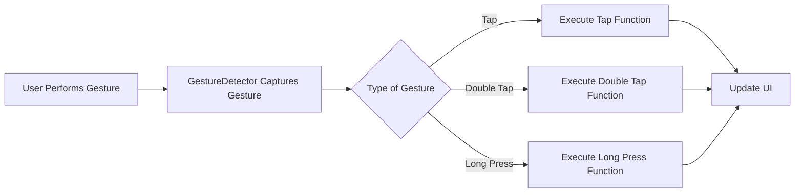

## 5.2.2 Gesture Detection

In this exciting section, we're going to dive into the world of gestures and learn how to make our apps respond to the way users interact with their screens. Just like how we use hand gestures to communicate with people, we can use gestures to communicate with our apps! Let's explore how we can detect and respond to these gestures using Flutter.

### Understanding Gestures

Gestures are actions that users perform on their devices, like tapping, swiping, or dragging their fingers across the screen. In Flutter, we can capture these gestures using the `GestureDetector` widget, which allows us to make our apps interactive and fun.

### Key Concepts

#### GestureDetector Widget

The `GestureDetector` widget is a powerful tool in Flutter that lets us capture and respond to various gestures. It's like a magical net that catches all the different ways users touch and interact with their screens.

#### Common Gestures

Here are some common gestures you can detect with the `GestureDetector`:

- **Tap:** A quick touch on the screen.
- **Double Tap:** Two quick touches in succession.
- **Long Press:** Touching and holding the screen for a while.
- **Horizontal Drag:** Moving a finger horizontally across the screen.
- **Vertical Drag:** Moving a finger vertically across the screen.

#### Implementing Multiple Gestures

You can handle different gestures within the same widget, allowing for a rich and interactive user experience. Let's see how we can implement this in our code.

### Code Example

Here's a simple Flutter app that demonstrates how to detect and respond to different gestures:

```dart
import 'package:flutter/material.dart';

void main() {
  runApp(GestureDetectionApp());
}

class GestureDetectionApp extends StatefulWidget {
  @override
  _GestureDetectionAppState createState() => _GestureDetectionAppState();
}

class _GestureDetectionAppState extends State<GestureDetectionApp> {
  String gestureInfo = 'Perform a gesture!';

  void onTap() {
    setState(() {
      gestureInfo = 'You tapped!';
    });
  }

  void onDoubleTap() {
    setState(() {
      gestureInfo = 'You double-tapped!';
    });
  }

  void onLongPress() {
    setState(() {
      gestureInfo = 'You long-pressed!';
    });
  }

  @override
  Widget build(BuildContext context) {
    return MaterialApp(
      home: Scaffold(
        appBar: AppBar(
          title: Text('Gesture Detection Example'),
        ),
        body: GestureDetector(
          onTap: onTap,
          onDoubleTap: onDoubleTap,
          onLongPress: onLongPress,
          child: Center(
            child: Text(
              gestureInfo,
              style: TextStyle(fontSize: 24),
            ),
          ),
        ),
      ),
    );
  }
}
```

### Activity: Create Your Own Gesture Responses

Now it's your turn! Try creating different responses for various gestures. For example, you could change the background color when you swipe or play a sound when you long press. Get creative and see what fun interactions you can come up with!

### Visualizing Gesture Detection

To help you understand how gestures are detected and handled, here's a flowchart that illustrates the process:



### Playful Language and Engagement

Think of gestures as a secret language between you and your app. Just like how you might wave to say hello or nod to show you understand, gestures let your app know what you want it to do. Encourage your imagination to run wild as you explore how gestures can make your apps more interactive and responsive.

### Best Practices and Tips

- **Experiment:** Try different gestures and see how they can enhance your app's interactivity.
- **User Experience:** Consider how gestures can make your app easier and more fun to use.
- **Feedback:** Provide visual or auditory feedback to let users know their gestures have been recognized.

### Conclusion

Gesture detection is a fantastic way to make your apps more engaging and user-friendly. By understanding and implementing gestures, you can create apps that feel intuitive and responsive to users' actions. Keep experimenting and have fun with the endless possibilities that gestures offer!

## Quiz Time!



### What is the primary widget used in Flutter to detect gestures?

- [x] GestureDetector
- [ ] GestureListener
- [ ] GestureHandler
- [ ] GestureWidget

> **Explanation:** The `GestureDetector` widget is used in Flutter to detect and respond to various gestures.

### Which gesture involves touching and holding the screen for a while?

- [ ] Tap
- [ ] Double Tap
- [x] Long Press
- [ ] Swipe

> **Explanation:** A long press involves touching and holding the screen for a certain duration.

### What happens when a user performs a gesture in a Flutter app?

- [ ] The app crashes
- [x] The GestureDetector captures the gesture
- [ ] The screen turns off
- [ ] Nothing happens

> **Explanation:** The `GestureDetector` captures the gesture and allows the app to respond accordingly.

### How can you handle multiple gestures within the same widget?

- [x] By using multiple callbacks in the GestureDetector
- [ ] By using separate widgets for each gesture
- [ ] By writing separate functions for each gesture
- [ ] By using a GestureHandler widget

> **Explanation:** You can handle multiple gestures within the same widget by using multiple callbacks in the `GestureDetector`.

### Which gesture is detected by two quick touches in succession?

- [ ] Tap
- [x] Double Tap
- [ ] Long Press
- [ ] Drag

> **Explanation:** A double tap is detected by two quick touches in succession.

### What is the purpose of the GestureDetector widget?

- [ ] To display images
- [x] To capture and handle user gestures
- [ ] To play audio
- [ ] To manage app state

> **Explanation:** The `GestureDetector` widget is used to capture and handle user gestures.

### What should you do to update the UI in response to a gesture?

- [ ] Restart the app
- [x] Use setState to update the UI
- [ ] Use a different widget
- [ ] Ignore the gesture

> **Explanation:** Use `setState` to update the UI in response to a gesture.

### Which of the following is NOT a common gesture detected by GestureDetector?

- [ ] Tap
- [ ] Double Tap
- [ ] Long Press
- [x] Shake

> **Explanation:** Shake is not a common gesture detected by `GestureDetector`.

### What is a practical use of gesture detection in apps?

- [x] Making apps interactive and responsive
- [ ] Slowing down app performance
- [ ] Increasing app size
- [ ] Reducing app functionality

> **Explanation:** Gesture detection makes apps interactive and responsive to user actions.

### True or False: Gesture detection can only be used for simple apps.

- [ ] True
- [x] False

> **Explanation:** False. Gesture detection can be used in both simple and complex apps to enhance interactivity.


