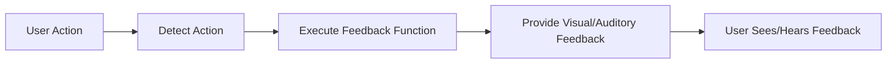

## 5.2.3 Feedback to Users

In this section, we'll explore how to make your apps more interactive and engaging by providing feedback to users. Feedback is a crucial part of user experience, as it lets users know that their actions have been recognized and processed by the app. Think of feedback as a friendly nod or a thumbs-up from your app, acknowledging that the user has done something.

### Why is Feedback Important?

Imagine playing a game where you press a button, but nothing happens. You'd probably wonder if the button was broken or if you did something wrong. Feedback helps prevent this confusion by providing immediate responses to user actions. It makes the app feel alive and responsive, creating a more enjoyable experience.

### Types of Feedback

There are several ways to provide feedback in your apps:

1. **Visual Feedback:** This includes changing colors, displaying messages, or updating images. It's like when a light turns on to show something is working.

2. **Auditory Feedback:** This involves playing sounds or music in response to actions. It's similar to hearing a beep when you press a button on a microwave.

3. **Haptic Feedback:** This uses vibrations to provide feedback. While this is optional and depends on the platform, it's like feeling a vibration when you receive a text message.

### Implementing Feedback in Flutter

Let's dive into a practical example to see how we can implement feedback in a Flutter app. We'll create a simple app that changes text and plays a sound when a button is pressed.

#### Code Example

Here's a basic Flutter app that demonstrates visual and auditory feedback:

```dart
import 'package:flutter/material.dart';
import 'package:audioplayers/audioplayers.dart';

void main() {
  runApp(FeedbackApp());
}

class FeedbackApp extends StatefulWidget {
  @override
  _FeedbackAppState createState() => _FeedbackAppState();
}

class _FeedbackAppState extends State<FeedbackApp> {
  String feedbackText = 'Press the button!';
  final AudioPlayer _audioPlayer = AudioPlayer();

  void giveFeedback() async {
    setState(() {
      feedbackText = 'Button Pressed!';
    });
    await _audioPlayer.play(AssetSource('sounds/click.mp3'));
  }

  @override
  Widget build(BuildContext context) {
    return MaterialApp(
      home: Scaffold(
        appBar: AppBar(
          title: Text('Feedback Example'),
        ),
        body: Center(
          child: Column(
            mainAxisAlignment: MainAxisAlignment.center,
            children: [
              ElevatedButton(
                onPressed: giveFeedback,
                child: Text('Press Me'),
              ),
              SizedBox(height: 20),
              Text(
                feedbackText,
                style: TextStyle(fontSize: 24, color: Colors.blue),
              ),
            ],
          ),
        ),
      ),
    );
  }
}
```

**Note:** Ensure the sound file (`sounds/click.mp3`) is added to the project's assets.

#### How It Works

- **Visual Feedback:** When the button is pressed, the text changes from "Press the button!" to "Button Pressed!" This change is achieved using the `setState` method, which updates the UI.

- **Auditory Feedback:** The app plays a sound using the `AudioPlayer` package. This provides an auditory cue that the button has been pressed.

### Activity: Adding Feedback to Your Apps

Now it's your turn! Try adding different types of feedback to your apps. Here are some ideas:

- Change the background color when a button is pressed.
- Play different sounds for correct and incorrect answers in a quiz app.
- Display a congratulatory message when a user completes a task.

### Visualizing Feedback Flow

To better understand how feedback works, let's look at a flowchart that illustrates the process:



This flowchart shows the journey from a user action to the feedback they receive. It starts with the user performing an action, which is detected by the app. The app then executes a feedback function, providing visual or auditory feedback that the user can see or hear.

### Encouragement and Creativity

Feedback is a powerful tool to make your apps more engaging and enjoyable. Think creatively about how you can use feedback to enhance the user experience. Whether it's a simple color change or a fun sound effect, feedback can make your app feel more interactive and alive.

### Best Practices

- **Consistency:** Ensure that feedback is consistent throughout your app. Users should know what to expect when they perform an action.
- **Clarity:** Feedback should be clear and easy to understand. Avoid using too many effects at once, as this can be overwhelming.
- **Accessibility:** Consider users with different needs. Ensure that visual feedback is accompanied by auditory cues for users who may have visual impairments.

By incorporating feedback into your apps, you're not only improving the user experience but also making your apps more fun and interactive. Keep experimenting and see how feedback can transform your projects!

## Quiz Time!



### What is the primary purpose of providing feedback in an app?

- [x] To let users know their actions have been recognized
- [ ] To make the app look more colorful
- [ ] To increase the app's loading time
- [ ] To confuse the users

> **Explanation:** Feedback is essential to inform users that their actions have been recognized and processed by the app, enhancing the user experience.

### Which of the following is an example of visual feedback?

- [x] Changing the color of a button when pressed
- [ ] Playing a sound when a button is pressed
- [ ] Vibrating the device when a button is pressed
- [ ] None of the above

> **Explanation:** Visual feedback involves changes that can be seen, such as altering colors or displaying messages.

### What package is used in the code example to play sounds?

- [x] audioplayers
- [ ] flutter_sound
- [ ] soundpool
- [ ] audiokit

> **Explanation:** The `audioplayers` package is used in the code example to play sounds in response to user actions.

### What method is used to update the UI in Flutter when providing visual feedback?

- [x] setState
- [ ] updateUI
- [ ] refresh
- [ ] rebuild

> **Explanation:** The `setState` method is used in Flutter to update the UI when the state of the app changes.

### Which type of feedback involves using vibrations?

- [x] Haptic Feedback
- [ ] Visual Feedback
- [ ] Auditory Feedback
- [ ] None of the above

> **Explanation:** Haptic feedback involves using vibrations to provide feedback to the user.

### What should you ensure when adding feedback to your app?

- [x] Consistency and clarity
- [ ] Randomness and confusion
- [ ] Excessive effects
- [ ] None of the above

> **Explanation:** Feedback should be consistent and clear to ensure a positive user experience.

### What is the role of the `giveFeedback` function in the code example?

- [x] To change the text and play a sound
- [ ] To change the background color
- [ ] To display an image
- [ ] To close the app

> **Explanation:** The `giveFeedback` function changes the text and plays a sound, providing both visual and auditory feedback.

### How can you make feedback more accessible?

- [x] By providing both visual and auditory cues
- [ ] By using only visual effects
- [ ] By using only sound effects
- [ ] By ignoring accessibility

> **Explanation:** Providing both visual and auditory cues ensures that feedback is accessible to users with different needs.

### What is a potential pitfall when using feedback in apps?

- [x] Overwhelming users with too many effects
- [ ] Making the app too simple
- [ ] Not using any feedback
- [ ] None of the above

> **Explanation:** Using too many effects can overwhelm users, so it's important to use feedback judiciously.

### True or False: Feedback can make an app feel more interactive and alive.

- [x] True
- [ ] False

> **Explanation:** Feedback enhances the interactivity of an app, making it feel more alive and responsive to user actions.


