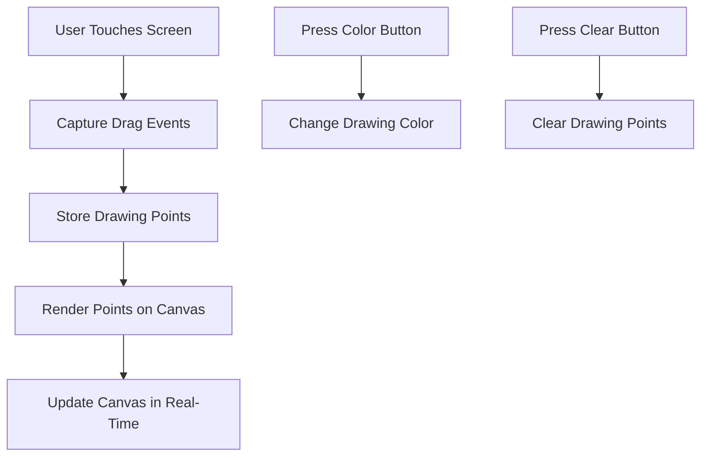

## 5.2.4 Mini Project: Drawing App

Welcome to an exciting mini project where you'll create your very own Drawing App using Flutter! This project will help you understand how to handle user interactions and events, allowing you to draw on the screen with your finger or mouse. Let's dive into the world of creativity and coding!

### Objective

The goal of this project is to build a simple Drawing App that lets users draw lines on the screen by dragging their finger or mouse. You'll also add features to change the drawing color and clear the canvas, making it a fun and interactive experience.

### Project Overview

In this project, you'll learn how to:

1. **Set Up the UI:** Create a canvas area for drawing and buttons to change colors or clear the canvas.
2. **Handle Touch Events:** Use `GestureDetector` to capture drag events and draw lines accordingly.
3. **Store Drawing Points:** Maintain a list of points or lines that the user has drawn.
4. **Render the Drawing:** Use a `CustomPainter` to draw the lines on the canvas.
5. **Add Interactions:** Implement buttons to change drawing color and clear the canvas.

### Step-by-Step Guide

#### 1. Set Up the UI

First, let's create the basic user interface for our Drawing App. We'll need a canvas area where users can draw and some buttons to change the color and clear the canvas.

```dart
import 'package:flutter/material.dart';

void main() {
  runApp(DrawingApp());
}

class DrawingApp extends StatefulWidget {
  @override
  _DrawingAppState createState() => _DrawingAppState();
}

class _DrawingAppState extends State<DrawingApp> {
  List<Offset> points = [];
  Color selectedColor = Colors.black;

  @override
  Widget build(BuildContext context) {
    return MaterialApp(
      home: Scaffold(
        appBar: AppBar(
          title: Text('Simple Drawing App'),
          actions: [
            IconButton(
              icon: Icon(Icons.color_lens),
              onPressed: () {
                setState(() {
                  selectedColor = Colors.primaries[points.length % Colors.primaries.length];
                });
              },
            ),
            IconButton(
              icon: Icon(Icons.clear),
              onPressed: () {
                setState(() {
                  points.clear();
                });
              },
            ),
          ],
        ),
        body: GestureDetector(
          onPanUpdate: (details) {
            setState(() {
              RenderBox? box = context.findRenderObject() as RenderBox?;
              points.add(box!.globalToLocal(details.globalPosition));
            });
          },
          onPanEnd: (details) {
            points.add(Offset.zero);
          },
          child: CustomPaint(
            painter: DrawingPainter(points: points, color: selectedColor),
            child: Container(),
          ),
        ),
      ),
    );
  }
}
```

#### 2. Handle Touch Events

To capture user interactions, we'll use the `GestureDetector` widget. This widget allows us to detect drag events, which we'll use to draw lines on the canvas.

```dart
body: GestureDetector(
  onPanUpdate: (details) {
    setState(() {
      RenderBox? box = context.findRenderObject() as RenderBox?;
      points.add(box!.globalToLocal(details.globalPosition));
    });
  },
  onPanEnd: (details) {
    points.add(Offset.zero);
  },
  child: CustomPaint(
    painter: DrawingPainter(points: points, color: selectedColor),
    child: Container(),
  ),
),
```

#### 3. Store Drawing Points

We'll maintain a list of `Offset` points that represent the positions where the user has drawn. This list will be used to render the lines on the canvas.

```dart
List<Offset> points = [];
```

#### 4. Render the Drawing

Using a `CustomPainter`, we can draw the lines on the canvas. The `CustomPainter` will iterate through the list of points and draw lines between them.

```dart
class DrawingPainter extends CustomPainter {
  final List<Offset> points;
  final Color color;

  DrawingPainter({required this.points, required this.color});

  @override
  void paint(Canvas canvas, Size size) {
    Paint paint = Paint()
      ..color = color
      ..strokeWidth = 4.0
      ..strokeCap = StrokeCap.round;

    for (int i = 0; i < points.length - 1; i++) {
      if (points[i] != Offset.zero && points[i + 1] != Offset.zero) {
        canvas.drawLine(points[i], points[i + 1], paint);
      }
    }
  }

  @override
  bool shouldRepaint(CustomPainter oldDelegate) => true;
}
```

#### 5. Add Interactions

Finally, let's add some buttons to change the drawing color and clear the canvas. We'll use the `AppBar` actions for this.

```dart
actions: [
  IconButton(
    icon: Icon(Icons.color_lens),
    onPressed: () {
      setState(() {
        selectedColor = Colors.primaries[points.length % Colors.primaries.length];
      });
    },
  ),
  IconButton(
    icon: Icon(Icons.clear),
    onPressed: () {
      setState(() {
        points.clear();
      });
    },
  ),
],
```

### Visuals

Here's a flowchart to help you visualize the Drawing App's flow:



### Engagement and Encouragement

Congratulations! You've just built a simple yet powerful Drawing App. Now, you can create beautiful artwork right on your screen. Feel free to experiment with different colors and showcase your drawings to your friends and family. 

For further enhancement, consider adding features like saving your drawings or implementing different brush sizes. Remember, the sky's the limit when it comes to creativity!

## Quiz Time!



### What is the main purpose of the `GestureDetector` in the Drawing App?

- [x] To capture user touch and drag events
- [ ] To display images
- [ ] To handle network requests
- [ ] To manage app navigation

> **Explanation:** The `GestureDetector` is used to capture user interactions like touch and drag events, which are essential for drawing on the canvas.

### Which widget is used to draw lines on the canvas?

- [x] CustomPainter
- [ ] ListView
- [ ] Text
- [ ] Image

> **Explanation:** The `CustomPainter` widget is used to draw custom graphics, such as lines, on the canvas.

### How do you change the drawing color in the app?

- [x] By pressing the color button in the AppBar
- [ ] By shaking the device
- [ ] By swiping left
- [ ] By double-tapping the screen

> **Explanation:** The color button in the AppBar allows users to change the drawing color.

### What does the `points` list store?

- [x] The positions where the user has drawn
- [ ] The colors used in the app
- [ ] The app's settings
- [ ] The user's login information

> **Explanation:** The `points` list stores the positions (as `Offset` values) where the user has drawn on the canvas.

### What happens when you press the clear button?

- [x] The canvas is cleared of all drawings
- [ ] The app closes
- [ ] The color changes
- [ ] A new page opens

> **Explanation:** Pressing the clear button clears all drawings from the canvas.

### Which method is used to convert global positions to local positions?

- [x] globalToLocal
- [ ] localToGlobal
- [ ] convertPosition
- [ ] translatePosition

> **Explanation:** The `globalToLocal` method is used to convert global positions to local positions within the widget.

### What is the role of the `paint` method in `CustomPainter`?

- [x] To draw the lines on the canvas
- [ ] To handle user input
- [ ] To manage app state
- [ ] To load images

> **Explanation:** The `paint` method in `CustomPainter` is responsible for drawing the lines on the canvas.

### How can you make the lines thicker in the app?

- [x] By increasing the `strokeWidth` in the `Paint` object
- [ ] By changing the color
- [ ] By pressing the clear button
- [ ] By rotating the device

> **Explanation:** Increasing the `strokeWidth` in the `Paint` object will make the lines thicker.

### What is the purpose of the `shouldRepaint` method?

- [x] To determine if the canvas needs to be repainted
- [ ] To save the drawing
- [ ] To clear the canvas
- [ ] To change the app theme

> **Explanation:** The `shouldRepaint` method determines if the canvas needs to be repainted when the state changes.

### True or False: The `DrawingApp` allows users to save their drawings by default.

- [ ] True
- [x] False

> **Explanation:** By default, the `DrawingApp` does not include functionality to save drawings. This could be added as an enhancement.



By completing this mini project, you've taken a significant step in understanding how to create interactive applications with Flutter. Keep experimenting and exploring new features to enhance your app-building skills!
