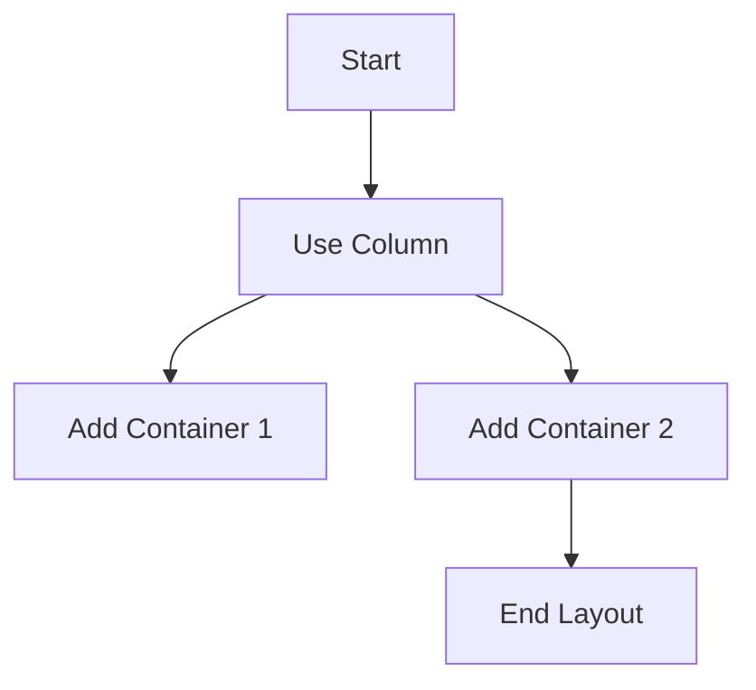

## 5.3.1 Layout Basics

Welcome to the exciting world of designing user interfaces with Flutter! In this section, we'll explore the basics of laying out widgets to create structured and organized user interfaces. Think of layout as arranging furniture in a room—it helps make your app look neat and easy to use. Let's dive in!

### Understanding Widgets

In Flutter, everything you see on the screen is a widget. Widgets are the basic building blocks for creating user interfaces. They can be simple, like a button or a piece of text, or complex, like an entire screen. By combining different widgets, you can create beautiful and functional apps.

### Using Containers

A `Container` is a versatile widget that can hold and style other widgets. It's like a box that you can decorate and use to organize your app's layout. You can change its color, size, and even add borders or shadows.

Here's a simple example of using a `Container`:

```dart
import 'package:flutter/material.dart';

void main() {
  runApp(LayoutExampleApp());
}

class LayoutExampleApp extends StatelessWidget {
  @override
  Widget build(BuildContext context) {
    return MaterialApp(
      home: Scaffold(
        appBar: AppBar(
          title: Text('Layout Basics'),
        ),
        body: Padding(
          padding: EdgeInsets.all(16.0),
          child: Column(
            children: [
              Container(
                padding: EdgeInsets.all(10),
                color: Colors.blueAccent,
                child: Text(
                  'Container 1',
                  style: TextStyle(color: Colors.white),
                ),
              ),
              SizedBox(height: 10),
              Container(
                padding: EdgeInsets.all(10),
                color: Colors.greenAccent,
                child: Text(
                  'Container 2',
                  style: TextStyle(color: Colors.black),
                ),
              ),
            ],
          ),
        ),
      ),
    );
  }
}
```

### Padding and Margins

Padding and margins are essential for creating space around widgets, making your layout look clean and organized. Padding is the space inside a widget, while margin is the space outside a widget.

In the code example above, we used `EdgeInsets.all(10)` to add padding inside the `Container`. You can experiment with different padding and margin values to see how they affect the layout.

### Alignment

Alignment is about positioning widgets within their parent containers. You can align widgets to the left, right, center, or any other position you like. This is similar to arranging toys or books on a shelf—each item has its place.

### Activity: Create Your Own Layout

Now it's your turn! Try creating a layout using different widgets like `Row`, `Column`, and `Container`. Organize text and images in a way that looks good to you. Remember, there's no right or wrong way—just have fun experimenting!

### Visualizing Layouts with Mermaid.js

To help you understand how layouts work, let's use a simple diagram to illustrate a basic layout structure:



This diagram shows a flow of creating a layout using a `Column` widget, adding two `Container` widgets, and completing the layout.

### Engagement and Experimentation

Encourage yourself to experiment with different layouts. Change the colors, sizes, and positions of widgets to see how these changes affect the overall appearance of your app. The more you practice, the better you'll become at designing beautiful user interfaces.

Remember, designing user interfaces is like art—it's all about creativity and expression. So, let your imagination run wild and create something amazing!

## Quiz Time!



### What is the primary purpose of a `Container` widget in Flutter?

- [x] To hold and style other widgets
- [ ] To perform mathematical calculations
- [ ] To manage app navigation
- [ ] To store user data

> **Explanation:** A `Container` widget is used to hold and style other widgets, acting like a box that can be decorated and organized within the app's layout.

### What is the difference between padding and margin in Flutter?

- [x] Padding is the space inside a widget, while margin is the space outside a widget.
- [ ] Padding is the space outside a widget, while margin is the space inside a widget.
- [ ] Padding and margin are the same.
- [ ] Padding is used for alignment, while margin is used for spacing.

> **Explanation:** Padding refers to the space inside a widget, while margin refers to the space outside a widget, affecting how widgets are spaced and aligned.

### Which widget is used to arrange widgets vertically in Flutter?

- [x] Column
- [ ] Row
- [ ] Stack
- [ ] ListView

> **Explanation:** A `Column` widget is used to arrange widgets vertically in Flutter, stacking them from top to bottom.

### How can you add space between two widgets in a `Column`?

- [x] Use a `SizedBox` with a specific height
- [ ] Use a `Row` widget
- [ ] Use a `Padding` widget
- [ ] Use a `Text` widget

> **Explanation:** A `SizedBox` with a specific height can be used to add space between two widgets in a `Column`, acting as a spacer.

### What does the `EdgeInsets.all(10)` do in a `Container` widget?

- [x] Adds 10 pixels of padding on all sides of the `Container`
- [ ] Adds 10 pixels of margin on all sides of the `Container`
- [ ] Sets the width of the `Container` to 10 pixels
- [ ] Sets the height of the `Container` to 10 pixels

> **Explanation:** `EdgeInsets.all(10)` adds 10 pixels of padding on all sides of the `Container`, creating space inside the widget.

### What is the role of the `Scaffold` widget in Flutter?

- [x] Provides a basic structure for the visual layout of the app
- [ ] Manages state in the app
- [ ] Handles network requests
- [ ] Stores user preferences

> **Explanation:** The `Scaffold` widget provides a basic structure for the visual layout of the app, including app bars, drawers, and body content.

### Which widget would you use to align a widget to the center of its parent?

- [x] Center
- [ ] Align
- [ ] Padding
- [ ] Container

> **Explanation:** The `Center` widget is used to align a widget to the center of its parent container, centering it both horizontally and vertically.

### What is the purpose of the `AppBar` widget in a Flutter app?

- [x] To provide a top navigation bar with a title and actions
- [ ] To display a list of items
- [ ] To manage user input
- [ ] To handle animations

> **Explanation:** The `AppBar` widget provides a top navigation bar with a title and actions, commonly used in the `Scaffold` widget.

### How can you change the color of a `Container` widget?

- [x] By setting the `color` property
- [ ] By using a `Padding` widget
- [ ] By changing the `Text` widget inside it
- [ ] By using a `Row` widget

> **Explanation:** The color of a `Container` widget can be changed by setting the `color` property, allowing you to customize its appearance.

### True or False: A `Row` widget arranges its children vertically.

- [ ] True
- [x] False

> **Explanation:** False. A `Row` widget arranges its children horizontally, from left to right.


