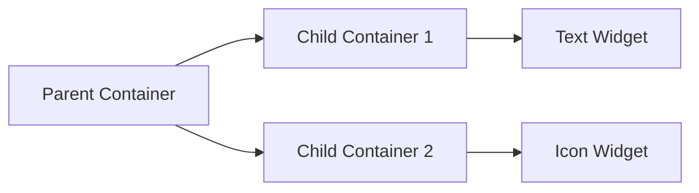

## 5.3.2 Using Containers

Welcome to the exciting world of Flutter UI design! In this section, we're going to explore how to use `Container` widgets to make your app's interface look amazing. Think of a `Container` as a magical box that can hold other widgets and make them look nice by adding colors, borders, and padding. Let's dive in and learn how to use these powerful tools to create stunning designs!

### What is a Container?

In Flutter, a `Container` is like a versatile box that you can use to group and style other widgets. It's one of the most commonly used widgets because it provides a lot of flexibility in designing your app's layout. You can think of it as a frame that can hold other widgets like text, images, or even other containers. With a `Container`, you can:

- **Change the background color** to make your widgets stand out.
- **Add borders and shadows** for a 3D effect.
- **Control the size** to fit your design needs.
- **Apply padding and margins** to space out your widgets.

### Key Concepts

#### Coloring Containers

One of the simplest ways to style a `Container` is by changing its background color. You can use the `color` property to set any color you like. Here's a quick example:

```dart
Container(
  color: Colors.blue,
  child: Text('Hello, Flutter!'),
)
```

In this example, the text "Hello, Flutter!" will appear on a blue background.

#### Styling with Borders and Shadows

You can make your containers look more interesting by adding borders and shadows. This is done using the `decoration` property with a `BoxDecoration`. Here's how you can add a border and a shadow:

```dart
Container(
  decoration: BoxDecoration(
    color: Colors.green,
    border: Border.all(color: Colors.black, width: 2),
    boxShadow: [
      BoxShadow(
        color: Colors.grey,
        blurRadius: 5.0,
        offset: Offset(2, 2),
      ),
    ],
  ),
  child: Text('Styled Container'),
)
```

This code creates a green container with a black border and a subtle shadow, giving it a lifted appearance.

#### Sizing Containers

You can control the size of a `Container` by setting its `width` and `height` properties. This is useful when you want your container to fit a specific area in your layout:

```dart
Container(
  width: 100,
  height: 100,
  color: Colors.red,
  child: Center(
    child: Text('Square'),
  ),
)
```

This creates a red square container with the text "Square" centered inside it.

#### Advanced Decoration with BoxDecoration

For more advanced styling, you can use `BoxDecoration` to add rounded corners, gradients, and more:

```dart
Container(
  width: 150,
  height: 150,
  decoration: BoxDecoration(
    color: Colors.orange,
    border: Border.all(color: Colors.black, width: 2),
    borderRadius: BorderRadius.circular(15),
    boxShadow: [
      BoxShadow(
        color: Colors.grey,
        blurRadius: 5.0,
        offset: Offset(2, 2),
      ),
    ],
  ),
  child: Center(
    child: Text(
      'Styled Container',
      style: TextStyle(color: Colors.white, fontSize: 18),
      textAlign: TextAlign.center,
    ),
  ),
)
```

This example shows how to create a container with rounded corners and a shadow, making it look like a button or badge.

### Code Example

Let's put everything together in a complete Flutter app example:

```dart
import 'package:flutter/material.dart';

void main() {
  runApp(ContainerExampleApp());
}

class ContainerExampleApp extends StatelessWidget {
  @override
  Widget build(BuildContext context) {
    return MaterialApp(
      home: Scaffold(
        appBar: AppBar(
          title: Text('Container Example'),
        ),
        body: Center(
          child: Container(
            width: 150,
            height: 150,
            decoration: BoxDecoration(
              color: Colors.orange,
              border: Border.all(color: Colors.black, width: 2),
              borderRadius: BorderRadius.circular(15),
              boxShadow: [
                BoxShadow(
                  color: Colors.grey,
                  blurRadius: 5.0,
                  offset: Offset(2, 2),
                ),
              ],
            ),
            child: Center(
              child: Text(
                'Styled Container',
                style: TextStyle(color: Colors.white, fontSize: 18),
                textAlign: TextAlign.center,
              ),
            ),
          ),
        ),
      ),
    );
  }
}
```

### Activity: Customize Your Container

Now it's your turn! Try modifying the container's properties to change its color, add borders, or adjust its size. You can even nest containers within each other for more complex designs. Here are some ideas to get you started:

- Change the background color to your favorite color.
- Add a thicker border and change its color.
- Make the container larger or smaller.
- Nest another container inside and style it differently.

### Visualizing Container Nesting

To help you understand how containers can be nested and styled, here's a simple diagram:



This diagram shows a parent container with two child containers inside it. Each child container can hold different widgets, like text or icons.

### Best Practices and Tips

- **Experiment with Colors:** Use different colors to see how they affect the look and feel of your app.
- **Play with Shadows:** Adding shadows can make your containers look more dynamic and interesting.
- **Keep It Simple:** Start with simple designs and gradually add more complexity as you become comfortable with the properties.

### Engagement: Design Your Own Styled Container

Challenge yourself to design your own styled container. Can you create a container that looks like a badge or a button? Use your creativity and the skills you've learned to make something unique!

## Quiz Time!



### What is a `Container` in Flutter?

- [x] A widget that can hold and style other widgets.
- [ ] A tool for debugging code.
- [ ] A type of data storage.
- [ ] A method for handling user input.

> **Explanation:** A `Container` is a versatile widget in Flutter used to group and style other widgets by adding colors, borders, and more.

### How can you change the background color of a `Container`?

- [x] By using the `color` property.
- [ ] By using the `text` property.
- [ ] By using the `size` property.
- [ ] By using the `font` property.

> **Explanation:** The `color` property of a `Container` is used to set its background color.

### What property is used to add a border to a `Container`?

- [x] `decoration`
- [ ] `padding`
- [ ] `alignment`
- [ ] `margin`

> **Explanation:** The `decoration` property, specifically with `BoxDecoration`, is used to add borders to a `Container`.

### Which property controls the size of a `Container`?

- [x] `width` and `height`
- [ ] `padding` and `margin`
- [ ] `color` and `alignment`
- [ ] `text` and `font`

> **Explanation:** The `width` and `height` properties are used to control the size of a `Container`.

### What does the `BoxDecoration` class allow you to do?

- [x] Add borders, shadows, and rounded corners.
- [ ] Change the text style.
- [ ] Handle user input.
- [ ] Store data.

> **Explanation:** `BoxDecoration` allows you to add borders, shadows, rounded corners, and other styling options to a `Container`.

### How can you add a shadow to a `Container`?

- [x] By using the `boxShadow` property in `BoxDecoration`.
- [ ] By using the `textShadow` property.
- [ ] By using the `alignment` property.
- [ ] By using the `margin` property.

> **Explanation:** The `boxShadow` property in `BoxDecoration` is used to add shadows to a `Container`.

### What is the purpose of nesting containers?

- [x] To create more complex designs by grouping widgets.
- [ ] To increase the app's performance.
- [ ] To store user data.
- [ ] To handle network requests.

> **Explanation:** Nesting containers allows you to create more complex designs by grouping and styling multiple widgets together.

### Which property would you use to round the corners of a `Container`?

- [x] `borderRadius`
- [ ] `padding`
- [ ] `alignment`
- [ ] `margin`

> **Explanation:** The `borderRadius` property in `BoxDecoration` is used to round the corners of a `Container`.

### Can a `Container` hold other widgets inside it?

- [x] True
- [ ] False

> **Explanation:** True, a `Container` can hold other widgets inside it, making it a versatile tool for layout design.

### What is a good practice when starting to design with containers?

- [x] Start with simple designs and gradually add complexity.
- [ ] Use as many colors as possible.
- [ ] Avoid using shadows.
- [ ] Ignore the size of the container.

> **Explanation:** It's best to start with simple designs and gradually add complexity as you become more comfortable with the properties and styling options.


