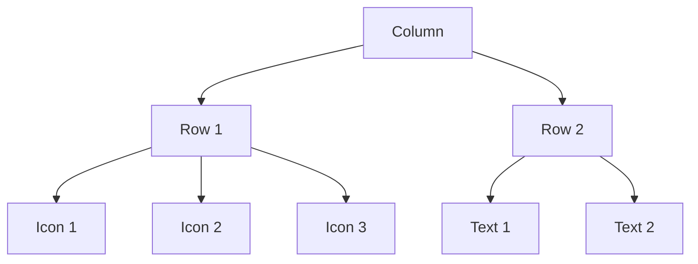

## 5.3.3 Rows and Columns

Welcome to the exciting world of designing user interfaces with Flutter! In this section, we'll explore two powerful tools that help you arrange widgets in your app: the `Row` and `Column` widgets. These widgets are like the building blocks of your app's layout, allowing you to organize content in a way that is both functional and visually appealing.

### Understanding Rows and Columns

Imagine you're organizing a photo album. You might place some pictures side by side in a row, while others are stacked on top of each other in a column. In Flutter, the `Row` widget lets you arrange widgets horizontally, just like placing items in a row. On the other hand, the `Column` widget stacks widgets vertically, similar to stacking books on a shelf.

#### Key Concepts

Before we dive into the code, let's understand some key concepts that will help you make the most of `Row` and `Column` widgets:

- **MainAxisAlignment:** This property controls how widgets are aligned along the main axis. For a `Row`, the main axis is horizontal, and for a `Column`, it's vertical. You can use it to space out widgets evenly, center them, or align them to one side.

- **CrossAxisAlignment:** This property controls the alignment along the cross axis, which is perpendicular to the main axis. For a `Row`, the cross axis is vertical, and for a `Column`, it's horizontal. It helps you align widgets at the start, center, or end of the cross axis.

- **Children Property:** Both `Row` and `Column` have a `children` property, which is a list of widgets you want to arrange. You can add as many widgets as you like inside a `Row` or `Column`.

### Code Example

Let's see how these concepts come together in a simple Flutter app. This example demonstrates how to use `Row` and `Column` widgets to create a neat layout with icons and text.

```dart
import 'package:flutter/material.dart';

void main() {
  runApp(RowColumnApp());
}

class RowColumnApp extends StatelessWidget {
  @override
  Widget build(BuildContext context) {
    return MaterialApp(
      home: Scaffold(
        appBar: AppBar(
          title: Text('Row and Column Example'),
        ),
        body: Padding(
          padding: EdgeInsets.all(16.0),
          child: Column(
            mainAxisAlignment: MainAxisAlignment.center,
            children: [
              Row(
                mainAxisAlignment: MainAxisAlignment.spaceAround,
                children: [
                  Icon(Icons.star, color: Colors.yellow, size: 40),
                  Icon(Icons.star, color: Colors.yellow, size: 40),
                  Icon(Icons.star, color: Colors.yellow, size: 40),
                ],
              ),
              SizedBox(height: 20),
              Column(
                children: [
                  Text('Top Text', style: TextStyle(fontSize: 20)),
                  SizedBox(height: 10),
                  Text('Bottom Text', style: TextStyle(fontSize: 20)),
                ],
              ),
            ],
          ),
        ),
      ),
    );
  }
}
```

#### Explanation of the Code

- **MaterialApp and Scaffold:** These widgets set up the basic structure of the app, including the app bar and body.
- **Padding:** Adds space around the `Column` to make the layout look nicer.
- **Column Widget:** The main container that stacks its children vertically.
  - **MainAxisAlignment.center:** Centers the children vertically within the `Column`.
- **Row Widget:** Arranges its children horizontally.
  - **MainAxisAlignment.spaceAround:** Evenly spaces the icons within the `Row`.
- **Icons and Text:** The content displayed in the `Row` and `Column`.

### Activity: Create Your Own Layout

Now it's your turn! Try creating a layout using both `Row` and `Column` widgets. You can arrange multiple icons or text widgets in different configurations. Experiment with different `MainAxisAlignment` and `CrossAxisAlignment` settings to see how they affect the layout.

### Visualizing Rows and Columns

To help you visualize how `Row` and `Column` widgets work together, here's a diagram showing their structure within the widget tree:



### Engage and Experiment

- **Symmetrical Layouts:** Try creating a symmetrical layout where widgets are evenly spaced.
- **Asymmetrical Layouts:** Experiment with asymmetrical layouts by using different alignments and spacings.
- **Creative Designs:** Use your creativity to design unique interfaces that reflect your style.

### Best Practices and Tips

- **Consistency:** Keep your layout consistent to make it easy for users to navigate.
- **Spacing:** Use `SizedBox` or `Padding` to add space between widgets for a cleaner look.
- **Alignment:** Experiment with different alignment options to achieve the desired visual effect.

By mastering `Row` and `Column` widgets, you're well on your way to creating beautiful and interactive user interfaces in Flutter. Keep experimenting and have fun designing your apps!

## Quiz Time!



### What does the `Row` widget do in Flutter?

- [x] Arranges widgets horizontally
- [ ] Arranges widgets vertically
- [ ] Stacks widgets on top of each other
- [ ] Aligns widgets to the center

> **Explanation:** The `Row` widget arranges its children horizontally, placing them side by side.

### What is the main axis for a `Column` widget?

- [ ] Horizontal
- [x] Vertical
- [ ] Diagonal
- [ ] Circular

> **Explanation:** The main axis for a `Column` widget is vertical, meaning it stacks its children from top to bottom.

### Which property controls the alignment of widgets along the main axis?

- [x] MainAxisAlignment
- [ ] CrossAxisAlignment
- [ ] Alignment
- [ ] Flex

> **Explanation:** The `MainAxisAlignment` property controls how widgets are aligned along the main axis.

### What does the `CrossAxisAlignment` property do?

- [ ] Aligns widgets along the main axis
- [x] Aligns widgets along the cross axis
- [ ] Spaces widgets evenly
- [ ] Centers widgets

> **Explanation:** The `CrossAxisAlignment` property controls the alignment of widgets along the cross axis, which is perpendicular to the main axis.

### How do you add multiple widgets inside a `Row` or `Column`?

- [x] Using the `children` property
- [ ] Using the `alignment` property
- [ ] Using the `padding` property
- [ ] Using the `flex` property

> **Explanation:** The `children` property is used to add multiple widgets inside a `Row` or `Column`.

### What does `MainAxisAlignment.spaceAround` do?

- [x] Spaces widgets evenly with space around them
- [ ] Aligns widgets to the start
- [ ] Aligns widgets to the end
- [ ] Centers widgets

> **Explanation:** `MainAxisAlignment.spaceAround` spaces the widgets evenly with equal space around them.

### Which widget would you use to add space between widgets?

- [x] SizedBox
- [ ] Container
- [ ] Align
- [ ] Flex

> **Explanation:** `SizedBox` is commonly used to add space between widgets.

### What is the purpose of the `Padding` widget?

- [x] Adds space around a widget
- [ ] Aligns a widget
- [ ] Changes the color of a widget
- [ ] Resizes a widget

> **Explanation:** The `Padding` widget adds space around a widget to separate it from other elements.

### Can you use both `Row` and `Column` widgets in the same layout?

- [x] Yes
- [ ] No

> **Explanation:** Yes, you can use both `Row` and `Column` widgets together to create complex layouts.

### True or False: The `Row` widget can only contain text widgets.

- [ ] True
- [x] False

> **Explanation:** False. The `Row` widget can contain any type of widgets, not just text.


