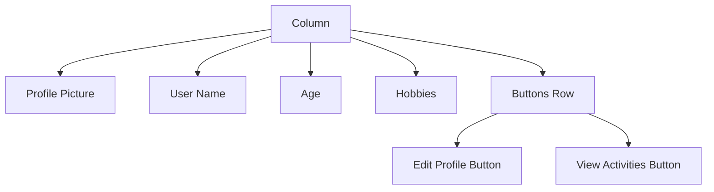

## 5.3.4 Building a Profile Page

Welcome to an exciting part of your Flutter journey where you'll learn to build a user profile page! A profile page is like a personal card that shows information about a user, such as their name, picture, and hobbies. It's a great way to apply your knowledge of layout, containers, rows, and columns. Let's dive in and create a simple yet stylish profile page!

### Understanding the Profile Page

A profile page is a common feature in many apps, from social media to games. It provides a snapshot of a user's identity and interests. Here's what we'll include in our profile page:

- **Profile Picture:** A visual representation of the user.
- **User Information:** Details like name, age, and hobbies.
- **Interactive Buttons:** Options to edit the profile or view activities.

### Key Concepts

Before we start coding, let's review some key concepts:

- **Profile Picture:** We'll use an `Image` widget to display a user's photo. This can be a fun way to personalize the page.
- **User Information:** `Text` widgets will help us show details like the user's name, age, and interests.
- **Layout Combination:** By combining `Row`, `Column`, and `Container` widgets, we can create an organized and visually appealing profile layout.

### Building the Profile Page

Let's create our profile page step by step. Below is a complete code example to guide you through the process:

```dart
import 'package:flutter/material.dart';

void main() {
  runApp(ProfilePageApp());
}

class ProfilePageApp extends StatelessWidget {
  @override
  Widget build(BuildContext context) {
    return MaterialApp(
      home: Scaffold(
        appBar: AppBar(
          title: Text('User Profile'),
        ),
        body: Padding(
          padding: EdgeInsets.all(16.0),
          child: Column(
            children: [
              CircleAvatar(
                radius: 50,
                backgroundImage: AssetImage('assets/images/profile.jpg'),
              ),
              SizedBox(height: 20),
              Text(
                'Alex Johnson',
                style: TextStyle(fontSize: 24, fontWeight: FontWeight.bold),
              ),
              SizedBox(height: 10),
              Text(
                'Age: 12',
                style: TextStyle(fontSize: 18),
              ),
              SizedBox(height: 10),
              Text(
                'Hobbies: Painting, Reading, Gaming',
                style: TextStyle(fontSize: 18),
                textAlign: TextAlign.center,
              ),
              SizedBox(height: 20),
              Row(
                mainAxisAlignment: MainAxisAlignment.spaceAround,
                children: [
                  ElevatedButton(
                    onPressed: () {},
                    child: Text('Edit Profile'),
                  ),
                  ElevatedButton(
                    onPressed: () {},
                    child: Text('View Activities'),
                  ),
                ],
              ),
            ],
          ),
        ),
      ),
    );
  }
}
```

**Note:** Make sure to add the profile image (`assets/images/profile.jpg`) to your project's assets folder.

### Code Breakdown

- **CircleAvatar:** This widget is used to display the profile picture in a circular frame. The `radius` property controls the size of the circle.
- **Text Widgets:** These are used to display the user's name, age, and hobbies. The `style` property allows us to customize the font size and weight.
- **Row and Column:** These widgets help us organize the layout. The `Column` widget stacks elements vertically, while the `Row` widget arranges them horizontally.
- **ElevatedButton:** These buttons provide interactive options for the user. You can add functionality to these buttons by defining actions in the `onPressed` property.

### Visualizing the Layout

To better understand the structure of our profile page, let's use a Mermaid.js diagram:



This diagram shows how each element is organized within the `Column` and `Row` widgets, creating a neat and structured layout.

### Activity: Customize Your Profile Page

Now it's your turn! Customize your profile page by:

- Changing the profile image to one of your choice.
- Adding more information, such as a favorite quote or a list of achievements.
- Styling the text and buttons with different colors and fonts.

### Encouragement and Engagement

Remember, your profile page is a reflection of you! Be creative and have fun with it. Once you're happy with your design, share your profile page with friends or family members. You can even add more personal touches and features as you become more comfortable with layout techniques.

### Best Practices and Tips

- **Consistency:** Keep your design consistent with similar styles and spacing.
- **Readability:** Ensure text is easy to read with appropriate font sizes and colors.
- **Experimentation:** Don't be afraid to try new layouts and styles. Experimentation is a great way to learn!

By building this profile page, you've taken another step towards mastering Flutter and creating interactive apps. Keep exploring and pushing the boundaries of your creativity!

## Quiz Time!



### What widget is used to display a circular profile picture?

- [x] CircleAvatar
- [ ] Image
- [ ] Container
- [ ] Column

> **Explanation:** The `CircleAvatar` widget is specifically designed to display images in a circular frame, making it perfect for profile pictures.

### Which widget is used to stack elements vertically?

- [ ] Row
- [x] Column
- [ ] Container
- [ ] Stack

> **Explanation:** The `Column` widget is used to stack elements vertically, while the `Row` widget arranges them horizontally.

### What property of the `Text` widget allows you to change the font size?

- [ ] color
- [x] style
- [ ] alignment
- [ ] padding

> **Explanation:** The `style` property of the `Text` widget allows you to customize the font size, weight, and other text attributes.

### How can you add functionality to a button in Flutter?

- [ ] By changing its color
- [ ] By using a `Text` widget
- [x] By defining an action in the `onPressed` property
- [ ] By using a `Column` widget

> **Explanation:** The `onPressed` property of a button widget is where you define the action that should occur when the button is pressed.

### What is the purpose of the `SizedBox` widget in the profile page layout?

- [ ] To display text
- [x] To add space between widgets
- [ ] To change the background color
- [ ] To align widgets

> **Explanation:** The `SizedBox` widget is used to add space between widgets, helping to create a clean and organized layout.

### Which widget is used to arrange elements horizontally?

- [x] Row
- [ ] Column
- [ ] Container
- [ ] Stack

> **Explanation:** The `Row` widget arranges elements horizontally, while the `Column` widget stacks them vertically.

### What is the main advantage of using a `Container` widget?

- [ ] It can only hold text
- [x] It can be used to add padding, margins, and background colors
- [ ] It automatically aligns widgets
- [ ] It is used for animations

> **Explanation:** The `Container` widget is versatile and can be used to add padding, margins, and background colors, making it useful for layout design.

### How can you make text bold in a `Text` widget?

- [ ] By using a `Row` widget
- [ ] By using a `Column` widget
- [x] By setting the `fontWeight` property in the `style`
- [ ] By using a `Container` widget

> **Explanation:** The `fontWeight` property in the `style` of a `Text` widget can be set to `FontWeight.bold` to make the text bold.

### What should you do if your profile image does not display?

- [ ] Ignore it
- [ ] Change the text color
- [x] Check if the image path is correct and the image is added to the assets
- [ ] Remove the `CircleAvatar` widget

> **Explanation:** If the profile image does not display, ensure that the image path is correct and that the image is included in the project's assets.

### True or False: The `ElevatedButton` widget can only be used for navigation.

- [ ] True
- [x] False

> **Explanation:** False. The `ElevatedButton` widget can be used for various actions, not just navigation. It can trigger any function defined in the `onPressed` property.


