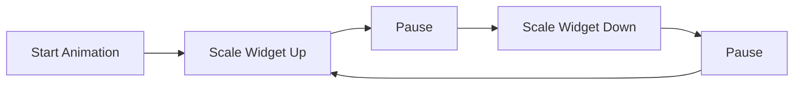

## 5.4.1 Introduction to Animation

Welcome to the exciting world of animations in Flutter! Animations are like magic spells that bring your apps to life, making them more dynamic and engaging. Just like in cartoons, where characters move and transform, animations in apps can make elements move, change colors, or transform smoothly. Let's dive into the basics of animations in Flutter and discover how you can use them to create lively and interactive apps.

### What Are Animations?

Animations are changes that happen over time. In the context of apps, animations can make a button grow when you tap it, a color change gradually, or a widget move across the screen. These movements and transformations make apps feel more responsive and fun to use.

### Key Concepts in Flutter Animations

#### Animated Widgets

Flutter provides a variety of widgets that have built-in animation capabilities. These are called animated widgets. One popular example is the `AnimatedContainer`, which can change its size, shape, color, and more over time. Animated widgets are a great way to start adding animations to your app without needing to manage the animation's timing manually.

#### Animation Controllers

An animation controller is like the conductor of an orchestra. It manages the timing and state of animations, ensuring that everything happens at the right moment. With an animation controller, you can start, stop, and reverse animations, giving you full control over how and when animations occur.

#### Transitions

Transitions are smooth changes between different states or properties of a widget. For example, you might transition a widget's position from one side of the screen to the other or change its opacity from fully visible to invisible. Transitions make these changes look smooth and natural.

### Code Example: Basic Animation in Flutter

Let's look at a simple example of how to create an animation in Flutter. We'll make a blue box grow and shrink continuously using an animation controller and a `ScaleTransition`.

```dart
import 'package:flutter/material.dart';

void main() {
  runApp(BasicAnimationApp());
}

class BasicAnimationApp extends StatefulWidget {
  @override
  _BasicAnimationAppState createState() => _BasicAnimationAppState();
}

class _BasicAnimationAppState extends State<BasicAnimationApp> with SingleTickerProviderStateMixin {
  late AnimationController _controller;
  late Animation<double> _animation;

  @override
  void initState() {
    super.initState();
    _controller = AnimationController(
      duration: Duration(seconds: 2),
      vsync: this,
    )..repeat(reverse: true);

    _animation = CurvedAnimation(parent: _controller, curve: Curves.easeInOut);
  }

  @override
  void dispose() {
    _controller.dispose();
    super.dispose();
  }

  @override
  Widget build(BuildContext context) {
    return MaterialApp(
      home: Scaffold(
        appBar: AppBar(
          title: Text('Basic Animation'),
        ),
        body: Center(
          child: ScaleTransition(
            scale: _animation,
            child: Container(
              width: 100,
              height: 100,
              color: Colors.blue,
            ),
          ),
        ),
      ),
    );
  }
}
```

#### How It Works:

- **AnimationController:** We create an `AnimationController` that runs for 2 seconds and repeats in reverse, making the animation go back and forth.
- **CurvedAnimation:** We use a `CurvedAnimation` to apply an easing curve (`Curves.easeInOut`) to the animation, making it smooth.
- **ScaleTransition:** This widget scales its child (the blue box) according to the animation value, making it grow and shrink.

### Activity: Create Your Own Animation

Now it's your turn! Try creating a simple animation where a box changes color over time. Use the `AnimatedContainer` widget to smoothly transition between different colors. Experiment with different durations and curves to see how they affect the animation.

### Visualizing Animation Flow

Here's a visual representation of the animation sequence using Mermaid.js:



This flowchart shows the cycle of our animation: the widget scales up, pauses, scales down, pauses, and repeats.

### Encouragement to Experiment

Animations can greatly enhance the interactivity and visual appeal of your apps. Don't be afraid to experiment with different types of animations. Try combining multiple animations, adjusting their timing, and exploring how they can make your app more engaging.

### Best Practices and Tips

- **Keep It Simple:** Start with simple animations and gradually add complexity as you become more comfortable.
- **Use Curves:** Curves like `Curves.easeInOut` can make animations feel more natural and less mechanical.
- **Test on Devices:** Animations may look different on various devices, so always test your animations on real hardware.

By adding animations to your apps, you can create experiences that are not only functional but also delightful and memorable. So, go ahead and bring your apps to life with the power of animations!

## Quiz Time!



### What is the main purpose of animations in apps?

- [x] To make apps more dynamic and engaging
- [ ] To increase the app's file size
- [ ] To make the app harder to use
- [ ] To slow down the app's performance

> **Explanation:** Animations are used to make apps more dynamic and engaging by adding movement and smooth transitions.

### Which widget is an example of an animated widget in Flutter?

- [x] AnimatedContainer
- [ ] Text
- [ ] Column
- [ ] Row

> **Explanation:** `AnimatedContainer` is an example of an animated widget that can change its properties over time.

### What does an animation controller do?

- [x] Manages the timing and state of animations
- [ ] Controls the app's layout
- [ ] Handles user input
- [ ] Manages network requests

> **Explanation:** An animation controller manages the timing and state of animations, allowing you to control when and how animations occur.

### What is a transition in the context of animations?

- [x] A smooth change between different states or properties
- [ ] A type of user input
- [ ] A network request
- [ ] A data storage method

> **Explanation:** A transition is a smooth change between different states or properties of a widget, making animations look natural.

### In the provided code example, what does the `ScaleTransition` widget do?

- [x] Scales its child widget according to the animation value
- [ ] Changes the color of its child widget
- [ ] Moves its child widget across the screen
- [ ] Rotates its child widget

> **Explanation:** The `ScaleTransition` widget scales its child widget based on the animation value, making it grow and shrink.

### What is the purpose of using `CurvedAnimation` in the code example?

- [x] To apply an easing curve to the animation
- [ ] To change the color of the animation
- [ ] To handle user input
- [ ] To manage network requests

> **Explanation:** `CurvedAnimation` is used to apply an easing curve to the animation, making it smooth and natural.

### What happens when you call `repeat(reverse: true)` on an `AnimationController`?

- [x] The animation repeats and reverses direction
- [ ] The animation stops immediately
- [ ] The animation speeds up
- [ ] The animation changes color

> **Explanation:** Calling `repeat(reverse: true)` makes the animation repeat and reverse direction, creating a back-and-forth effect.

### Which of the following is a benefit of using animations in apps?

- [x] Enhances user experience
- [ ] Increases app size
- [ ] Makes the app slower
- [ ] Complicates the code

> **Explanation:** Animations enhance user experience by making apps more engaging and interactive.

### What should you consider when testing animations on different devices?

- [x] Animations may look different on various devices
- [ ] Animations always look the same on all devices
- [ ] Animations are not affected by device performance
- [ ] Animations do not need testing on real hardware

> **Explanation:** Animations may look different on various devices, so it's important to test them on real hardware.

### True or False: Animations can only be used for visual effects and have no impact on user interaction.

- [ ] True
- [x] False

> **Explanation:** False. Animations can enhance user interaction by providing visual feedback and making the app more engaging.


