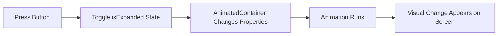

## 5.4.2 Animated Widgets

Welcome to the exciting world of animated widgets in Flutter! In this section, we'll explore how you can use Flutter's built-in animated widgets to add life and movement to your apps. Animations can make your apps more engaging and fun to use, and with Flutter, you don't need to write complex code to achieve beautiful effects.

### What Are Animated Widgets?

Animated widgets are special tools in Flutter that allow you to create animations easily. They are pre-built components that handle the animation logic for you, so you can focus on designing your app. With animated widgets, you can smoothly change the appearance and position of elements in your app, making it more dynamic and interactive.

### Key Concepts

Let's dive into some of the key animated widgets that Flutter offers:

#### AnimatedContainer

The `AnimatedContainer` widget is a powerful tool that automatically animates changes in its properties, such as size, color, and position. This means you can create smooth transitions without having to manually animate each property.

**Example:**

```dart
AnimatedContainer(
  width: isExpanded ? 200 : 100,
  height: isExpanded ? 200 : 100,
  color: isExpanded ? Colors.red : Colors.blue,
  alignment: isExpanded ? Alignment.center : AlignmentDirectional.topCenter,
  duration: Duration(seconds: 1),
  curve: Curves.easeInOut,
  child: FlutterLogo(size: 75),
)
```

In this example, the `AnimatedContainer` changes its size, color, and alignment when the `isExpanded` state changes. The transition happens over one second with an `easeInOut` curve, making the animation smooth and natural.

#### AnimatedOpacity

The `AnimatedOpacity` widget allows you to change the transparency of a widget smoothly. This is useful for fading elements in and out of view.

**Example:**

```dart
AnimatedOpacity(
  opacity: isVisible ? 1.0 : 0.0,
  duration: Duration(seconds: 1),
  child: FlutterLogo(size: 75),
)
```

Here, the `AnimatedOpacity` widget changes the opacity of the `FlutterLogo` based on the `isVisible` state. When `isVisible` is true, the logo is fully opaque; otherwise, it fades out.

#### AnimatedPositioned

The `AnimatedPositioned` widget is perfect for moving a widget to a new position with animation. It's often used within a `Stack` widget to animate the position of its children.

**Example:**

```dart
Stack(
  children: [
    AnimatedPositioned(
      left: isMoved ? 100 : 0,
      top: isMoved ? 100 : 0,
      duration: Duration(seconds: 1),
      curve: Curves.easeInOut,
      child: FlutterLogo(size: 75),
    ),
  ],
)
```

In this example, the `AnimatedPositioned` widget moves the `FlutterLogo` to a new position when the `isMoved` state changes.

#### Combining Animations

You can combine multiple animated widgets to create complex effects. For instance, you might use `AnimatedContainer` and `AnimatedOpacity` together to change both the size and transparency of a widget simultaneously.

### Code Example

Let's put these concepts into practice with a complete example:

```dart
import 'package:flutter/material.dart';

void main() {
  runApp(AnimatedWidgetsApp());
}

class AnimatedWidgetsApp extends StatefulWidget {
  @override
  _AnimatedWidgetsAppState createState() => _AnimatedWidgetsAppState();
}

class _AnimatedWidgetsAppState extends State<AnimatedWidgetsApp> {
  bool isExpanded = false;

  @override
  Widget build(BuildContext context) {
    return MaterialApp(
      home: Scaffold(
        appBar: AppBar(
          title: Text('Animated Widgets Example'),
        ),
        body: Center(
          child: Column(
            mainAxisAlignment: MainAxisAlignment.center,
            children: [
              AnimatedContainer(
                width: isExpanded ? 200 : 100,
                height: isExpanded ? 200 : 100,
                color: isExpanded ? Colors.red : Colors.blue,
                alignment: isExpanded ? Alignment.center : AlignmentDirectional.topCenter,
                duration: Duration(seconds: 1),
                curve: Curves.easeInOut,
                child: FlutterLogo(size: 75),
              ),
              SizedBox(height: 20),
              ElevatedButton(
                onPressed: () {
                  setState(() {
                    isExpanded = !isExpanded;
                  });
                },
                child: Text(isExpanded ? 'Shrink' : 'Expand'),
              ),
            ],
          ),
        ),
      ),
    );
  }
}
```

In this app, pressing the button toggles the `isExpanded` state, causing the `AnimatedContainer` to change its size, color, and alignment. The animation is smooth and visually appealing, thanks to the built-in capabilities of the `AnimatedContainer`.

### Activity: Create Your Own Animations

Now it's your turn! Try using different animated widgets to create interactive effects in your app. For example, you could use `AnimatedOpacity` to fade elements in and out or `AnimatedPositioned` to move them across the screen. Experiment with combining these widgets to see what creative animations you can come up with.

### Visualizing Animated Widgets

To help you understand how animated widgets work, here's a simple flowchart illustrating the process:



This flowchart shows the sequence of events when you press the button in our example app. The `isExpanded` state toggles, triggering the `AnimatedContainer` to change its properties, which results in an animation that you can see on the screen.

### Best Practices and Tips

- **Use Curves:** Flutter provides various animation curves like `Curves.easeInOut` to make animations feel more natural. Experiment with different curves to see how they affect the animation.
- **Keep It Simple:** Start with simple animations and gradually add complexity as you become more comfortable with the concepts.
- **Combine Widgets:** Don't hesitate to combine multiple animated widgets to achieve the desired effect. This can lead to more dynamic and engaging animations.

### Conclusion

Animated widgets are a fantastic way to bring your Flutter apps to life. By using these pre-built tools, you can create smooth and engaging animations without writing complex code. So go ahead, experiment with different widgets, and let your creativity shine!

## Quiz Time!



### What is the primary benefit of using animated widgets in Flutter?

- [x] They simplify the process of adding animations.
- [ ] They make the app run faster.
- [ ] They reduce the app's file size.
- [ ] They automatically fix bugs in the code.

> **Explanation:** Animated widgets simplify the process of adding animations by handling the animation logic for you.

### Which widget would you use to animate changes in size and color?

- [x] AnimatedContainer
- [ ] AnimatedOpacity
- [ ] AnimatedPositioned
- [ ] AnimatedBuilder

> **Explanation:** The `AnimatedContainer` widget is used to animate changes in properties like size and color.

### What does the `AnimatedOpacity` widget do?

- [x] It changes the transparency of a widget smoothly.
- [ ] It changes the position of a widget.
- [ ] It changes the size of a widget.
- [ ] It changes the color of a widget.

> **Explanation:** The `AnimatedOpacity` widget is used to change the transparency of a widget smoothly.

### How can you combine multiple animations in Flutter?

- [x] By using multiple animated widgets together.
- [ ] By writing complex animation code.
- [ ] By using a single animated widget.
- [ ] By using only the `AnimatedBuilder` widget.

> **Explanation:** You can combine multiple animations by using different animated widgets together.

### What is the purpose of using animation curves like `Curves.easeInOut`?

- [x] To make animations feel more natural.
- [ ] To speed up the animation.
- [ ] To make the animation longer.
- [ ] To change the color of the animation.

> **Explanation:** Animation curves like `Curves.easeInOut` are used to make animations feel more natural.

### Which widget is best for moving a widget to a new position with animation?

- [ ] AnimatedContainer
- [ ] AnimatedOpacity
- [x] AnimatedPositioned
- [ ] AnimatedBuilder

> **Explanation:** The `AnimatedPositioned` widget is used to move a widget to a new position with animation.

### What happens when you press the button in the provided code example?

- [x] The `isExpanded` state toggles, causing the `AnimatedContainer` to change its properties.
- [ ] The app crashes.
- [ ] The button disappears.
- [ ] The app closes.

> **Explanation:** Pressing the button toggles the `isExpanded` state, causing the `AnimatedContainer` to change its properties and animate.

### What is the role of the `duration` property in animated widgets?

- [x] It defines how long the animation takes to complete.
- [ ] It defines the size of the widget.
- [ ] It defines the color of the widget.
- [ ] It defines the position of the widget.

> **Explanation:** The `duration` property defines how long the animation takes to complete.

### Can you use animated widgets to create complex animations?

- [x] Yes, by combining multiple animated widgets.
- [ ] No, animated widgets are only for simple animations.
- [ ] Yes, but only with `AnimatedBuilder`.
- [ ] No, you need to write custom animation code.

> **Explanation:** You can create complex animations by combining multiple animated widgets.

### True or False: Animated widgets require complex code to implement.

- [ ] True
- [x] False

> **Explanation:** False. Animated widgets are designed to simplify the process of adding animations, requiring less complex code.


