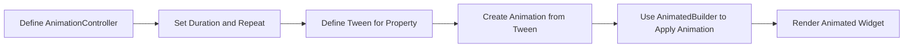

## 5.4.3 Creating Custom Animations

Welcome to the exciting world of custom animations in Flutter! In this section, we'll explore how to create your own animations, giving you the power to make your apps come alive with movement and color. Custom animations allow you to have more control and flexibility, enabling you to design unique effects tailored to your app's needs. Let's dive in!

### Understanding Custom Animations

Custom animations in Flutter are all about creating effects that are unique to your app. Whether it's a bouncing ball, a color-changing button, or a character that moves across the screen, custom animations can make your app more engaging and fun.

#### Key Concepts

Before we start coding, let's understand some key concepts:

- **AnimationController:** This is like the conductor of an orchestra. It manages the state and timing of your animations, telling them when to start, stop, and repeat.

- **Tween:** Think of a Tween as a bridge between two values. It defines the start and end values for your animations, such as moving from blue to red or from small to large.

- **CustomPainter:** This is used for drawing custom graphics. You can animate these graphics to create complex visual effects.

- **AnimationBuilder:** This helps you build animations dynamically, updating the UI as the animation progresses.

### Let's Code: Creating a Custom Animation

Now, let's create a simple custom animation using Flutter. We'll animate a square that changes its size and color over time.

```dart
import 'package:flutter/material.dart';

void main() {
  runApp(CustomAnimationApp());
}

class CustomAnimationApp extends StatefulWidget {
  @override
  _CustomAnimationAppState createState() => _CustomAnimationAppState();
}

class _CustomAnimationAppState extends State<CustomAnimationApp> with SingleTickerProviderStateMixin {
  late AnimationController _controller;
  late Animation<Color?> _colorAnimation;
  late Animation<double> _sizeAnimation;

  @override
  void initState() {
    super.initState();
    _controller = AnimationController(
      duration: Duration(seconds: 3),
      vsync: this,
    )..repeat(reverse: true);

    _colorAnimation = ColorTween(begin: Colors.blue, end: Colors.purple).animate(_controller);
    _sizeAnimation = Tween<double>(begin: 100, end: 200).animate(_controller);
  }

  @override
  void dispose() {
    _controller.dispose();
    super.dispose();
  }

  @override
  Widget build(BuildContext context) {
    return MaterialApp(
      home: Scaffold(
        appBar: AppBar(
          title: Text('Custom Animation Example'),
        ),
        body: Center(
          child: AnimatedBuilder(
            animation: _controller,
            builder: (context, child) {
              return Container(
                width: _sizeAnimation.value,
                height: _sizeAnimation.value,
                color: _colorAnimation.value,
              );
            },
          ),
        ),
      ),
    );
  }
}
```

#### Code Breakdown

1. **AnimationController:** We create an `AnimationController` to manage the animation's duration and repetition. It runs for 3 seconds and repeats in reverse.

2. **Tween:** We use a `ColorTween` to animate the color from blue to purple and a `Tween<double>` to animate the size from 100 to 200.

3. **AnimatedBuilder:** This widget listens to the animation and rebuilds the UI whenever the animation changes. It updates the size and color of the square.

### Activity: Experiment with Custom Animations

Now it's your turn! Try changing different properties like color, size, or position over time. Experiment with different tweens and animation curves to see how they affect the animation. Here are some ideas:

- Change the shape from a square to a circle.
- Animate the position to move the shape across the screen.
- Use different colors and sizes to create a rainbow effect.

### Visualizing the Animation Flow

To help you understand the flow of creating a custom animation, here's a visual representation using Mermaid.js:



### Best Practices and Tips

- **Start Simple:** Begin with simple animations and gradually add complexity as you become more comfortable.
- **Experiment:** Don't be afraid to try different values and see how they affect the animation.
- **Use Comments:** Comment your code to remember what each part does, especially when experimenting with different animations.
- **Test on Different Devices:** Animations can look different on various devices, so test your app on multiple screens.

### Engage Your Creativity

Think about how you can use custom animations to make your apps more dynamic. Could you animate characters in a game, create moving backgrounds, or highlight important information with animations? The possibilities are endless!

## Quiz Time!



### What is the role of an AnimationController in Flutter?

- [x] It manages the state and timing of animations.
- [ ] It defines the start and end values for animations.
- [ ] It draws custom graphics.
- [ ] It builds animations dynamically.

> **Explanation:** The AnimationController is responsible for managing the state and timing of animations, acting as the conductor for your animation's lifecycle.

### What does a Tween do in Flutter animations?

- [ ] It manages the state and timing of animations.
- [x] It defines the start and end values for animations.
- [ ] It draws custom graphics.
- [ ] It builds animations dynamically.

> **Explanation:** A Tween defines the start and end values for animations, acting as a bridge between these values.

### Which widget helps build animations dynamically in Flutter?

- [ ] AnimationController
- [ ] Tween
- [ ] CustomPainter
- [x] AnimatedBuilder

> **Explanation:** The AnimatedBuilder widget helps build animations dynamically by rebuilding the UI as the animation progresses.

### What is the purpose of using a CustomPainter in animations?

- [ ] To manage the state and timing of animations.
- [ ] To define the start and end values for animations.
- [x] To draw custom graphics.
- [ ] To build animations dynamically.

> **Explanation:** CustomPainter is used to draw custom graphics, which can be animated to create complex visual effects.

### How can you make an animation repeat in reverse?

- [x] By using the `repeat(reverse: true)` method on the AnimationController.
- [ ] By using a Tween.
- [ ] By using a CustomPainter.
- [ ] By using an AnimatedBuilder.

> **Explanation:** The `repeat(reverse: true)` method on the AnimationController makes the animation repeat in reverse.

### What is the benefit of using an AnimatedBuilder?

- [x] It rebuilds the UI whenever the animation changes.
- [ ] It manages the state and timing of animations.
- [ ] It defines the start and end values for animations.
- [ ] It draws custom graphics.

> **Explanation:** AnimatedBuilder rebuilds the UI whenever the animation changes, allowing for dynamic updates.

### Which of the following can be animated using a Tween?

- [x] Color
- [x] Size
- [ ] AnimationController
- [ ] CustomPainter

> **Explanation:** Tweens can animate properties like color and size by defining their start and end values.

### What should you do before adding complexity to your animations?

- [x] Start with simple animations.
- [ ] Use a CustomPainter.
- [ ] Avoid using comments.
- [ ] Test only on one device.

> **Explanation:** Starting with simple animations helps you understand the basics before adding complexity.

### How can you make your animations more engaging?

- [x] Experiment with different tweens and animation curves.
- [ ] Use only one color.
- [ ] Avoid testing on different devices.
- [ ] Use static widgets.

> **Explanation:** Experimenting with different tweens and animation curves can make your animations more engaging and dynamic.

### True or False: Custom animations allow for more control and flexibility in your app.

- [x] True
- [ ] False

> **Explanation:** Custom animations provide more control and flexibility, allowing you to design unique effects tailored to your app's needs.



By experimenting with custom animations, you're not only making your apps more dynamic but also enhancing your creativity and problem-solving skills. Keep exploring and have fun animating!
