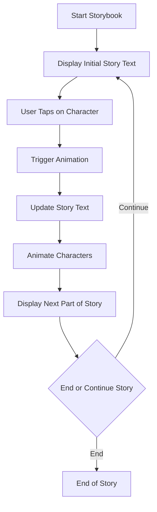

## 5.4.4 Mini Project: Animated Storybook

Welcome to the magical world of storytelling with code! In this mini project, you'll learn how to create an Animated Storybook app using Flutter. This app will bring stories to life with moving characters, dynamic scenes, and interactive elements that respond to user actions. Let's embark on this enchanting journey and see how we can make stories come alive!

### Objective

The goal of this project is to combine animations and user interactions to build an Animated Storybook app. You'll learn how to animate characters, change backgrounds, and create interactive elements that enhance the storytelling experience.

### Project Overview

Our Animated Storybook app will display a story with animated elements. You'll learn how to:

- Set up the user interface with text areas for the story and placeholders for animated characters and backgrounds.
- Use custom animations to make characters move, change expressions, or interact with the environment.
- Handle user interactions, allowing users to tap on elements to trigger animations.
- Integrate story text, displaying parts of the story sequentially and syncing with animations.
- Optionally, add audio effects or background music to enhance the storytelling experience.

### Step-by-Step Guide

#### 1. Set Up the UI

First, let's create a basic layout for our storybook. We'll need a page with areas for the story text and placeholders for our animated characters and backgrounds.

```dart
import 'package:flutter/material.dart';

void main() {
  runApp(AnimatedStorybookApp());
}

class AnimatedStorybookApp extends StatelessWidget {
  @override
  Widget build(BuildContext context) {
    return MaterialApp(
      home: Scaffold(
        appBar: AppBar(
          title: Text('Animated Storybook'),
        ),
        body: StoryPage(),
      ),
    );
  }
}

class StoryPage extends StatelessWidget {
  @override
  Widget build(BuildContext context) {
    return Padding(
      padding: EdgeInsets.all(16.0),
      child: Column(
        children: [
          Expanded(
            child: Placeholder(), // Placeholder for animated characters
          ),
          SizedBox(height: 20),
          Text(
            'Once upon a time...',
            style: TextStyle(fontSize: 24),
            textAlign: TextAlign.center,
          ),
          SizedBox(height: 20),
          ElevatedButton(
            onPressed: () {},
            child: Text('Next'),
          ),
        ],
      ),
    );
  }
}
```

#### 2. Animate Story Elements

Next, we'll add animations to our story elements. We'll use Flutter's `AnimationController` and `CurvedAnimation` to animate our characters.

```dart
class StoryPage extends StatefulWidget {
  @override
  _StoryPageState createState() => _StoryPageState();
}

class _StoryPageState extends State<StoryPage> with SingleTickerProviderStateMixin {
  late AnimationController _controller;
  late Animation<double> _animation;
  String storyText = 'Once upon a time...';

  @override
  void initState() {
    super.initState();
    _controller = AnimationController(
      duration: Duration(seconds: 2),
      vsync: this,
    )..addListener(() {
        setState(() {});
      });

    _animation = CurvedAnimation(parent: _controller, curve: Curves.easeIn);
  }

  @override
  void dispose() {
    _controller.dispose();
    super.dispose();
  }

  void animateCharacter() {
    _controller.forward(from: 0.0);
    setState(() {
      storyText = 'The brave knight approached the dragon!';
    });
  }

  @override
  Widget build(BuildContext context) {
    return Padding(
      padding: EdgeInsets.all(16.0),
      child: Column(
        children: [
          GestureDetector(
            onTap: animateCharacter,
            child: Stack(
              children: [
                Positioned(
                  left: _animation.value * 100,
                  top: 50,
                  child: Icon(Icons.person, size: 100, color: Colors.blue),
                ),
                Positioned(
                  right: _animation.value * 100,
                  top: 50,
                  child: Icon(Icons.local_fire_department, size: 100, color: Colors.red),
                ),
              ],
            ),
          ),
          SizedBox(height: 20),
          Text(
            storyText,
            style: TextStyle(fontSize: 24),
            textAlign: TextAlign.center,
          ),
          SizedBox(height: 20),
          ElevatedButton(
            onPressed: () {
              setState(() {
                storyText = 'Once upon a time...';
              });
            },
            child: Text('Restart Story'),
          ),
        ],
      ),
    );
  }
}
```

#### 3. Handle User Interactions

Allow users to interact with the story by tapping on elements to trigger animations. In our example, tapping the characters will animate them and update the story text.

#### 4. Integrate Story Text

Sync the story text with the animations to create a cohesive storytelling experience. As characters move, update the story text to reflect the action.

#### 5. Add Audio (Optional)

Enhance the storytelling experience by adding sound effects or background music. You can use the `audioplayers` package to play audio files in your app.

### Visuals

Here's a flowchart outlining the flow of the Animated Storybook app:



### Engagement

Encourage kids to create their own stories with unique characters and animations. This project not only teaches coding skills but also fosters creativity and narrative skills. Suggest sharing their Animated Storybook with friends and family to showcase their work.

### Conclusion

Congratulations! You've built an Animated Storybook app that brings stories to life with animations and user interactions. This project is a great way to combine coding with creativity, and we hope it inspires you to create even more magical stories.

## Quiz Time!



### What is the main objective of the Animated Storybook project?

- [x] To combine animations and user interactions to build an engaging storybook app.
- [ ] To create a static storybook with no animations.
- [ ] To learn about database integration in Flutter.
- [ ] To develop a multiplayer game.

> **Explanation:** The main objective is to combine animations and user interactions to create an engaging storybook app.

### Which Flutter widget is used to create animations in the example?

- [x] AnimationController
- [ ] ListView
- [ ] GridView
- [ ] StreamBuilder

> **Explanation:** AnimationController is used to create animations in the example.

### What happens when the user taps on the character in the storybook?

- [x] The character animates and the story text updates.
- [ ] The app closes.
- [ ] The character changes color.
- [ ] Nothing happens.

> **Explanation:** When the user taps on the character, it animates and the story text updates.

### What is the purpose of the `CurvedAnimation` in the code?

- [x] To apply a curve to the animation for smoother transitions.
- [ ] To change the color of the animation.
- [ ] To stop the animation.
- [ ] To make the animation faster.

> **Explanation:** CurvedAnimation is used to apply a curve to the animation for smoother transitions.

### How can you enhance the storytelling experience in the app?

- [x] By adding sound effects or background music.
- [ ] By removing all animations.
- [ ] By using only black and white colors.
- [ ] By making the text smaller.

> **Explanation:** Adding sound effects or background music can enhance the storytelling experience.

### What is the role of the `GestureDetector` in the app?

- [x] To detect user taps and trigger animations.
- [ ] To display images.
- [ ] To manage app state.
- [ ] To handle network requests.

> **Explanation:** GestureDetector is used to detect user taps and trigger animations.

### What does the `setState` function do in the Flutter app?

- [x] It updates the UI by rebuilding the widget tree.
- [ ] It saves data to a database.
- [ ] It sends data to a server.
- [ ] It closes the app.

> **Explanation:** setState updates the UI by rebuilding the widget tree.

### What is the initial story text in the example app?

- [x] "Once upon a time..."
- [ ] "The end."
- [ ] "Hello, World!"
- [ ] "Welcome to Flutter."

> **Explanation:** The initial story text is "Once upon a time..."

### Which package can be used to add audio to the Flutter app?

- [x] audioplayers
- [ ] http
- [ ] provider
- [ ] shared_preferences

> **Explanation:** The audioplayers package can be used to add audio to the Flutter app.

### True or False: The Animated Storybook app can only display static images.

- [ ] True
- [x] False

> **Explanation:** False. The Animated Storybook app can display animated elements, not just static images.


