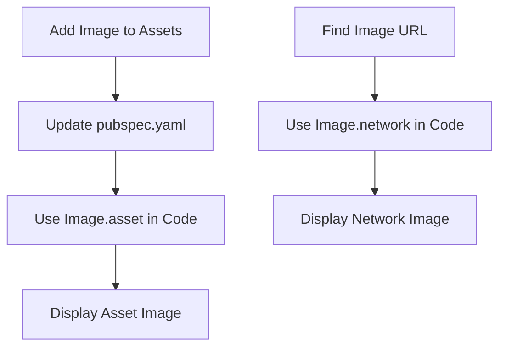

## 6.1.1 Displaying Images

Welcome to the exciting world of images in Flutter! In this section, we'll explore how to make your apps visually appealing by displaying images. Whether it's a logo, a background, or a character, images can bring your app to life. Let's dive in!

### Understanding the Image Widget

The `Image` widget is your go-to tool for displaying images in Flutter. Think of it as a picture frame that holds your image, ready to be shown to the world. You can use images for various purposes, like creating logos, setting backgrounds, or adding characters to your app.

### Key Concepts

#### Image Widget

The `Image` widget is the basic building block for displaying images in Flutter. It can show images from different sources, such as:

- **Asset Images:** These are images stored locally within your app's project directory. They're like books in a library that you can access anytime.
- **Network Images:** These are images fetched from the internet using URLs. Imagine them as pictures you see online.

### Code Example

Let's look at a simple example of how to display both asset and network images in a Flutter app.

```dart
import 'package:flutter/material.dart';

void main() {
  runApp(DisplayImageApp());
}

class DisplayImageApp extends StatelessWidget {
  @override
  Widget build(BuildContext context) {
    return MaterialApp(
      home: Scaffold(
        appBar: AppBar(
          title: Text('Display Images'),
        ),
        body: Center(
          child: Column(
            mainAxisAlignment: MainAxisAlignment.center,
            children: [
              Image.asset('assets/images/flutter_logo.png'),
              SizedBox(height: 20),
              Image.network('https://flutter.dev/assets/homepage/carousel/slide_1-bg-opaque-3b7aadf34934b3eab66a07da4ef9e427cdefdb7c7e5f3f3e3706d6ce0c3fb557.jpg'),
            ],
          ),
        ),
      ),
    );
  }
}
```

### Activity: Adding and Displaying Images

#### 1. Add Asset Image

To add an asset image, follow these steps:

1. **Download an Image:** Find an image you like and download it. Save it in the `assets/images` directory of your Flutter project.

2. **Update `pubspec.yaml`:** Open the `pubspec.yaml` file and add your image to the assets section. This tells Flutter where to find your image.

   ```yaml
   flutter:
     assets:
       - assets/images/flutter_logo.png
   ```

3. **Use `Image.asset`:** In your code, use the `Image.asset` widget to display the image.

#### 2. Display Network Image

To display a network image, you can use the `Image.network` widget. Here's how:

1. **Choose an Image URL:** Find an image online that you want to display. Copy its URL.

2. **Use `Image.network`:** In your code, use the `Image.network` widget with the URL to display the image.

### Visuals: Asset vs. Network Images

Let's visualize the process of displaying asset and network images with a flowchart:



### Language and Engagement

When explaining these concepts, think of asset images as books in a library that you can always access, and network images as pictures you see online. Encourage kids to personalize their apps by adding images of their favorite characters, pets, or hobbies. This makes the learning process fun and engaging!

### Best Practices and Tips

- **Organize Your Assets:** Keep your images organized in the `assets` directory. This makes it easier to manage and find them.
- **Optimize Image Sizes:** Use appropriately sized images to ensure your app runs smoothly and loads quickly.
- **Test Network Images:** Make sure the URLs for network images are correct and accessible.

### Common Pitfalls

- **Forgetting to Update `pubspec.yaml`:** If your asset image isn't showing, check that you've added it to the `pubspec.yaml` file.
- **Incorrect Image Paths:** Double-check the file paths for asset images to ensure they're correct.
- **Network Issues:** If a network image isn't loading, verify the URL and your internet connection.

### Encouragement

Remember, coding is a journey, and every step you take brings you closer to becoming a skilled developer. Don't be afraid to experiment with different images and styles. Your creativity is your superpower!

## Quiz Time!



### What is the primary widget used to display images in Flutter?

- [x] Image
- [ ] Text
- [ ] Button
- [ ] Container

> **Explanation:** The `Image` widget is used to display images in Flutter.

### What are asset images?

- [x] Images stored locally within the app's project directory
- [ ] Images fetched from the internet
- [ ] Images created dynamically
- [ ] Images stored in the cloud

> **Explanation:** Asset images are stored locally within the app's project directory.

### How do you display an image from the internet in Flutter?

- [ ] Image.asset
- [x] Image.network
- [ ] Image.file
- [ ] Image.memory

> **Explanation:** The `Image.network` widget is used to display images from the internet.

### What file must be updated to include asset images in a Flutter project?

- [ ] main.dart
- [x] pubspec.yaml
- [ ] index.html
- [ ] styles.css

> **Explanation:** The `pubspec.yaml` file must be updated to include asset images.

### Which widget is used to display an asset image?

- [x] Image.asset
- [ ] Image.network
- [ ] Image.file
- [ ] Image.memory

> **Explanation:** The `Image.asset` widget is used to display asset images.

### What should you do if a network image isn't loading?

- [x] Check the URL and internet connection
- [ ] Restart the app
- [ ] Change the image format
- [ ] Update the pubspec.yaml file

> **Explanation:** If a network image isn't loading, check the URL and your internet connection.

### What analogy is used to describe asset images?

- [x] Books in a library
- [ ] Pictures on a wall
- [ ] Videos on a screen
- [ ] Songs in a playlist

> **Explanation:** Asset images are compared to books in a library because they are stored locally and easily accessible.

### What is a common mistake when adding asset images?

- [x] Forgetting to update the pubspec.yaml file
- [ ] Using the wrong image format
- [ ] Placing images in the wrong directory
- [ ] Using too many images

> **Explanation:** A common mistake is forgetting to update the `pubspec.yaml` file to include asset images.

### What is the purpose of the `SizedBox` widget in the code example?

- [x] To add space between images
- [ ] To display an image
- [ ] To change the image size
- [ ] To align images

> **Explanation:** The `SizedBox` widget is used to add space between images.

### True or False: Network images are always stored locally in the app.

- [ ] True
- [x] False

> **Explanation:** Network images are fetched from the internet and not stored locally in the app.


