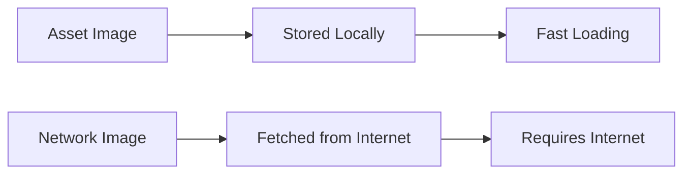

## 6.1.2 Image Sources in Flutter

In the world of app development, images play a crucial role in enhancing the visual appeal and user experience. Flutter, a popular framework for building cross-platform apps, provides robust support for displaying images. In this section, we'll explore the two primary sources of images in Flutter: asset images and network images. Understanding these concepts will help you decide which type of image to use in different scenarios, making your apps both efficient and visually engaging.

### Understanding Image Sources

Images in Flutter can be sourced from two main places:

1. **Asset Images**: These are images stored locally within your app's project directory. They are bundled with the app when it's built, making them readily available without needing an internet connection.

2. **Network Images**: These images are fetched from the internet using URLs. They are ideal for displaying dynamic content that might change or update frequently.

Let's dive deeper into each type and see how they can be used effectively in your Flutter apps.

### Asset Images

Asset images are like books on a shelf in your room. They're always there, ready to be used whenever you need them. Here are some key points about asset images:

- **Stored Locally**: Asset images are part of your app's project files. This means they are included in the app package when you build your app.
- **Faster Loading**: Since asset images are stored locally, they load quickly without any delay, making them perfect for static images like logos, icons, and backgrounds.
- **No Internet Required**: Asset images do not require an internet connection, ensuring they are always available to the user.

#### How to Use Asset Images

To use an asset image in your Flutter app, follow these steps:

1. **Add the Image to Your Project**: Place your image file in the `assets/images` directory of your project. If this directory doesn't exist, you can create it.

2. **Update `pubspec.yaml`**: You need to inform Flutter about the assets you're using. Open the `pubspec.yaml` file and add the following lines:

   ```yaml
   flutter:
     assets:
       - assets/images/my_picture.png
   ```

3. **Display the Image**: Use the `Image.asset` widget to display the image in your app:

   ```dart
   Image.asset('assets/images/my_picture.png'),
   ```

### Network Images

Network images are like books in a library. You can access them whenever you have an internet connection, and they can be updated or changed by the library (or server) at any time. Here are some key points about network images:

- **Fetched from the Internet**: Network images are not stored locally. They are retrieved from a server using a URL.
- **Dynamic Content**: Ideal for content that changes frequently, such as user-generated content or images from an online database.
- **Requires Internet**: Since these images are fetched from the internet, they require an active internet connection to be displayed.

#### How to Use Network Images

To use a network image in your Flutter app, follow these steps:

1. **Choose an Image URL**: Find the URL of the image you want to display. This could be from an online image repository or your own server.

2. **Display the Image**: Use the `Image.network` widget to display the image in your app:

   ```dart
   Image.network('https://example.com/path/to/image.jpg'),
   ```

### Practical Activity

Let's put this knowledge into practice with a fun activity!

#### Activity: Displaying Asset and Network Images

1. **Asset Image**:
   - Add a new image to the `assets/images` directory.
   - Update your `pubspec.yaml` file to include this image.
   - Use `Image.asset` to display the image in your app.

2. **Network Image**:
   - Choose a different image URL from the internet.
   - Use `Image.network` to display this image alongside your asset image.

By completing this activity, you'll gain hands-on experience with both asset and network images, understanding their setup and usage in Flutter.

### Visual Comparison

To help visualize the differences between asset and network images, here's a simple diagram:



### Making the Right Choice

When deciding which type of image to use, consider the following:

- **Use Asset Images** for static content that doesn't change, such as app logos or icons.
- **Use Network Images** for dynamic content that updates regularly, like user profiles or online galleries.

### Conclusion

Understanding the differences between asset and network images allows you to make informed decisions about how to manage and display images in your Flutter apps. By choosing the right type of image for each scenario, you can optimize your app's performance and user experience.

### Engagement and Reflection

Think about the app you're building or planning to build. Where would you use asset images, and where would network images be more appropriate? This decision-making process is a crucial skill in app development, helping you create efficient and user-friendly applications.

## Quiz Time!



### What is an asset image in Flutter?

- [x] An image stored locally within the app's project directory.
- [ ] An image fetched from the internet.
- [ ] An image that requires an internet connection to display.
- [ ] An image that changes frequently.

> **Explanation:** Asset images are stored locally within the app's project directory and do not require an internet connection to display.

### What is a network image in Flutter?

- [ ] An image stored locally within the app's project directory.
- [x] An image fetched from the internet.
- [ ] An image that does not require an internet connection to display.
- [ ] An image that is always static.

> **Explanation:** Network images are fetched from the internet using URLs and require an internet connection to display.

### Which of the following is a benefit of using asset images?

- [x] Faster loading since they are bundled with the app.
- [ ] They can be updated frequently without changing the app.
- [ ] They require an internet connection.
- [ ] They are ideal for dynamic content.

> **Explanation:** Asset images are bundled with the app, leading to faster loading times and no need for an internet connection.

### Which of the following is a benefit of using network images?

- [ ] Faster loading since they are bundled with the app.
- [x] They can be updated frequently without changing the app.
- [ ] They do not require an internet connection.
- [ ] They are ideal for static content.

> **Explanation:** Network images can be updated frequently without changing the app, making them ideal for dynamic content.

### How do you display an asset image in Flutter?

- [x] Use the `Image.asset` widget.
- [ ] Use the `Image.network` widget.
- [ ] Use the `Image.local` widget.
- [ ] Use the `Image.dynamic` widget.

> **Explanation:** The `Image.asset` widget is used to display asset images stored locally within the app's project directory.

### How do you display a network image in Flutter?

- [ ] Use the `Image.asset` widget.
- [x] Use the `Image.network` widget.
- [ ] Use the `Image.local` widget.
- [ ] Use the `Image.dynamic` widget.

> **Explanation:** The `Image.network` widget is used to display images fetched from the internet using URLs.

### What must you do before using an asset image in your Flutter app?

- [x] Add the image to the `assets/images` directory and update `pubspec.yaml`.
- [ ] Just add the image to the `assets/images` directory.
- [ ] Just update `pubspec.yaml`.
- [ ] No additional steps are needed.

> **Explanation:** You must add the image to the `assets/images` directory and update the `pubspec.yaml` file to inform Flutter about the asset.

### What is required to display a network image?

- [ ] No internet connection is needed.
- [x] An active internet connection is needed.
- [ ] The image must be stored locally.
- [ ] The image must be included in `pubspec.yaml`.

> **Explanation:** An active internet connection is needed to fetch and display network images from the internet.

### Which type of image is best for app logos?

- [x] Asset images
- [ ] Network images
- [ ] Both asset and network images
- [ ] Neither asset nor network images

> **Explanation:** Asset images are best for app logos because they are static and do not require an internet connection.

### True or False: Network images are always faster to load than asset images.

- [ ] True
- [x] False

> **Explanation:** Network images are not always faster to load than asset images. Asset images are stored locally and load faster, whereas network images depend on internet speed and connectivity.


