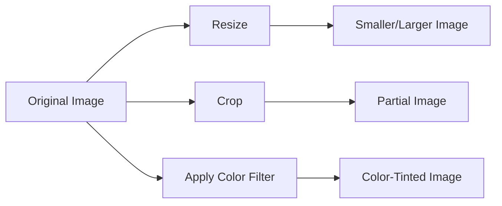

## 6.1.3 Image Manipulation

Welcome to the exciting world of image manipulation in Flutter! In this section, we'll explore how to resize, crop, and apply filters to images, making them fit perfectly into your app's design and enhancing their visual appeal. Let's dive in and learn how to transform images creatively!

### Why Manipulate Images?

Manipulating images allows you to customize how they appear in your app. Whether you want to resize an image to fit a specific space, crop it to focus on a particular part, or apply filters to change its mood, these techniques can significantly enhance the user experience.

### Key Concepts

#### Resizing Images

Resizing involves changing the dimensions of an image. This can be useful when you need an image to fit within a specific area of your app. In Flutter, you can easily resize images by adjusting their width and height properties.

#### Cropping Images

Cropping allows you to display only a portion of an image. This technique is handy when you want to focus on a specific part of an image or fit it into a particular shape.

#### Applying Filters

Filters can alter the appearance of an image by changing its colors or adding effects. This can be used to create a specific mood or highlight certain elements within the image.

### Code Example

Let's look at some code snippets that demonstrate these image manipulation techniques in Flutter.

```dart
// Resizing Image
Image.asset(
  'assets/images/flutter_logo.png',
  width: 100,
  height: 100,
),

// Cropping Image using ClipRect
ClipRect(
  child: Align(
    alignment: Alignment.topCenter,
    heightFactor: 0.5,
    child: Image.asset('assets/images/flutter_logo.png'),
  ),
),

// Applying Color Filter
ColorFiltered(
  colorFilter: ColorFilter.mode(Colors.red, BlendMode.modulate),
  child: Image.asset('assets/images/flutter_logo.png'),
),
```

### Activity

Let's put these concepts into practice with some fun activities!

1. **Resize an Image:** Change the width and height of an image to see how it affects its display. Try making it smaller or larger and observe the differences.

2. **Crop an Image:** Use `ClipRect` and `Align` to show only part of an image. Experiment with different alignments and height factors to see how you can focus on different parts of the image.

3. **Apply a Color Filter:** Experiment with different colors and blend modes to alter the image’s appearance. Try using different colors to see how they change the mood of the image.

### Visuals

To better understand these techniques, let's look at a diagram that illustrates each manipulation method.



### Real-Life Scenarios

Think of resizing an image like adjusting a photo to fit into a frame. Cropping is like cutting out a part of a picture to focus on what's important. Applying filters is similar to using Instagram filters to change the look and feel of your photos.

### Encouragement and Creativity

Now it's your turn to get creative! Use these techniques to create unique variations of your images. Try combining resizing, cropping, and filters to see what interesting effects you can achieve. Remember, the only limit is your imagination!

## Quiz Time!



### What is the purpose of resizing an image in Flutter?

- [x] To adjust the image's dimensions to fit a specific space
- [ ] To change the image's color
- [ ] To rotate the image
- [ ] To add text to the image

> **Explanation:** Resizing an image changes its width and height to fit a specific area in your app.

### Which Flutter widget is used for cropping images?

- [ ] ColorFiltered
- [ ] Image.asset
- [x] ClipRect
- [ ] Container

> **Explanation:** `ClipRect` is used to crop images by displaying only a portion of them.

### What does applying a color filter to an image do?

- [ ] Changes the image's size
- [x] Alters the image's appearance by changing its colors
- [ ] Crops the image
- [ ] Rotates the image

> **Explanation:** Applying a color filter changes the image's appearance by modifying its colors.

### In the provided code example, what does the `Align` widget do?

- [x] Aligns the child widget within its parent
- [ ] Resizes the image
- [ ] Applies a color filter
- [ ] Crops the image

> **Explanation:** The `Align` widget positions its child widget within its parent, which can be used to crop images.

### How can you make an image appear red-tinted in Flutter?

- [x] Use `ColorFiltered` with a red color filter
- [ ] Use `ClipRect` with a red background
- [ ] Resize the image to a smaller size
- [ ] Rotate the image by 90 degrees

> **Explanation:** Using `ColorFiltered` with a red color filter will tint the image red.

### What is the result of setting `heightFactor` to 0.5 in `Align`?

- [x] Displays only half of the image vertically
- [ ] Displays the entire image
- [ ] Changes the image's color
- [ ] Rotates the image

> **Explanation:** Setting `heightFactor` to 0.5 in `Align` displays only half of the image vertically.

### Which widget is used to display images in Flutter?

- [ ] ClipRect
- [x] Image.asset
- [ ] ColorFiltered
- [ ] Container

> **Explanation:** `Image.asset` is used to display images stored in the app's assets.

### What happens if you set both width and height to 100 in `Image.asset`?

- [x] The image is resized to 100x100 pixels
- [ ] The image is cropped to 100x100 pixels
- [ ] The image is rotated by 100 degrees
- [ ] The image's color is changed

> **Explanation:** Setting both width and height to 100 resizes the image to 100x100 pixels.

### What is the purpose of using `BlendMode.modulate` in `ColorFiltered`?

- [x] To blend the color filter with the image
- [ ] To resize the image
- [ ] To crop the image
- [ ] To rotate the image

> **Explanation:** `BlendMode.modulate` blends the color filter with the image, altering its appearance.

### True or False: Cropping an image always requires changing its dimensions.

- [ ] True
- [x] False

> **Explanation:** Cropping an image involves displaying only a part of it, which doesn't necessarily change its dimensions.


