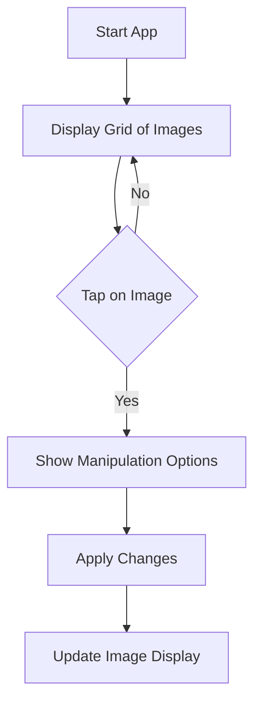

## 6.1.4 Photo Gallery App

Welcome to the exciting world of creating your very own Photo Gallery app using Flutter! In this section, we'll guide you through building an app that displays a collection of images, allowing you to view, resize, crop, and even apply filters to your photos. This project will help you put into practice everything you've learned about working with images in Flutter. Let's dive in!

### Project Overview

Our goal is to create a Photo Gallery app where users can view a series of images in a grid or scrollable view. We'll also add some fun features that let users interact with the images, such as resizing, cropping, and applying filters. This project will be a great way to showcase your creativity and coding skills!

### Step-by-Step Guide

#### 1. Set Up the UI

To start, we'll set up the user interface (UI) of our app. We'll use Flutter widgets like `GridView` or `ListView` to display multiple images in a neat and organized manner.

#### 2. Import Images

Before we can display images, we need to add them to our project. Follow these steps:

- Create a folder named `assets/images` in your project directory.
- Add several images to this folder. You can use personal photos or download some themed images online.
- Update your `pubspec.yaml` file to include the assets:

  ```yaml
  flutter:
    assets:
      - assets/images/photo1.png
      - assets/images/photo2.png
      - assets/images/photo3.png
      - assets/images/photo4.png
  ```

#### 3. Display Images in a Grid

Now, let's display the images in a grid format using `GridView.builder`. This widget allows us to create a grid layout for our images.

```dart
import 'package:flutter/material.dart';

void main() {
  runApp(PhotoGalleryApp());
}

class PhotoGalleryApp extends StatelessWidget {
  final List<String> images = [
    'assets/images/photo1.png',
    'assets/images/photo2.png',
    'assets/images/photo3.png',
    'assets/images/photo4.png',
  ];
  
  @override
  Widget build(BuildContext context) {
    return MaterialApp(
      home: Scaffold(
        appBar: AppBar(
          title: Text('Photo Gallery'),
        ),
        body: GridView.builder(
          gridDelegate: SliverGridDelegateWithFixedCrossAxisCount(crossAxisCount: 2),
          itemCount: images.length,
          itemBuilder: (context, index) {
            return GestureDetector(
              onTap: () {
                // Implement image manipulation options here
              },
              child: Image.asset(images[index], fit: BoxFit.cover),
            );
          },
        ),
      ),
    );
  }
}
```

#### 4. Add Image Manipulation Options

To make our app interactive, we'll allow users to tap on an image to see options for resizing, cropping, or applying filters. You can use dialogs or navigate to new screens to apply these changes.

#### 5. Implement Interactions

Here's how you can implement basic interactions:

- **Resizing:** Use a slider to adjust the size of the image.
- **Cropping:** Allow users to select a portion of the image to crop.
- **Filters:** Apply different color filters to change the look of the image.

### Activity

To make your Photo Gallery app even more engaging, try adding these features:

1. **Swipe Navigation:** Allow users to swipe between images for a smooth browsing experience.
2. **Image Details:** Display information about each image, such as a title or the date it was taken.
3. **Manipulation Features:** Add buttons or gestures to manipulate images directly within the gallery.

### Visuals

Here's a flowchart outlining the structure of our Photo Gallery app:



### Language and Engagement

Remember, coding is all about creativity and fun! As you build your Photo Gallery app, think about how you can make it unique. Maybe you want to curate a collection of your favorite animal photos or create a themed gallery based on your hobbies. The possibilities are endless!

### Encouragement

Don't be afraid to experiment and try new things. Coding is a journey, and every project you create is a step forward. Share your app with friends and family, and see what they think. Who knows, you might inspire someone else to start coding too!

## Quiz Time!



### What widget is used to display images in a grid format in Flutter?

- [x] GridView.builder
- [ ] ListView.builder
- [ ] Column
- [ ] Row

> **Explanation:** `GridView.builder` is used to create a grid layout for displaying images in Flutter.

### Where should you add images in your Flutter project?

- [x] assets/images directory
- [ ] lib directory
- [ ] test directory
- [ ] build directory

> **Explanation:** Images should be added to the `assets/images` directory and referenced in the `pubspec.yaml` file.

### What file needs to be updated to include image assets in a Flutter project?

- [x] pubspec.yaml
- [ ] main.dart
- [ ] index.html
- [ ] styles.css

> **Explanation:** The `pubspec.yaml` file needs to be updated to include image assets in a Flutter project.

### What is the purpose of the `GestureDetector` widget in the Photo Gallery app?

- [x] To detect taps on images
- [ ] To display images
- [ ] To resize images
- [ ] To apply filters to images

> **Explanation:** The `GestureDetector` widget is used to detect taps on images, allowing users to interact with them.

### How can you allow users to swipe between images in the gallery?

- [x] Implement swipe gestures
- [ ] Use buttons for navigation
- [ ] Use a dropdown menu
- [ ] Use a text input field

> **Explanation:** Implementing swipe gestures allows users to navigate between images smoothly.

### What can you use to resize an image in the app?

- [x] A slider widget
- [ ] A button widget
- [ ] A text field widget
- [ ] A checkbox widget

> **Explanation:** A slider widget can be used to resize an image by adjusting its size dynamically.

### What is a potential feature you can add to display more information about each image?

- [x] Image details like title or date
- [ ] Image rotation
- [ ] Image duplication
- [ ] Image deletion

> **Explanation:** Displaying image details like title or date provides additional context and information about each image.

### What is the main purpose of the `SliverGridDelegateWithFixedCrossAxisCount` in the GridView?

- [x] To define the number of columns in the grid
- [ ] To define the number of rows in the grid
- [ ] To apply filters to images
- [ ] To resize images

> **Explanation:** `SliverGridDelegateWithFixedCrossAxisCount` is used to define the number of columns in the grid layout.

### What is the first step in setting up the Photo Gallery app?

- [x] Set up the UI with widgets
- [ ] Add image manipulation options
- [ ] Implement interactions
- [ ] Update the app icon

> **Explanation:** The first step is to set up the UI with widgets like `GridView` to display images.

### True or False: You can only use images from the internet in your Flutter app.

- [ ] True
- [x] False

> **Explanation:** False. You can use images from both local assets and the internet in your Flutter app.


