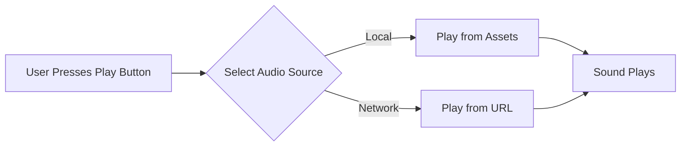

## 6.2.1 Playing Audio

Welcome to the exciting world of sound in Flutter apps! Adding audio to your applications can make them more engaging and fun. Whether it's background music, sound effects, or notifications, audio can enhance the user experience significantly. In this section, we'll explore how to play audio files using Flutter, focusing on both local and network sources.

### Why Add Audio to Your Apps?

Imagine playing a game without any sound effects or music. It might feel a bit dull, right? Sounds can provide feedback, set the mood, and make interactions more enjoyable. For instance, a cheerful tune can make a game more exciting, while a simple click sound can confirm a button press.

### Key Concepts

Before we dive into the code, let's understand some key concepts:

#### Audio Packages

To play audio in Flutter, we use a package called `audioplayers`. This package makes it easy to handle audio playback, whether the audio files are stored locally within your app or streamed from the internet.

#### Asset Sounds

Asset sounds are audio files stored within your app. These files are included in your app's assets and can be played without needing an internet connection.

#### Network Sounds

Network sounds are audio files that are streamed from the internet. This allows you to play audio files hosted on a server, which can be useful for dynamic content or when you want to keep your app's size small.

### Code Example

Let's look at a simple example of how to play both local and network audio files using the `audioplayers` package.

```dart
import 'package:flutter/material.dart';
import 'package:audioplayers/audioplayers.dart';

void main() {
  runApp(PlaySoundApp());
}

class PlaySoundApp extends StatefulWidget {
  @override
  _PlaySoundAppState createState() => _PlaySoundAppState();
}

class _PlaySoundAppState extends State<PlaySoundApp> {
  final AudioPlayer _audioPlayer = AudioPlayer();

  void playLocalSound() async {
    await _audioPlayer.play(AssetSource('sounds/hello.mp3'));
  }

  void playNetworkSound() async {
    await _audioPlayer.play(UrlSource('https://example.com/sounds/hello.mp3'));
  }

  @override
  Widget build(BuildContext context) {
    return MaterialApp(
      home: Scaffold(
        appBar: AppBar(
          title: Text('Play Sound Example'),
        ),
        body: Center(
          child: Column(
            mainAxisAlignment: MainAxisAlignment.center,
            children: [
              ElevatedButton(
                onPressed: playLocalSound,
                child: Text('Play Local Sound'),
              ),
              SizedBox(height: 20),
              ElevatedButton(
                onPressed: playNetworkSound,
                child: Text('Play Network Sound'),
              ),
            ],
          ),
        ),
      ),
    );
  }
}
```

**Note:** Ensure the sound file (`sounds/hello.mp3`) is added to the project's assets, and update `pubspec.yaml` accordingly.

### Activity

Let's make this learning experience more interactive!

1. **Add a Button to Play a Favorite Song:** Try adding a new button that plays your favorite song when pressed. You can use a local file or a URL to stream the song.

2. **Use Different Audio Files:** Experiment by adding multiple audio files and creating buttons to play each one. This will help you understand how to manage different audio sources.

### Visualizing Audio Playback

Here's a flowchart to help you visualize how audio is played from different sources:



### Language and Engagement

Remember, adding sound to your app is not just about making noise—it's about enhancing the experience. Think of creative ways to use sounds, such as background music for a relaxing app, sound effects for actions in a game, or notifications for important updates.

### Best Practices

- **Optimize Audio Files:** Use compressed audio formats like MP3 to keep your app size small.
- **Test on Different Devices:** Ensure audio plays correctly on various devices and platforms.
- **Consider User Preferences:** Allow users to control audio settings, such as volume or muting options.

### Common Pitfalls

- **File Paths:** Ensure your asset paths are correct in `pubspec.yaml`.
- **Network Latency:** Be mindful of potential delays when streaming audio from the internet.

By following these guidelines, you'll be well on your way to creating apps that sound as good as they look!

## Quiz Time!



### What is the purpose of adding audio to apps?

- [x] To make apps more engaging and provide feedback during interactions
- [ ] To increase the app's file size
- [ ] To make the app more complex
- [ ] To reduce the app's performance

> **Explanation:** Audio enhances user experience by making apps more engaging and providing feedback during interactions.

### Which package is used for handling audio playback in Flutter?

- [x] audioplayers
- [ ] audiohandler
- [ ] soundplayer
- [ ] flutteraudio

> **Explanation:** The `audioplayers` package is commonly used for handling audio playback in Flutter apps.

### What are asset sounds?

- [x] Audio files stored within the app
- [ ] Audio files streamed from the internet
- [ ] Sounds generated by the app
- [ ] Sounds recorded by the user

> **Explanation:** Asset sounds are audio files stored within the app's assets.

### What is a benefit of using network sounds?

- [x] They can be updated without changing the app
- [ ] They require no internet connection
- [ ] They are always faster to load
- [ ] They are stored on the user's device

> **Explanation:** Network sounds can be updated on the server without needing to update the app itself.

### What should you do to ensure a local audio file plays correctly?

- [x] Add the file to the project's assets and update `pubspec.yaml`
- [ ] Only use URLs for audio files
- [ ] Store the file in the app's database
- [ ] Use a different package for local files

> **Explanation:** Local audio files must be added to the project's assets and referenced in `pubspec.yaml`.

### How can you play a sound from a URL in Flutter?

- [x] Use the `play` method with `UrlSource`
- [ ] Use the `play` method with `AssetSource`
- [ ] Use the `load` method with `UrlSource`
- [ ] Use the `stream` method with `AssetSource`

> **Explanation:** To play a sound from a URL, use the `play` method with `UrlSource`.

### What is a common pitfall when using audio in apps?

- [x] Incorrect file paths in `pubspec.yaml`
- [ ] Using too many buttons
- [ ] Not having enough colors
- [ ] Using too much text

> **Explanation:** Incorrect file paths in `pubspec.yaml` can prevent audio files from being found and played.

### Why is it important to test audio on different devices?

- [x] To ensure audio plays correctly across platforms
- [ ] To make the app look better
- [ ] To increase the app's size
- [ ] To reduce the app's complexity

> **Explanation:** Testing on different devices ensures that audio plays correctly across various platforms and devices.

### What is a best practice when adding audio to apps?

- [x] Allow users to control audio settings
- [ ] Use the largest audio files possible
- [ ] Avoid using any audio
- [ ] Only use one audio file per app

> **Explanation:** Allowing users to control audio settings, such as volume or muting, enhances user experience.

### True or False: Network sounds require an internet connection to play.

- [x] True
- [ ] False

> **Explanation:** Network sounds are streamed from the internet and require an internet connection to play.


