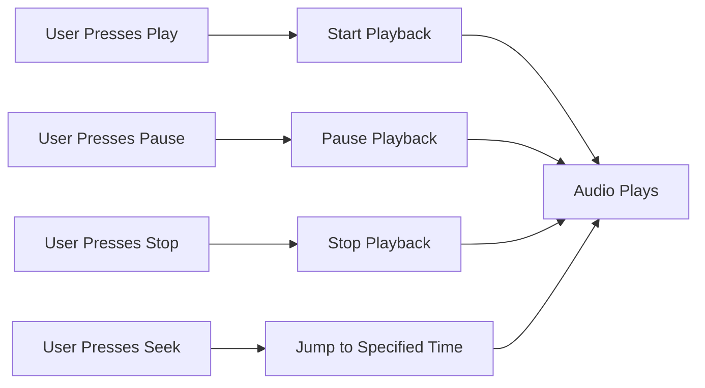

## 6.2.2 Controlling Playback

In this section, we will explore how to control audio playback in your Flutter apps. Just like using a remote control to manage your favorite TV shows or music, controlling playback in an app allows users to start, pause, stop, and seek through audio tracks. This is a fun and interactive way to enhance your app's user experience!

### Understanding Playback Controls

Before we dive into the code, let's understand the key concepts of audio playback control:

- **Play:** This function starts or resumes audio playback. Imagine pressing the play button on your music player to start listening to your favorite song.
- **Pause:** This temporarily stops the audio without resetting its position. It's like hitting pause on a movie when you need a quick break.
- **Stop:** This completely stops the audio and resets its position to the beginning, similar to stopping a video and rewinding it to the start.
- **Seek:** This allows you to jump to a specific position in the audio track, like skipping to your favorite part of a song.

### Code Example: Implementing Playback Controls

Let's create a simple Flutter app that demonstrates these playback controls using the `audioplayers` package. Make sure you have added the `audioplayers` package to your `pubspec.yaml` file and included the audio file (`sounds/music.mp3`) in your project's assets.

```dart
import 'package:flutter/material.dart';
import 'package:audioplayers/audioplayers.dart';

void main() {
  runApp(ControlPlaybackApp());
}

class ControlPlaybackApp extends StatefulWidget {
  @override
  _ControlPlaybackAppState createState() => _ControlPlaybackAppState();
}

class _ControlPlaybackAppState extends State<ControlPlaybackApp> {
  final AudioPlayer _audioPlayer = AudioPlayer();

  void playSound() async {
    await _audioPlayer.play(AssetSource('sounds/music.mp3'));
  }

  void pauseSound() async {
    await _audioPlayer.pause();
  }

  void stopSound() async {
    await _audioPlayer.stop();
  }

  void seekSound() async {
    await _audioPlayer.seek(Duration(seconds: 10));
  }

  @override
  Widget build(BuildContext context) {
    return MaterialApp(
      home: Scaffold(
        appBar: AppBar(
          title: Text('Control Playback Example'),
        ),
        body: Center(
          child: Column(
            mainAxisAlignment: MainAxisAlignment.center,
            children: [
              ElevatedButton(
                onPressed: playSound,
                child: Text('Play'),
              ),
              ElevatedButton(
                onPressed: pauseSound,
                child: Text('Pause'),
              ),
              ElevatedButton(
                onPressed: stopSound,
                child: Text('Stop'),
              ),
              ElevatedButton(
                onPressed: seekSound,
                child: Text('Seek to 10s'),
              ),
            ],
          ),
        ),
      ),
    );
  }
}
```

### Activity: Enhancing Your Music Player

Now that you've got the basics down, let's make your music player even more interactive!

1. **Create a Music Player Interface:** Add additional buttons for different playback controls, such as volume up and down.
2. **Implement a Slider for Volume Control:** Allow users to adjust the volume dynamically. You can use a `Slider` widget to change the volume level.

### Visualizing Playback Control

To help you understand how these controls work together, here's a flowchart illustrating the interaction between user actions and audio functions:



### Engaging with Playback Controls

Encourage yourself to experiment with different playback controls. Try changing the seek position to different times or adjusting the volume to see how it affects the audio experience. This hands-on practice will deepen your understanding of audio management within apps.

### Best Practices and Tips

- **Asset Management:** Ensure your audio files are correctly added to your project's assets and referenced in the `pubspec.yaml` file.
- **User Experience:** Consider adding visual feedback, such as changing button colors, to indicate the current playback state.
- **Error Handling:** Implement error handling to manage scenarios where audio files might not load correctly.

By mastering these playback controls, you're well on your way to creating engaging and interactive audio experiences in your Flutter apps. Keep experimenting and have fun with your coding journey!

## Quiz Time!



### What does the "Play" function do in audio playback?

- [x] Starts or resumes audio playback
- [ ] Stops the audio and resets its position
- [ ] Temporarily stops the audio without resetting its position
- [ ] Jumps to a specific position in the audio track

> **Explanation:** The "Play" function is used to start or resume audio playback, similar to pressing the play button on a music player.

### Which function would you use to temporarily stop audio playback without resetting its position?

- [ ] Play
- [x] Pause
- [ ] Stop
- [ ] Seek

> **Explanation:** The "Pause" function temporarily stops audio playback without resetting its position, allowing you to resume from where you left off.

### What is the purpose of the "Stop" function in audio playback?

- [ ] Starts or resumes audio playback
- [ ] Temporarily stops the audio without resetting its position
- [x] Completely stops the audio and resets its position
- [ ] Jumps to a specific position in the audio track

> **Explanation:** The "Stop" function completely stops the audio and resets its position to the beginning.

### How does the "Seek" function enhance audio playback control?

- [ ] It starts or resumes audio playback
- [ ] It stops the audio and resets its position
- [ ] It temporarily stops the audio without resetting its position
- [x] It jumps to a specific position in the audio track

> **Explanation:** The "Seek" function allows you to jump to a specific position in the audio track, enhancing control over playback.

### In the provided code example, what does the `seekSound` function do?

- [ ] Starts or resumes audio playback
- [ ] Stops the audio and resets its position
- [ ] Temporarily stops the audio without resetting its position
- [x] Jumps to 10 seconds into the audio track

> **Explanation:** The `seekSound` function uses the `seek` method to jump to 10 seconds into the audio track.

### What package is used in the code example to handle audio playback?

- [x] audioplayers
- [ ] audio_manager
- [ ] flutter_audio
- [ ] sound_player

> **Explanation:** The `audioplayers` package is used in the code example to handle audio playback functionalities.

### Why is it important to update the `pubspec.yaml` file when adding audio files to your project?

- [x] To ensure the audio files are included in the app's assets
- [ ] To automatically play the audio files
- [ ] To change the audio file format
- [ ] To delete unused audio files

> **Explanation:** Updating the `pubspec.yaml` file ensures that the audio files are included in the app's assets and can be accessed by the app.

### What is a practical use of the "Seek" function in a music player app?

- [ ] To start playing a song
- [ ] To stop a song
- [x] To skip to a favorite part of a song
- [ ] To pause a song

> **Explanation:** The "Seek" function is practical for skipping to a favorite part of a song in a music player app.

### How can you enhance user experience when implementing playback controls?

- [x] By adding visual feedback, such as changing button colors
- [ ] By removing all buttons
- [ ] By making the app silent
- [ ] By using only one control button

> **Explanation:** Adding visual feedback, like changing button colors, enhances user experience by indicating the current playback state.

### True or False: The "Pause" function resets the audio position to the beginning.

- [ ] True
- [x] False

> **Explanation:** False. The "Pause" function temporarily stops the audio without resetting its position, allowing you to resume playback from the same point.


