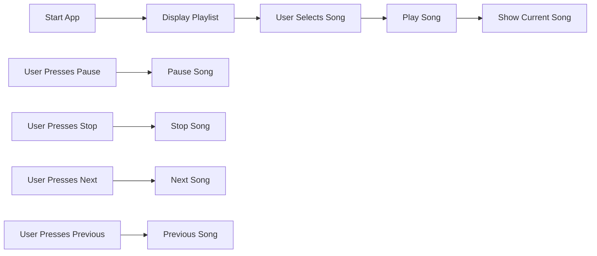

## 6.2.4 Mini Project: Music Player

Welcome to an exciting mini project where you'll build your very own Music Player app using Flutter! This project will guide you through creating an app that can play, pause, stop, and navigate through a playlist of songs. Let's dive into the world of sound and music with Flutter!

### Objective

The goal of this project is to apply your audio playback and control skills by building a simple Music Player app. You'll learn how to manage a playlist, control playback, and display the current song. By the end of this project, you'll have a functional music player that you can personalize with your favorite tunes.

### Project Overview

Your Music Player app will feature:

- A user interface with a list of songs and playback controls.
- The ability to play, pause, stop, and navigate through songs.
- Displaying the name of the currently playing song.

### Step-by-Step Guide

Let's break down the process into manageable steps:

#### 1. Set Up the UI

First, design a simple interface for your Music Player app. You'll need a list to display the songs and buttons for playback controls.

- **Song List:** Use a `ListView` to display the songs.
- **Playback Controls:** Add buttons for play, pause, stop, next, and previous actions.

#### 2. Import Audio Files

Add your audio files to the `assets/sounds` directory in your Flutter project. Update your `pubspec.yaml` file to include these assets:

```yaml
flutter:
  assets:
    - assets/sounds/song1.mp3
    - assets/sounds/song2.mp3
    - assets/sounds/song3.mp3
```

#### 3. Manage Playlist

Create a list in your code to store the paths of the songs. This list will help you navigate through the playlist.

```dart
final List<String> playlist = [
  'sounds/song1.mp3',
  'sounds/song2.mp3',
  'sounds/song3.mp3',
];
```

#### 4. Implement Playback Controls

Now, let's implement the functionality for each playback control:

- **Play:** Start playing the selected song.
- **Pause:** Pause the current song.
- **Stop:** Stop playback and reset the position.
- **Next/Previous:** Navigate through the playlist.

Here's a code example to get you started:

```dart
import 'package:flutter/material.dart';
import 'package:audioplayers/audioplayers.dart';

void main() {
  runApp(MusicPlayerApp());
}

class MusicPlayerApp extends StatefulWidget {
  @override
  _MusicPlayerAppState createState() => _MusicPlayerAppState();
}

class _MusicPlayerAppState extends State<MusicPlayerApp> {
  final AudioPlayer _audioPlayer = AudioPlayer();
  final List<String> playlist = [
    'sounds/song1.mp3',
    'sounds/song2.mp3',
    'sounds/song3.mp3',
  ];
  int currentIndex = 0;
  String currentSong = 'song1.mp3';

  void playSong() async {
    await _audioPlayer.play(AssetSource(playlist[currentIndex]));
    setState(() {
      currentSong = playlist[currentIndex].split('/').last;
    });
  }

  void pauseSong() async {
    await _audioPlayer.pause();
  }

  void stopSong() async {
    await _audioPlayer.stop();
    setState(() {
      currentSong = 'None';
    });
  }

  void nextSong() {
    if (currentIndex < playlist.length - 1) {
      setState(() {
        currentIndex++;
      });
      playSong();
    }
  }

  void previousSong() {
    if (currentIndex > 0) {
      setState(() {
        currentIndex--;
      });
      playSong();
    }
  }

  @override
  Widget build(BuildContext context) {
    return MaterialApp(
      home: Scaffold(
        appBar: AppBar(
          title: Text('Music Player'),
        ),
        body: Padding(
          padding: EdgeInsets.all(16.0),
          child: Column(
            children: [
              Text(
                'Current Song: $currentSong',
                style: TextStyle(fontSize: 20),
              ),
              SizedBox(height: 20),
              Expanded(
                child: ListView.builder(
                  itemCount: playlist.length,
                  itemBuilder: (context, index) {
                    return ListTile(
                      title: Text(playlist[index].split('/').last),
                      onTap: () {
                        setState(() {
                          currentIndex = index;
                        });
                        playSong();
                      },
                    );
                  },
                ),
              ),
              Row(
                mainAxisAlignment: MainAxisAlignment.center,
                children: [
                  IconButton(
                    icon: Icon(Icons.skip_previous),
                    iconSize: 40,
                    onPressed: previousSong,
                  ),
                  IconButton(
                    icon: Icon(Icons.play_arrow),
                    iconSize: 40,
                    onPressed: playSong,
                  ),
                  IconButton(
                    icon: Icon(Icons.pause),
                    iconSize: 40,
                    onPressed: pauseSong,
                  ),
                  IconButton(
                    icon: Icon(Icons.stop),
                    iconSize: 40,
                    onPressed: stopSong,
                  ),
                  IconButton(
                    icon: Icon(Icons.skip_next),
                    iconSize: 40,
                    onPressed: nextSong,
                  ),
                ],
              ),
            ],
          ),
        ),
      ),
    );
  }
}
```

#### 5. Display Current Song

Ensure that the name of the currently playing song is displayed prominently in your app. This helps users know which song is playing.

### Visuals

To help you understand the flow of the Music Player app, here's a flowchart outlining its functionality:



### Engagement and Personalization

Encourage kids to personalize their playlists with their favorite songs. Experimenting with different playback controls will enhance their understanding and make the project more enjoyable.

### Conclusion

Congratulations! You've built a simple Music Player app using Flutter. This project not only enhances your understanding of audio playback but also gives you a fun tool to enjoy your favorite music. Keep experimenting and adding new features to make your app even more exciting!

## Quiz Time!



### What is the main objective of the Music Player mini project?

- [x] To apply audio playback and control skills by building a simple Music Player app.
- [ ] To create a video streaming app.
- [ ] To design a photo gallery app.
- [ ] To build a text editor.

> **Explanation:** The main objective is to apply audio playback and control skills by building a simple Music Player app.

### Which directory should you add your audio files to?

- [ ] `assets/images`
- [x] `assets/sounds`
- [ ] `assets/videos`
- [ ] `assets/music`

> **Explanation:** Audio files should be added to the `assets/sounds` directory.

### What should you update in your project to include audio files?

- [ ] `main.dart`
- [ ] `README.md`
- [x] `pubspec.yaml`
- [ ] `index.html`

> **Explanation:** You need to update `pubspec.yaml` to include audio files in your project.

### What does the `playSong` function do?

- [x] It starts playing the selected song.
- [ ] It stops the current song.
- [ ] It pauses the current song.
- [ ] It skips to the next song.

> **Explanation:** The `playSong` function starts playing the selected song.

### How do you navigate to the next song in the playlist?

- [ ] By pressing the play button.
- [ ] By pressing the pause button.
- [x] By pressing the next button.
- [ ] By pressing the stop button.

> **Explanation:** You navigate to the next song by pressing the next button.

### What is displayed to show the currently playing song?

- [ ] The song's duration.
- [x] The name of the currently playing song.
- [ ] The artist's name.
- [ ] The album cover.

> **Explanation:** The name of the currently playing song is displayed.

### Which widget is used to display the list of songs?

- [ ] `GridView`
- [x] `ListView`
- [ ] `Column`
- [ ] `Row`

> **Explanation:** A `ListView` is used to display the list of songs.

### What happens when you press the stop button?

- [ ] The song pauses.
- [ ] The song skips to the next track.
- [x] The song stops and resets the position.
- [ ] The song repeats.

> **Explanation:** Pressing the stop button stops the song and resets the position.

### How can you personalize your Music Player app?

- [x] By adding your favorite songs to the playlist.
- [ ] By changing the app's language.
- [ ] By modifying the app's theme.
- [ ] By altering the app's font size.

> **Explanation:** You can personalize your Music Player app by adding your favorite songs to the playlist.

### True or False: The Music Player app can only play one song.

- [ ] True
- [x] False

> **Explanation:** False. The Music Player app can navigate through a playlist of multiple songs.


