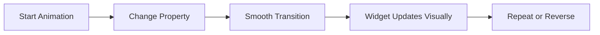

## 6.3.2 Animating Widgets

Welcome to the exciting world of animating widgets in Flutter! Just like how cartoons bring characters to life with movement and expression, animations can make your apps feel more lively and responsive. In this section, we'll explore how to create animations for widgets, making your apps more interactive and visually appealing.

### Why Animate Widgets?

Animating widgets can transform a static app into a dynamic experience. Imagine a button that gently grows when you press it or a character that slides smoothly across the screen. These animations not only make your app look cool but also help guide users' attention and improve the overall user experience.

### Key Concepts in Animating Widgets

Before we dive into coding, let's understand some key concepts that will help us animate widgets effectively.

#### Animated Widgets

Flutter provides several built-in animated widgets that make it easy to add animations to your app. Here are a few popular ones:

- **AnimatedContainer:** This widget allows you to animate changes in its properties, such as size, color, and alignment.
- **AnimatedOpacity:** Use this widget to animate the opacity of a widget, making it fade in or out.
- **AnimatedPositioned:** Perfect for animating the position of a widget within a `Stack`.

#### Animation Controllers

An `AnimationController` is like the director of your animation. It manages the timing and state of the animation, allowing you to start, stop, and reverse it. You'll often use it with `TickerProviderStateMixin` to keep your animations in sync with the Flutter framework.

#### Curves

Curves define the speed and style of your animations. They can make animations start slowly and speed up, or vice versa. Flutter provides a variety of curves like `Curves.easeInOut`, `Curves.bounceIn`, and more, each offering a unique animation effect.

### Let's Code: Animating a Widget

Let's create a simple Flutter app that animates a widget's opacity using an `AnimationController` and a `CurvedAnimation`.

```dart
import 'package:flutter/material.dart';

void main() {
  runApp(AnimateWidgetApp());
}

class AnimateWidgetApp extends StatefulWidget {
  @override
  _AnimateWidgetAppState createState() => _AnimateWidgetAppState();
}

class _AnimateWidgetAppState extends State<AnimateWidgetApp> with SingleTickerProviderStateMixin {
  late AnimationController _controller;
  late Animation<double> _animation;

  @override
  void initState() {
    super.initState();
    _controller = AnimationController(
      duration: Duration(seconds: 2),
      vsync: this,
    )..repeat(reverse: true);

    _animation = CurvedAnimation(parent: _controller, curve: Curves.easeInOut);
  }

  @override
  void dispose() {
    _controller.dispose();
    super.dispose();
  }

  @override
  Widget build(BuildContext context) {
    return MaterialApp(
      home: Scaffold(
        appBar: AppBar(
          title: Text('Animate Widget Example'),
        ),
        body: Center(
          child: AnimatedBuilder(
            animation: _animation,
            builder: (context, child) {
              return Opacity(
                opacity: _animation.value,
                child: Container(
                  width: 100,
                  height: 100,
                  color: Colors.green,
                ),
              );
            },
          ),
        ),
      ),
    );
  }
}
```

#### Code Explanation

- **AnimationController:** We create an `AnimationController` to manage the animation's duration and state.
- **CurvedAnimation:** This adds a smooth transition effect to the animation using `Curves.easeInOut`.
- **AnimatedBuilder:** This widget rebuilds its child whenever the animation changes, allowing us to animate the `Opacity` of the container.

### Activity: Create Your Own Animations

Now it's your turn to experiment with animations! Here are some activities to try:

1. **Create a Size Animation:** Use `AnimatedContainer` to smoothly transition between different sizes. Try changing the width and height properties.

2. **Color Change:** Animate the color property using `ColorTween`. See how the widget changes color over time.

3. **Position Movement:** Use `AnimatedPositioned` within a `Stack` to move widgets around. Create a widget that slides from one side of the screen to the other.

### Visualizing Animation Flow

To better understand how animations work, let's look at a flowchart illustrating the process:



This flowchart shows the steps involved in animating a widget. It starts with initiating the animation, changing a property, applying a smooth transition, updating the widget visually, and optionally repeating or reversing the animation.

### Best Practices and Tips

- **Keep Animations Smooth:** Use curves to make animations feel natural and less abrupt.
- **Avoid Overloading:** Too many animations can overwhelm users. Use them sparingly to enhance key interactions.
- **Test on Different Devices:** Ensure animations look good on various screen sizes and devices.

### Encouragement to Explore

Animating widgets is a fun and creative way to enhance your apps. Don't be afraid to experiment with different animated widgets and combine them to create unique effects. The more you practice, the more you'll discover the endless possibilities of animations in Flutter.

## Quiz Time!



### What is the purpose of animating widgets in an app?

- [x] To make the app more interactive and visually appealing
- [ ] To make the app run faster
- [ ] To reduce the app's size
- [ ] To increase the app's complexity

> **Explanation:** Animating widgets makes the app more interactive and visually appealing, enhancing the user experience.

### Which widget is used to animate changes in size, color, and alignment?

- [x] AnimatedContainer
- [ ] AnimatedOpacity
- [ ] AnimatedPositioned
- [ ] AnimatedBuilder

> **Explanation:** `AnimatedContainer` is used to animate changes in size, color, and alignment.

### What does an AnimationController do?

- [x] Manages the timing and state of animations
- [ ] Controls the app's layout
- [ ] Handles user input
- [ ] Manages network requests

> **Explanation:** An `AnimationController` manages the timing and state of animations, allowing you to start, stop, and reverse them.

### Which curve would you use for a smooth start and end to an animation?

- [x] Curves.easeInOut
- [ ] Curves.linear
- [ ] Curves.bounceIn
- [ ] Curves.fastOutSlowIn

> **Explanation:** `Curves.easeInOut` provides a smooth start and end to an animation.

### What is the role of an AnimatedBuilder?

- [x] Rebuilds its child whenever the animation changes
- [ ] Handles user input
- [ ] Manages network requests
- [ ] Controls the app's layout

> **Explanation:** `AnimatedBuilder` rebuilds its child whenever the animation changes, allowing for dynamic updates.

### Which widget would you use to animate the opacity of a widget?

- [x] AnimatedOpacity
- [ ] AnimatedContainer
- [ ] AnimatedPositioned
- [ ] AnimatedBuilder

> **Explanation:** `AnimatedOpacity` is used to animate the opacity of a widget, making it fade in or out.

### What is a common use for AnimatedPositioned?

- [x] To animate the position of a widget within a Stack
- [ ] To animate the color of a widget
- [ ] To animate the text of a widget
- [ ] To animate the size of a widget

> **Explanation:** `AnimatedPositioned` is commonly used to animate the position of a widget within a `Stack`.

### How can you make an animation feel more natural?

- [x] Use curves to control the speed and style
- [ ] Increase the animation duration
- [ ] Use more widgets
- [ ] Add more colors

> **Explanation:** Using curves helps control the speed and style of the animation, making it feel more natural.

### What should you avoid when using animations in your app?

- [x] Overloading with too many animations
- [ ] Using curves
- [ ] Testing on different devices
- [ ] Combining different animations

> **Explanation:** Overloading with too many animations can overwhelm users, so it's best to use them sparingly.

### True or False: An AnimationController can only be used with Stateless widgets.

- [ ] True
- [x] False

> **Explanation:** An `AnimationController` is typically used with Stateful widgets to manage the animation's lifecycle.


