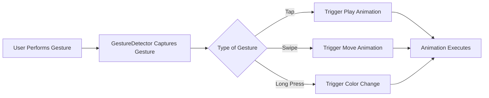

## 6.3.3 Interactive Animations

Welcome to the exciting world of interactive animations! Imagine your app as a playground where every tap, swipe, or drag brings something to life, just like a toy that responds when you play with it. In this section, we'll explore how to make your Flutter apps more engaging by creating animations that respond to user interactions.

### Understanding Interactive Animations

Interactive animations are like magic tricks in your app. They respond to what users do, making the experience more fun and engaging. Whether it's a character jumping when tapped or a color changing with a long press, these animations make your app feel alive.

#### Key Concepts

Let's dive into the key concepts that will help you create interactive animations:

1. **Gesture Detection:** This is how your app knows when a user interacts with it. In Flutter, we use the `GestureDetector` widget to capture gestures like taps, swipes, and long presses.

2. **Triggering Animations:** Once a gesture is detected, we can start or stop animations. This is where the magic happens, as we bring elements of our app to life.

3. **State Management:** To control when and how animations play, we need to manage the state of our app. This involves keeping track of whether an animation is playing or stopped.

### Code Example: Interactive Animation App

Let's create a simple app that demonstrates these concepts. We'll make a square that grows and shrinks when tapped.

```dart
import 'package:flutter/material.dart';

void main() {
  runApp(InteractiveAnimationApp());
}

class InteractiveAnimationApp extends StatefulWidget {
  @override
  _InteractiveAnimationAppState createState() => _InteractiveAnimationAppState();
}

class _InteractiveAnimationAppState extends State<InteractiveAnimationApp> with SingleTickerProviderStateMixin {
  late AnimationController _controller;
  bool isAnimating = false;

  @override
  void initState() {
    super.initState();
    _controller = AnimationController(
      duration: Duration(seconds: 2),
      vsync: this,
    );
  }

  @override
  void dispose() {
    _controller.dispose();
    super.dispose();
  }

  void toggleAnimation() {
    setState(() {
      isAnimating = !isAnimating;
      isAnimating ? _controller.forward() : _controller.reverse();
    });
  }

  @override
  Widget build(BuildContext context) {
    return MaterialApp(
      home: Scaffold(
        appBar: AppBar(
          title: Text('Interactive Animation Example'),
        ),
        body: Center(
          child: GestureDetector(
            onTap: toggleAnimation,
            child: AnimatedBuilder(
              animation: _controller,
              builder: (context, child) {
                return Transform.scale(
                  scale: 1 + _controller.value,
                  child: Container(
                    width: 100,
                    height: 100,
                    color: Colors.orange,
                  ),
                );
              },
            ),
          ),
        ),
      ),
    );
  }
}
```

#### How It Works

- **GestureDetector:** This widget wraps the animated square and detects taps. When tapped, it calls the `toggleAnimation` function.
- **AnimationController:** This controls the animation, determining how long it lasts and when it starts or stops.
- **AnimatedBuilder:** This widget rebuilds the square whenever the animation changes, allowing us to apply transformations like scaling.

### Activities to Try

Now that you've seen the basics, let's get creative! Here are some activities to try:

1. **Create Tap-Based Animation:** Modify the code so that tapping the square makes it jump up and down. Hint: You can use the `Transform.translate` widget.

2. **Swipe to Change Position:** Implement swipe gestures to move the square across the screen. Use the `onHorizontalDragUpdate` callback in `GestureDetector`.

3. **Long Press to Change Color:** Use a long press gesture to change the color of the square. You can modify the `color` property of the `Container`.

### Visualizing the Process

Here's a flowchart to help you visualize how user interactions trigger animations:



### Encouragement and Engagement

Interactive animations are like playing with responsive toys. They make your app feel alive and exciting. Think about how different gestures can trigger unique animations. Maybe a swipe could make a character run, or a long press could open a treasure chest. The possibilities are endless!

### Best Practices and Tips

- **Keep it Simple:** Start with simple animations and gradually add complexity.
- **Test on Real Devices:** Animations can behave differently on various devices, so always test your app on real hardware.
- **Be Mindful of Performance:** Too many animations can slow down your app. Use them wisely.

### Conclusion

Interactive animations are a powerful tool to make your apps more engaging and fun. By understanding gesture detection, triggering animations, and managing state, you can create dynamic experiences that captivate users. So go ahead, experiment, and bring your app to life!

## Quiz Time!



### What is the purpose of the `GestureDetector` widget in Flutter?

- [x] To capture user interactions like taps, swipes, and long presses.
- [ ] To display images and text.
- [ ] To manage the app's state.
- [ ] To control the app's layout.

> **Explanation:** The `GestureDetector` widget is used to capture user interactions such as taps, swipes, and long presses, allowing the app to respond to these gestures.

### How can you start or stop an animation in Flutter?

- [x] By using an `AnimationController` and calling its `forward` or `reverse` methods.
- [ ] By changing the app's theme.
- [ ] By using a `Text` widget.
- [ ] By modifying the app's layout.

> **Explanation:** An `AnimationController` is used to control animations in Flutter. You can start an animation with the `forward` method and stop it with the `reverse` method.

### What is the role of the `AnimatedBuilder` widget?

- [x] To rebuild a widget whenever the animation changes.
- [ ] To detect user gestures.
- [ ] To manage the app's state.
- [ ] To display a list of items.

> **Explanation:** The `AnimatedBuilder` widget is used to rebuild a widget whenever the animation changes, allowing for dynamic updates to the UI.

### Which gesture can be used to change the color of a widget?

- [x] Long press.
- [ ] Double tap.
- [ ] Swipe.
- [ ] Pinch.

> **Explanation:** A long press gesture can be used to change the color of a widget by detecting the gesture and updating the widget's properties.

### What is the benefit of using interactive animations in apps?

- [x] They make apps more engaging and dynamic.
- [ ] They reduce app performance.
- [ ] They make apps harder to use.
- [ ] They increase app size significantly.

> **Explanation:** Interactive animations make apps more engaging and dynamic by responding to user interactions, enhancing the user experience.

### What should you consider when adding animations to your app?

- [x] Performance and simplicity.
- [ ] Only the app's color scheme.
- [ ] The number of text widgets.
- [ ] The app's icon design.

> **Explanation:** When adding animations, consider performance and simplicity to ensure the app remains responsive and user-friendly.

### How can you move a widget across the screen with a swipe gesture?

- [x] By using the `onHorizontalDragUpdate` callback in `GestureDetector`.
- [ ] By changing the app's theme.
- [ ] By using a `Text` widget.
- [ ] By modifying the app's layout.

> **Explanation:** The `onHorizontalDragUpdate` callback in `GestureDetector` can be used to move a widget across the screen in response to swipe gestures.

### What is the first step in creating an interactive animation?

- [x] Detecting user gestures with `GestureDetector`.
- [ ] Changing the app's theme.
- [ ] Modifying the app's layout.
- [ ] Adding a `Text` widget.

> **Explanation:** The first step in creating an interactive animation is detecting user gestures with the `GestureDetector` widget.

### True or False: Interactive animations can only be triggered by taps.

- [ ] True
- [x] False

> **Explanation:** False. Interactive animations can be triggered by various gestures, including taps, swipes, and long presses.

### Why is it important to test animations on real devices?

- [x] Because animations can behave differently on various devices.
- [ ] Because it changes the app's theme.
- [ ] Because it modifies the app's layout.
- [ ] Because it adds more text widgets.

> **Explanation:** It's important to test animations on real devices because they can behave differently depending on the hardware and screen size.


