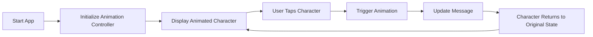

## 6.3.4 Mini Project: Animated Storybook

Welcome to the magical world of animated storytelling! In this mini project, we will embark on an exciting journey to create an Animated Storybook app using Flutter. This app will bring stories to life with moving characters, dynamic scenes, and interactive elements that respond to user actions. Let's dive in and learn how to make stories more engaging and fun!

### Project Overview

The Animated Storybook app is designed to display a story with animated elements. Imagine characters that move, change expressions, and interact with their environment, all while the story unfolds. Users can tap on elements to trigger animations, making the experience interactive and immersive. We'll also explore adding sound effects or background music to enhance the storytelling.

### Step-by-Step Guide

#### 1. Set Up the UI

First, we'll create a page layout for our storybook. This layout will include areas for story text and placeholders for animated characters and backgrounds. Here's how you can set up the basic UI:

- **Text Areas:** These will display the story text. You can use `Text` widgets to show different parts of the story.
- **Placeholders:** Use `Container` or `Stack` widgets to reserve space for animated characters and backgrounds.

#### 2. Animate Story Elements

Next, we'll add animations to our story elements. This involves using Flutter's animation framework to make characters move, change expressions, or interact with the environment. Here's a simple example of animating a character:

```dart
import 'package:flutter/material.dart';

class AnimatedCharacter extends StatefulWidget {
  @override
  _AnimatedCharacterState createState() => _AnimatedCharacterState();
}

class _AnimatedCharacterState extends State<AnimatedCharacter> with SingleTickerProviderStateMixin {
  late AnimationController _controller;
  late Animation<Offset> _animation;

  @override
  void initState() {
    super.initState();
    _controller = AnimationController(
      duration: const Duration(seconds: 2),
      vsync: this,
    )..repeat(reverse: true);

    _animation = Tween<Offset>(
      begin: Offset(-1, 0),
      end: Offset(1, 0),
    ).animate(_controller);
  }

  @override
  void dispose() {
    _controller.dispose();
    super.dispose();
  }

  @override
  Widget build(BuildContext context) {
    return SlideTransition(
      position: _animation,
      child: Image.asset('assets/images/happy_character.png', width: 100, height: 100),
    );
  }
}
```

#### 3. Handle User Interactions

To make the story interactive, we'll allow users to tap on elements to trigger animations. For example, tapping a character could make it speak or perform an action. Here's how you can handle user interactions:

```dart
GestureDetector(
  onTap: () {
    setState(() {
      // Trigger animation or update story text
    });
  },
  child: AnimatedCharacter(),
)
```

#### 4. Integrate Story Text

Display parts of the story sequentially, syncing with the animations for a cohesive experience. You can update the story text based on user interactions or animation states.

```dart
String storyText = "Once upon a time...";

void updateStoryText() {
  setState(() {
    storyText = "The character is happy!";
  });
}

Text(
  storyText,
  style: TextStyle(fontSize: 20, color: Colors.blue),
  textAlign: TextAlign.center,
)
```

#### 5. Add Audio (Optional)

Incorporate sound effects or background music to enhance the storytelling. You can use packages like `audioplayers` to play audio files.

```dart
import 'package:audioplayers/audioplayers.dart';

final player = AudioPlayer();

void playSound() {
  player.play('assets/sounds/background_music.mp3');
}
```

### Code Example

Here's a complete example of the Animated Storybook app:

```dart
import 'package:flutter/material.dart';
import 'dart:math';

void main() {
  runApp(AnimatedStorybookApp());
}

class AnimatedStorybookApp extends StatefulWidget {
  @override
  _AnimatedStorybookAppState createState() => _AnimatedStorybookAppState();
}

class _AnimatedStorybookAppState extends State<AnimatedStorybookApp> with SingleTickerProviderStateMixin {
  late AnimationController _animationController;
  late Animation<double> _animation;
  String message = 'Tap the character!';

  @override
  void initState() {
    super.initState();
    _animationController = AnimationController(
      duration: Duration(seconds: 2),
      vsync: this,
    )..repeat(reverse: true);

    _animation = Tween<double>(begin: 0, end: 1).animate(_animationController);
  }

  @override
  void dispose() {
    _animationController.dispose();
    super.dispose();
  }

  void animateCharacter() {
    setState(() {
      message = 'Character is happy!';
    });
    _animationController.forward().then((_) {
      _animationController.reverse();
    });
  }

  @override
  Widget build(BuildContext context) {
    return MaterialApp(
      home: Scaffold(
        appBar: AppBar(
          title: Text('Animated Storybook'),
        ),
        body: Column(
          children: [
            Expanded(
              child: Stack(
                children: [
                  Center(
                    child: SlideTransition(
                      position: Tween<Offset>(
                        begin: Offset(-1, 0),
                        end: Offset(1, 0),
                      ).animate(_animation),
                      child: GestureDetector(
                        onTap: animateCharacter,
                        child: Image.asset('assets/images/happy_character.png', width: 100, height: 100),
                      ),
                    ),
                  ),
                  Positioned(
                    bottom: 20,
                    left: 20,
                    right: 20,
                    child: Text(
                      message,
                      style: TextStyle(fontSize: 20, color: Colors.blue),
                      textAlign: TextAlign.center,
                    ),
                  ),
                ],
              ),
            ),
          ],
        ),
      ),
    );
  }
}
```

*Note: Ensure the character image (`assets/images/happy_character.png`) is added to the project's assets, and update `pubspec.yaml` accordingly.*

### Visuals

Let's visualize the flow of our Animated Storybook app using a flowchart:



### Engagement

Now that you've learned how to create an Animated Storybook app, it's time to unleash your creativity! Encourage kids to create their own animated stories, incorporating different video clips and character animations to bring their narratives to life. What stories will you tell?

## Quiz Time!



### What is the main objective of the Animated Storybook app?

- [x] To combine animations and user interactions to bring stories to life.
- [ ] To create a static storybook with text only.
- [ ] To develop a game with no animations.
- [ ] To build a music player app.

> **Explanation:** The main objective is to create an app that combines animations and user interactions to make stories engaging and dynamic.

### Which widget is used to animate the character in the example?

- [ ] Container
- [ ] Column
- [x] SlideTransition
- [ ] Text

> **Explanation:** The `SlideTransition` widget is used to animate the character's movement in the example.

### How can users interact with the story elements?

- [ ] By typing text
- [x] By tapping on elements
- [ ] By shaking the device
- [ ] By using voice commands

> **Explanation:** Users can interact with the story elements by tapping on them to trigger animations.

### What is the purpose of the `GestureDetector` widget?

- [x] To detect user interactions like taps
- [ ] To display images
- [ ] To play audio
- [ ] To manage animations

> **Explanation:** The `GestureDetector` widget is used to detect user interactions, such as taps, and trigger actions in response.

### What optional feature can enhance the storytelling experience?

- [ ] Adding more text
- [x] Incorporating sound effects or background music
- [ ] Using a larger font size
- [ ] Removing animations

> **Explanation:** Incorporating sound effects or background music can enhance the storytelling experience by adding an auditory dimension.

### Which package can be used to play audio files in Flutter?

- [ ] video_player
- [x] audioplayers
- [ ] image_picker
- [ ] path_provider

> **Explanation:** The `audioplayers` package can be used to play audio files in Flutter.

### What does the `AnimationController` do in the app?

- [ ] It displays text
- [x] It controls the animation's duration and state
- [ ] It manages user inputs
- [ ] It plays video files

> **Explanation:** The `AnimationController` controls the animation's duration and state, allowing it to start, stop, and repeat.

### What should be updated in `pubspec.yaml` for the app?

- [x] Asset paths for images and audio files
- [ ] The app's version number
- [ ] The app's name
- [ ] The app's description

> **Explanation:** Asset paths for images and audio files should be updated in `pubspec.yaml` to ensure they are included in the app.

### What is the role of the `Tween` class in animations?

- [ ] To play audio files
- [ ] To display text
- [x] To define the range of values for an animation
- [ ] To manage user interactions

> **Explanation:** The `Tween` class defines the range of values for an animation, such as the start and end positions.

### True or False: The Animated Storybook app can include both animations and audio.

- [x] True
- [ ] False

> **Explanation:** True. The Animated Storybook app can include both animations and audio to create a more immersive storytelling experience.


