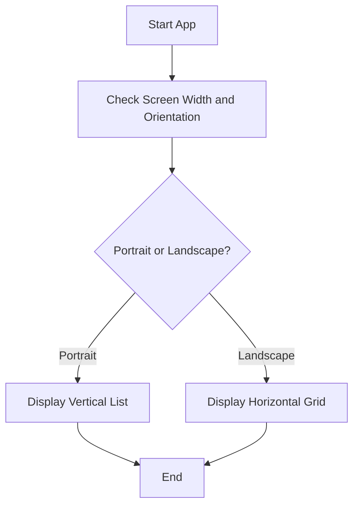

## 6.4.1 Media Query Basics

Welcome to the exciting world of responsive design in Flutter! In this section, we'll explore how to make your apps look great on any device using MediaQuery. Whether your users are on a phone, tablet, or even a large-screen device, MediaQuery helps ensure your app's layout adapts beautifully.

### Understanding MediaQuery

**MediaQuery** is a powerful tool in Flutter that provides information about the device's screen. This includes details like screen dimensions, orientation, and pixel density. By leveraging MediaQuery, you can create apps that adjust their layout and content dynamically, offering a seamless experience across different devices.

#### Key Concepts

Let's dive into some key concepts that MediaQuery helps us manage:

- **Screen Dimensions:** MediaQuery allows you to retrieve the width and height of the screen, enabling you to adjust your app's layout based on available space.
- **Orientation:** You can detect whether the device is in portrait or landscape mode, allowing you to change the layout accordingly.
- **Device Pixel Ratio:** This ensures that images and text appear at appropriate sizes, maintaining clarity and readability.

### Code Example: Using MediaQuery

Here's a simple Flutter app that demonstrates how to use MediaQuery to access screen information:

```dart
import 'package:flutter/material.dart';

void main() {
  runApp(MediaQueryBasicsApp());
}

class MediaQueryBasicsApp extends StatelessWidget {
  @override
  Widget build(BuildContext context) {
    return MaterialApp(
      home: Scaffold(
        appBar: AppBar(
          title: Text('MediaQuery Basics'),
        ),
        body: LayoutBuilder(
          builder: (context, constraints) {
            var screenWidth = MediaQuery.of(context).size.width;
            var screenHeight = MediaQuery.of(context).size.height;
            var orientation = MediaQuery.of(context).orientation;

            return Center(
              child: Column(
                mainAxisAlignment: MainAxisAlignment.center,
                children: [
                  Text(
                    'Screen Width: $screenWidth',
                    style: TextStyle(fontSize: 18),
                  ),
                  Text(
                    'Screen Height: $screenHeight',
                    style: TextStyle(fontSize: 18),
                  ),
                  Text(
                    'Orientation: $orientation',
                    style: TextStyle(fontSize: 18),
                  ),
                ],
              ),
            );
          },
        ),
      ),
    );
  }
}
```

**Explanation:**

- **MediaQuery.of(context).size:** Retrieves the current screen's width and height.
- **MediaQuery.of(context).orientation:** Determines if the device is in portrait or landscape mode.
- The app displays this information on the screen, helping you understand how MediaQuery works.

### Activity: Create Responsive Layouts

Let's put MediaQuery into action with a fun activity!

#### Step 1: Create an App with Different Layouts

- **Portrait Mode:** Display a vertical list of images.
- **Landscape Mode:** Display images in a horizontal grid.

Here's a basic structure to get you started:

```dart
import 'package:flutter/material.dart';

void main() {
  runApp(ResponsiveLayoutApp());
}

class ResponsiveLayoutApp extends StatelessWidget {
  @override
  Widget build(BuildContext context) {
    return MaterialApp(
      home: Scaffold(
        appBar: AppBar(
          title: Text('Responsive Layout'),
        ),
        body: OrientationBuilder(
          builder: (context, orientation) {
            return orientation == Orientation.portrait
                ? VerticalImageList()
                : HorizontalImageGrid();
          },
        ),
      ),
    );
  }
}

class VerticalImageList extends StatelessWidget {
  @override
  Widget build(BuildContext context) {
    return ListView(
      children: List.generate(10, (index) {
        return Image.network('https://via.placeholder.com/150');
      }),
    );
  }
}

class HorizontalImageGrid extends StatelessWidget {
  @override
  Widget build(BuildContext context) {
    return GridView.count(
      crossAxisCount: 2,
      children: List.generate(10, (index) {
        return Image.network('https://via.placeholder.com/150');
      }),
    );
  }
}
```

**Explanation:**

- **OrientationBuilder:** A widget that rebuilds its child when the orientation changes.
- **VerticalImageList:** Displays images in a vertical list for portrait mode.
- **HorizontalImageGrid:** Displays images in a grid for landscape mode.

#### Step 2: Test on Different Devices

Encourage testing the app on phones and tablets to see how MediaQuery adapts the layout. Notice how the app changes its layout based on the device's orientation!

### Visualizing MediaQuery with a Flowchart

To better understand how MediaQuery adapts layouts, let's look at a flowchart:



This flowchart illustrates the decision-making process in your app, showing how it chooses between different layouts based on screen properties.

### Engaging with Responsive Design

Think of responsive design like adjusting furniture for different room sizes. Just as you might rearrange a room to fit a new sofa, you adjust your app's layout to fit different screens. This ensures your app looks good and functions well, no matter where it's used.

### Encouragement and Exploration

As you explore MediaQuery, consider how your apps can look great on both phones and tablets. Responsive design is a crucial skill in app development, and mastering it will make your apps more versatile and user-friendly.

## Quiz Time!



### What is the primary purpose of MediaQuery in Flutter?

- [x] To provide information about the device's screen
- [ ] To store user data
- [ ] To manage app permissions
- [ ] To handle network requests

> **Explanation:** MediaQuery provides information about the device's screen, such as dimensions and orientation, allowing apps to adapt their layout accordingly.

### Which method is used to get the screen width in Flutter?

- [x] MediaQuery.of(context).size.width
- [ ] MediaQuery.of(context).screenWidth
- [ ] context.size.width
- [ ] MediaQuery.width(context)

> **Explanation:** MediaQuery.of(context).size.width is the correct method to retrieve the screen width in Flutter.

### How does MediaQuery help with responsive design?

- [x] By providing screen dimensions and orientation
- [ ] By storing app settings
- [ ] By managing user inputs
- [ ] By handling animations

> **Explanation:** MediaQuery helps with responsive design by providing information about screen dimensions and orientation, allowing apps to adjust their layout dynamically.

### What widget can be used to change layout based on orientation?

- [x] OrientationBuilder
- [ ] LayoutBuilder
- [ ] Scaffold
- [ ] AppBar

> **Explanation:** OrientationBuilder is a widget that rebuilds its child when the orientation changes, making it useful for responsive design.

### In the code example, what does OrientationBuilder do?

- [x] It rebuilds its child when the orientation changes
- [ ] It manages app state
- [ ] It handles network requests
- [ ] It stores user data

> **Explanation:** OrientationBuilder rebuilds its child when the orientation changes, allowing for different layouts in portrait and landscape modes.

### What is the benefit of using a grid layout in landscape mode?

- [x] It utilizes more horizontal space effectively
- [ ] It reduces app performance
- [ ] It simplifies code structure
- [ ] It increases app size

> **Explanation:** A grid layout in landscape mode utilizes more horizontal space effectively, making better use of the available screen area.

### What analogy is used to explain responsive design?

- [x] Adjusting furniture for different room sizes
- [ ] Baking a cake
- [ ] Building a house
- [ ] Driving a car

> **Explanation:** Responsive design is compared to adjusting furniture for different room sizes, illustrating how layouts adapt to various screen sizes.

### Which of the following is NOT a key concept of MediaQuery?

- [ ] Screen Dimensions
- [ ] Orientation
- [ ] Device Pixel Ratio
- [x] User Authentication

> **Explanation:** User Authentication is not related to MediaQuery, which focuses on screen dimensions, orientation, and pixel ratio.

### What does the flowchart illustrate in the context of MediaQuery?

- [x] How the app chooses between different layouts based on screen properties
- [ ] How to manage app permissions
- [ ] How to store user data
- [ ] How to handle network requests

> **Explanation:** The flowchart illustrates how the app chooses between different layouts based on screen properties like orientation.

### True or False: MediaQuery can help make apps look good on both phones and tablets.

- [x] True
- [ ] False

> **Explanation:** True. MediaQuery helps make apps responsive, ensuring they look good on both phones and tablets by adapting to different screen sizes and orientations.



By understanding and utilizing MediaQuery, you're on your way to creating apps that are not only functional but also visually appealing across a wide range of devices. Keep experimenting and exploring the possibilities of responsive design in Flutter!
