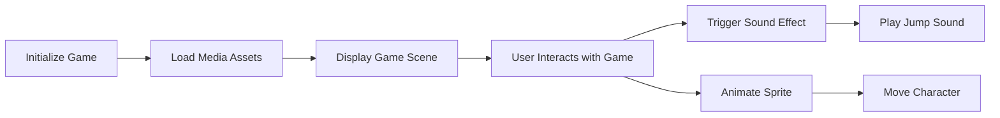

## 6.4.2 Using Media in Games

Welcome to the exciting world of game development with Flutter! In this section, we'll explore how to use media elements like images, sounds, and animations to make your games more engaging and fun. By the end of this chapter, you'll be able to create a game that not only looks great but also sounds and feels immersive.

### Why Use Media in Games?

Games are not just about code; they are about creating experiences. Media elements such as images, sounds, and animations play a crucial role in making games interactive and enjoyable. They help in:

- **Creating Visual Appeal:** Images and animations bring characters and environments to life.
- **Enhancing Interactivity:** Sounds and animations respond to player actions, making the game feel dynamic.
- **Building Atmosphere:** Background music and sound effects set the mood and tone of the game.

### Key Concepts

#### Sprites

Sprites are images used to represent characters, objects, or other elements in a game. They can be static or animated, and they are essential for visual storytelling in games.

#### Sound Effects and Background Music

Sound effects are short audio clips that play in response to specific actions, like jumping or collecting an item. Background music plays continuously to create an immersive atmosphere.

#### Animated Sprites

Animated sprites are sequences of images that create the illusion of movement. They are used to animate characters and objects, making them appear lively and dynamic.

#### Collision Detection

Collision detection is the process of determining when two game elements interact, such as a character collecting a star or avoiding an obstacle. It is crucial for gameplay mechanics.

### Code Example: Integrating Media in a Flutter Game

Let's dive into a practical example where we integrate images, sounds, and animations into a simple Flutter game.

```dart
import 'package:flutter/material.dart';
import 'package:audioplayers/audioplayers.dart';

void main() {
  runApp(GameMediaApp());
}

class GameMediaApp extends StatefulWidget {
  @override
  _GameMediaAppState createState() => _GameMediaAppState();
}

class _GameMediaAppState extends State<GameMediaApp> with SingleTickerProviderStateMixin {
  late AnimationController _controller;
  late Animation<Offset> _animation;
  final AudioPlayer _audioPlayer = AudioPlayer();

  @override
  void initState() {
    super.initState();
    _controller = AnimationController(
      duration: Duration(seconds: 2),
      vsync: this,
    )..repeat(reverse: true);
    
    _animation = Tween<Offset>(begin: Offset.zero, end: Offset(1.0, 0.0)).animate(_controller);
    
    // Play background music
    _audioPlayer.play(AssetSource('sounds/game_background.mp3'));
  }

  @override
  void dispose() {
    _controller.dispose();
    _audioPlayer.dispose();
    super.dispose();
  }

  void playSoundEffect() async {
    await _audioPlayer.play(AssetSource('sounds/jump.mp3'));
  }

  @override
  Widget build(BuildContext context) {
    return MaterialApp(
      home: Scaffold(
        appBar: AppBar(
          title: Text('Media in Games'),
        ),
        body: Stack(
          children: [
            Positioned(
              left: 100,
              top: 100,
              child: GestureDetector(
                onTap: playSoundEffect,
                child: SlideTransition(
                  position: _animation,
                  child: Image.asset('assets/images/game_character.png', width: 100, height: 100),
                ),
              ),
            ),
            // Add more game elements here
          ],
        ),
      ),
    );
  }
}
```

**Note:** Ensure the sound files (`sounds/game_background.mp3`, `sounds/jump.mp3`) and character image (`assets/images/game_character.png`) are added to the project's assets, and update `pubspec.yaml` accordingly.

### Activity: Enhance Your Game

1. **Add Multiple Characters:** Try adding more character sprites and animate them moving across the screen. Experiment with different animations to see how they change the feel of your game.

2. **Sound Effects for Actions:** Implement different sound effects for various actions, such as jumping, collecting items, or scoring points. Think about how each sound can enhance the player's experience.

3. **Collision Detection:** Introduce simple collision detection, like having a character collect stars or avoid obstacles. This will add an interactive element to your game.

### Visualizing Media Integration

To better understand how media elements are integrated into a game, let's look at a flowchart:



### Language and Engagement

Using media in games is like adding spices to a dish—it enhances the flavor and makes it more enjoyable. Encourage kids to think creatively about how different media elements can enhance their games. For example, adding unique sound effects for various actions or creating animated backgrounds can make a game more immersive and fun.

### Best Practices and Tips

- **Keep It Simple:** Start with basic media elements and gradually add complexity as you become more comfortable.
- **Test and Iterate:** Continuously test your game to see how media elements affect gameplay. Make adjustments based on feedback.
- **Be Creative:** Use media to tell a story or create a unique atmosphere in your game. Let your imagination run wild!

By incorporating media elements into your games, you can create experiences that are not only visually appealing but also engaging and memorable. So, get creative and start building your own immersive games today!

## Quiz Time!



### What is a sprite in game development?

- [x] An image used to represent characters or objects in a game
- [ ] A type of sound effect
- [ ] A programming language
- [ ] A game development tool

> **Explanation:** A sprite is an image used to represent characters, objects, or other elements in a game.

### What role do sound effects play in games?

- [x] They enhance interactivity by responding to player actions
- [ ] They are used to display game graphics
- [ ] They are a type of programming language
- [ ] They are used to create game levels

> **Explanation:** Sound effects enhance interactivity by providing audio feedback in response to player actions.

### What is the purpose of background music in a game?

- [x] To create an immersive atmosphere
- [ ] To display game graphics
- [ ] To write code
- [ ] To debug the game

> **Explanation:** Background music sets the mood and tone of the game, creating an immersive atmosphere.

### What is collision detection used for in games?

- [x] To determine when two game elements interact
- [ ] To play background music
- [ ] To animate sprites
- [ ] To write code

> **Explanation:** Collision detection is used to determine when two game elements, such as characters and obstacles, interact.

### How can animated sprites enhance a game?

- [x] By creating the illusion of movement
- [ ] By playing sound effects
- [ ] By writing code
- [ ] By debugging the game

> **Explanation:** Animated sprites create the illusion of movement, making characters and objects appear lively and dynamic.

### What should you do before using media assets in a Flutter project?

- [x] Add them to the project's assets and update `pubspec.yaml`
- [ ] Write code to create them
- [ ] Use them without any preparation
- [ ] Delete them from the project

> **Explanation:** Media assets must be added to the project's assets and `pubspec.yaml` must be updated to use them in a Flutter project.

### What is the first step in integrating media into a game?

- [x] Load media assets
- [ ] Write game logic
- [ ] Test the game
- [ ] Publish the game

> **Explanation:** The first step in integrating media into a game is to load the media assets.

### How can you make a game more interactive?

- [x] By adding sound effects and animations
- [ ] By removing all media elements
- [ ] By using only text
- [ ] By disabling user input

> **Explanation:** Adding sound effects and animations makes a game more interactive and engaging.

### What is the benefit of using animations in games?

- [x] They make the game feel dynamic and lively
- [ ] They slow down the game
- [ ] They are used for debugging
- [ ] They replace sound effects

> **Explanation:** Animations make the game feel dynamic and lively by bringing characters and objects to life.

### True or False: Media elements are optional in game development.

- [ ] True
- [x] False

> **Explanation:** While technically optional, media elements are essential for creating engaging and immersive games.


