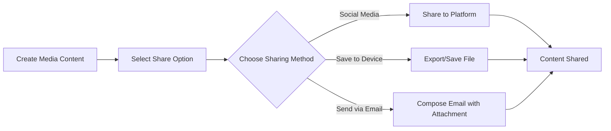

## 6.4.4 Sharing Your Creations

Creating media content within your Flutter apps is an exciting journey, but the real magic happens when you share your creations with the world. Sharing allows others to enjoy and interact with what you've made, similar to sharing a piece of artwork or a song with friends and family. In this section, we'll explore how you can export and share the media content you've created in your apps, fostering a sense of accomplishment and community.

### Why Share Your Creations?

Sharing your creations is not just about showing off your work; it's about connecting with others, receiving feedback, and inspiring creativity. When you share your media, you invite others to experience your vision and potentially collaborate on new ideas. Whether it's a beautiful image, a catchy tune, or an engaging video, sharing can open doors to new opportunities and friendships.

### Key Concepts in Sharing Media

Let's dive into some key concepts that will help you share your media creations effectively:

#### Exporting Media

Exporting media involves saving the images, sounds, or videos you've created within your app. This step is crucial because it allows you to store your creations in a format that can be easily shared or used elsewhere.

#### Sharing via Social Media

Social media platforms like Instagram, TikTok, and YouTube are great places to share your creations. By implementing features in your app that allow direct sharing to these platforms, you can reach a wider audience and engage with a community that appreciates your work.

#### Saving to Device

Sometimes, you might want to save your creations directly to your device's gallery or storage. This allows you to keep a personal collection of your work or share it later through other means.

#### Exporting Data with Packages

Using packages like `share_plus`, you can easily share files or links from your app. This package simplifies the process of sharing content across different platforms and devices.

### Implementing Sharing Features in Flutter

Let's look at a simple code example to understand how you can implement sharing features in your Flutter app using the `share_plus` package.

```dart
import 'package:flutter/material.dart';
import 'package:share_plus/share_plus.dart';

void main() {
  runApp(ShareContentApp());
}

class ShareContentApp extends StatelessWidget {
  final String textToShare = 'Check out my awesome Flutter app!';

  @override
  Widget build(BuildContext context) {
    return MaterialApp(
      home: Scaffold(
        appBar: AppBar(
          title: Text('Share Your Creations'),
        ),
        body: Center(
          child: ElevatedButton(
            onPressed: () {
              Share.share(textToShare);
            },
            child: Text('Share App'),
          ),
        ),
      ),
    );
  }
}
```

In this example, we create a simple Flutter app with a button that, when pressed, shares a text message. The `share_plus` package handles the sharing functionality, making it easy to integrate into your app.

### Activities to Enhance Sharing

Here are some activities you can try to enhance the sharing capabilities of your app:

1. **Share Text:** Allow users to share messages or descriptions of their projects. This can be a simple text field where users can write about their creation and share it with others.

2. **Share Images:** Enable sharing of images created or used within the app. You can use the `share_plus` package to share images stored in your app's assets or generated by the user.

3. **Share Media Links:** Let users share links to videos or sound files hosted online. This is useful if your app creates content that is uploaded to platforms like YouTube or SoundCloud.

### Visualizing the Sharing Process

To better understand the sharing process, let's look at a flowchart that outlines the steps involved:



This flowchart illustrates the different paths your app can take when sharing media content. Whether it's through social media, saving to a device, or sending via email, each method leads to the ultimate goal: sharing your creation with others.

### Encouragement and Engagement

Sharing your creations is a joyful experience that brings a sense of pride and accomplishment. Encourage yourself to share your apps with friends and family, receive feedback, and take pride in your work. Sharing can inspire others and lead to collaborative projects, sparking new ideas and innovations.

### Safety Considerations

While sharing your creations is exciting, it's important to do so safely. Always involve a parent or guardian when sharing your projects online, especially if you're using social media or other public platforms. Ensure that your personal information is protected and that you're sharing content responsibly.

### Conclusion

By integrating sharing features into your Flutter apps, you not only enhance the functionality of your creations but also open up a world of possibilities for interaction and collaboration. Remember, sharing is about more than just showing off your work—it's about connecting with others and inspiring creativity. So go ahead, share your creations, and let the world see what you've made!

## Quiz Time!



### What is the primary purpose of sharing your media creations?

- [x] To connect with others and receive feedback
- [ ] To make money
- [ ] To keep your work private
- [ ] To delete your creations

> **Explanation:** Sharing your media creations allows you to connect with others, receive feedback, and inspire creativity.

### Which package is used in Flutter to share content across platforms?

- [x] share_plus
- [ ] flutter_share
- [ ] share_content
- [ ] media_share

> **Explanation:** The `share_plus` package is used in Flutter to share content across different platforms and devices.

### What is one benefit of saving media to your device?

- [x] You can keep a personal collection of your work
- [ ] It automatically deletes the media
- [ ] It prevents sharing with others
- [ ] It hides the media from view

> **Explanation:** Saving media to your device allows you to keep a personal collection of your work or share it later through other means.

### What is a key concept in sharing media via social media?

- [x] Implementing features to share content directly to platforms
- [ ] Keeping content hidden
- [ ] Deleting content after sharing
- [ ] Making content private

> **Explanation:** Implementing features to share content directly to platforms like Instagram, TikTok, or YouTube is a key concept in sharing media via social media.

### What does the `share_plus` package simplify?

- [x] The process of sharing content across different platforms
- [ ] The process of deleting content
- [ ] The process of hiding content
- [ ] The process of encrypting content

> **Explanation:** The `share_plus` package simplifies the process of sharing content across different platforms and devices.

### Which of the following is NOT a method of sharing media content?

- [ ] Social Media
- [ ] Save to Device
- [ ] Send via Email
- [x] Delete Content

> **Explanation:** Deleting content is not a method of sharing media content.

### What should you do before sharing your creations online?

- [x] Involve a parent or guardian
- [ ] Share without checking
- [ ] Ignore safety considerations
- [ ] Share personal information

> **Explanation:** It's important to involve a parent or guardian when sharing your projects online to ensure safety and responsible sharing.

### What is the final goal of the sharing process in the flowchart?

- [x] Content Shared
- [ ] Content Deleted
- [ ] Content Hidden
- [ ] Content Encrypted

> **Explanation:** The final goal of the sharing process in the flowchart is to have the content shared with others.

### What is an activity you can try to enhance sharing capabilities?

- [x] Share Images
- [ ] Hide Images
- [ ] Delete Images
- [ ] Encrypt Images

> **Explanation:** Sharing images is an activity you can try to enhance the sharing capabilities of your app.

### True or False: Sharing your creations can inspire others and lead to collaborative projects.

- [x] True
- [ ] False

> **Explanation:** Sharing your creations can indeed inspire others and lead to collaborative projects, sparking new ideas and innovations.


