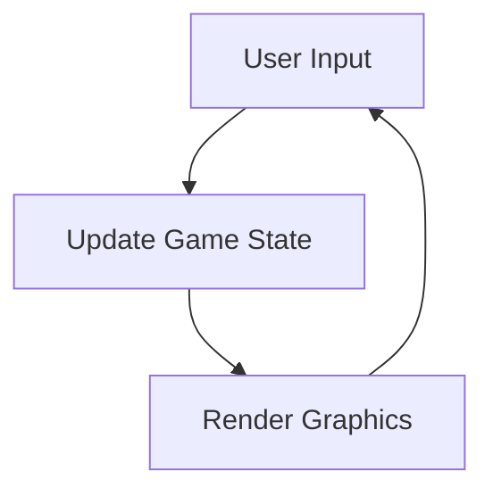

## 7.1.3 Game Loop Concept

Welcome to the exciting world of game development! In this section, we'll explore a fundamental concept that powers every game you play: the **game loop**. Understanding the game loop is crucial for creating interactive and dynamic games. Let's dive in and discover how this loop works and why it's so important.

### What is a Game Loop?

At the heart of every game lies the game loop. Think of it as the engine that keeps your game running smoothly. The game loop is a cycle that repeats continuously while the game is active. It handles everything from processing user input to updating the game state and rendering graphics on the screen. Without the game loop, your game wouldn't be able to respond to players' actions or display changes in real-time.

### Components of the Game Loop

The game loop consists of three main components: **Input**, **Update**, and **Render**. Let's break down each part to see how they work together to create an engaging gaming experience.

#### 1. Input

The first step in the game loop is capturing user input. This could be anything from tapping the screen, swiping, pressing a button, or moving a joystick. The game needs to know what the player wants to do so it can respond appropriately. For example, if you're playing a game where a character jumps when you tap the screen, the input phase detects that tap.

#### 2. Update

Once the game has the input, it's time to update the game state. This means changing what's happening in the game based on the player's actions and the game's logic. Continuing with our example, if the player tapped the screen, the update phase would move the character upward to simulate a jump. This phase also includes other game logic, like checking for collisions, updating scores, or changing levels.

#### 3. Render

Finally, the game needs to show the updated state to the player. This is where rendering comes in. The render phase draws the game's graphics on the screen, reflecting any changes made during the update phase. In our jumping character example, the render phase would display the character in its new position, mid-jump.

### The Game Loop in Action

To better understand how these components work together, let's look at a simple example. Imagine a game where a character moves across the screen when you swipe. Here's how the game loop would handle this:

1. **Input:** The game detects a swipe gesture from the player.
2. **Update:** The game calculates the new position of the character based on the swipe direction and speed.
3. **Render:** The game draws the character in its new position on the screen.

This cycle repeats many times per second, creating a smooth and responsive gaming experience.

### Visualizing the Game Loop

To help visualize the game loop, here's a flowchart diagram using Mermaid.js:

This diagram shows the continuous cycle of the game loop, where each component leads into the next, creating a seamless flow of interaction and feedback.

### Interactive Exercise

Now that you understand the game loop, let's put your knowledge to the test! Think about one of your favorite games. Can you identify the game loop in action? Consider how the game captures your input, updates the game state, and renders the graphics. Alternatively, if you're planning your own game, sketch out how the game loop would work. What inputs will your game respond to? How will the game state change? What will be rendered on the screen?

### Conclusion

The game loop is a powerful concept that brings games to life. By continuously cycling through input, update, and render phases, it creates an interactive experience that responds to players' actions in real-time. Understanding the game loop is a key step in your journey to becoming a game developer. Keep experimenting and exploring, and soon you'll be creating your own amazing games!

## Quiz Time!



### What is the primary purpose of a game loop?

- [x] To continuously handle input, update the game state, and render graphics.
- [ ] To store game data.
- [ ] To manage game settings.
- [ ] To create game music.

> **Explanation:** The game loop is essential for continuously handling input, updating the game state, and rendering graphics, ensuring the game runs smoothly.

### Which component of the game loop is responsible for capturing user actions?

- [x] Input
- [ ] Update
- [ ] Render
- [ ] Storage

> **Explanation:** The Input component captures user actions like tapping or swiping, allowing the game to respond accordingly.

### What happens during the update phase of the game loop?

- [x] The game state changes based on input and game logic.
- [ ] Graphics are drawn on the screen.
- [ ] User input is captured.
- [ ] The game saves progress.

> **Explanation:** During the update phase, the game state changes based on the player's input and the game's logic, such as moving characters or updating scores.

### In the render phase, what is the main task?

- [x] Drawing the updated state on the screen.
- [ ] Capturing user input.
- [ ] Updating game logic.
- [ ] Saving game data.

> **Explanation:** The render phase is responsible for drawing the updated game state on the screen, showing any changes made during the update phase.

### How often does the game loop cycle?

- [x] Continuously while the game is active.
- [ ] Once per minute.
- [ ] Only when the player presses a button.
- [ ] At the start of the game.

> **Explanation:** The game loop cycles continuously while the game is active, ensuring real-time interaction and updates.

### Which of the following is NOT a component of the game loop?

- [x] Storage
- [ ] Input
- [ ] Update
- [ ] Render

> **Explanation:** Storage is not a component of the game loop. The main components are Input, Update, and Render.

### What is the relationship between the update and render phases?

- [x] The update phase changes the game state, and the render phase displays these changes.
- [ ] The render phase changes the game state, and the update phase displays these changes.
- [ ] Both phases capture user input.
- [ ] Both phases store game data.

> **Explanation:** The update phase changes the game state based on input, and the render phase displays these changes on the screen.

### Why is the game loop important in game development?

- [x] It ensures the game responds to player actions in real-time.
- [ ] It saves the game progress.
- [ ] It creates game music.
- [ ] It manages game settings.

> **Explanation:** The game loop is crucial because it ensures the game responds to player actions in real-time, providing an interactive experience.

### What is an example of user input in a game?

- [x] Tapping the screen
- [ ] Changing game settings
- [ ] Saving progress
- [ ] Loading a level

> **Explanation:** User input includes actions like tapping the screen, which the game loop captures to update the game state.

### True or False: The game loop only runs once when the game starts.

- [ ] True
- [x] False

> **Explanation:** False. The game loop runs continuously while the game is active, allowing for real-time interaction and updates.


