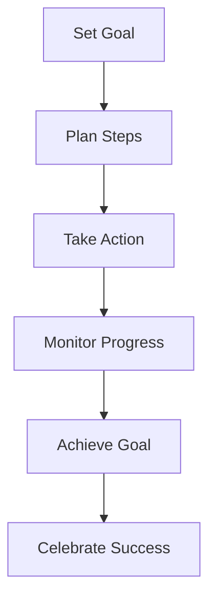

## 7.1.4 Setting Goals

Embarking on the journey of creating your first game is an exciting adventure! To make sure your project stays on track and you achieve what you set out to do, it's important to set clear and achievable goals. In this section, we'll explore why goals matter, the different types of goals you can set, and how to create effective goals using the SMART framework. Let's dive in!

### Why Goals Matter

Setting goals is like having a map for your game development journey. Without goals, it's easy to get lost or overwhelmed by the many tasks involved in creating a game. Goals help you:

- **Stay Focused:** By knowing what you want to achieve, you can concentrate your efforts on tasks that matter.
- **Measure Progress:** Goals give you milestones to celebrate as you complete each step.
- **Stay Motivated:** Achieving goals, even small ones, boosts your confidence and keeps you motivated to continue.
- **Manage Time:** With clear goals, you can better allocate your time and resources.

### Types of Goals

When setting goals for your game project, it's helpful to categorize them into short-term and long-term goals.

#### Short-Term Goals

Short-term goals are smaller tasks that you can accomplish relatively quickly. They help you build momentum and make steady progress. Examples include:

- Designing a character sprite.
- Creating a basic game level.
- Implementing a simple scoring system.

#### Long-Term Goals

Long-term goals are bigger objectives that take more time and effort to achieve. They represent the overall vision for your game. Examples include:

- Completing the entire game with multiple levels.
- Adding advanced features like power-ups or multiplayer modes.
- Publishing your game on an app store.

### SMART Goals

To make your goals more effective, use the SMART framework. SMART stands for Specific, Measurable, Achievable, Relevant, and Time-bound. Let's break it down:

- **Specific:** Clearly define what you want to achieve. Avoid vague goals.
- **Measurable:** Ensure you can track your progress and know when you've achieved the goal.
- **Achievable:** Set goals that are realistic given your skills and resources.
- **Relevant:** Make sure your goals align with your overall vision for the game.
- **Time-bound:** Set a deadline to create a sense of urgency and focus.

### Example Goals

Here are some examples of SMART goals for a game project:

- **Short-Term Goal:** "I want to create a character that can jump and collect apples by the end of this week."
  - **Specific:** Create a character with jumping and collecting abilities.
  - **Measurable:** The character can jump and collect apples.
  - **Achievable:** You have the skills to animate and code these actions.
  - **Relevant:** This is a core mechanic of your game.
  - **Time-bound:** Complete by the end of the week.

- **Long-Term Goal:** "I aim to design three different levels with increasing difficulty within the next month."
  - **Specific:** Design three levels with varying challenges.
  - **Measurable:** Three completed levels.
  - **Achievable:** You have the time and resources to design these levels.
  - **Relevant:** Levels are essential for game progression.
  - **Time-bound:** Complete within a month.

### Interactive Exercise

Now it's your turn! Take a moment to think about your game project and write down at least three goals. Try to categorize them into short-term and long-term goals. Use the SMART framework to ensure your goals are well-defined and achievable.

1. **Short-Term Goal:** 
   - Specific:
   - Measurable:
   - Achievable:
   - Relevant:
   - Time-bound:

2. **Long-Term Goal:** 
   - Specific:
   - Measurable:
   - Achievable:
   - Relevant:
   - Time-bound:

3. **Another Goal:** 
   - Specific:
   - Measurable:
   - Achievable:
   - Relevant:
   - Time-bound:

### Visualizing Your Goals

To help you visualize the process of setting and achieving goals, here's a simple diagram illustrating the journey from setting a goal to achieving it:

### Conclusion

Setting goals is a crucial step in your game development journey. By defining clear, achievable objectives, you can stay focused, motivated, and on track to create an amazing game. Remember to use the SMART framework to ensure your goals are well-defined and attainable. Happy coding!

## Quiz Time!



### Why is setting goals important in game development?

- [x] It helps keep the project focused and manageable.
- [ ] It makes the game more fun to play.
- [ ] It ensures the game will be successful.
- [ ] It allows you to skip planning.

> **Explanation:** Setting goals helps keep the project focused and manageable by providing direction and milestones.

### What are short-term goals?

- [x] Smaller tasks that can be accomplished quickly.
- [ ] The overall vision for the game.
- [ ] Goals that take a long time to achieve.
- [ ] Tasks that are not important.

> **Explanation:** Short-term goals are smaller tasks that can be accomplished quickly, helping to build momentum.

### What does the "S" in SMART goals stand for?

- [x] Specific
- [ ] Simple
- [ ] Speedy
- [ ] Special

> **Explanation:** The "S" in SMART goals stands for Specific, meaning the goal should be clearly defined.

### Which of the following is an example of a long-term goal?

- [ ] Designing a character sprite.
- [ ] Creating a basic game level.
- [x] Completing the entire game with multiple levels.
- [ ] Implementing a simple scoring system.

> **Explanation:** Completing the entire game with multiple levels is a long-term goal because it takes more time and effort.

### What does "Measurable" mean in the context of SMART goals?

- [x] You can track your progress and know when you've achieved the goal.
- [ ] The goal is easy to achieve.
- [ ] The goal is relevant to your interests.
- [ ] The goal has a set deadline.

> **Explanation:** "Measurable" means you can track your progress and know when you've achieved the goal.

### How can setting a deadline help in achieving a goal?

- [x] It creates a sense of urgency and focus.
- [ ] It makes the goal more fun.
- [ ] It ensures the goal is achievable.
- [ ] It makes the goal less important.

> **Explanation:** Setting a deadline creates a sense of urgency and focus, helping you stay on track.

### What is a benefit of achieving short-term goals?

- [x] They boost your confidence and keep you motivated.
- [ ] They are not important to the project.
- [ ] They make the game more difficult.
- [ ] They allow you to skip long-term goals.

> **Explanation:** Achieving short-term goals boosts your confidence and keeps you motivated to continue.

### What should you do after achieving a goal?

- [x] Celebrate your success.
- [ ] Forget about it.
- [ ] Set fewer goals.
- [ ] Stop working on the project.

> **Explanation:** Celebrating your success after achieving a goal helps maintain motivation and acknowledges your hard work.

### Which of the following is NOT a characteristic of SMART goals?

- [ ] Specific
- [ ] Measurable
- [ ] Achievable
- [x] Random

> **Explanation:** SMART goals are Specific, Measurable, Achievable, Relevant, and Time-bound, not random.

### True or False: Long-term goals should be vague to allow flexibility.

- [ ] True
- [x] False

> **Explanation:** Long-term goals should be specific to provide clear direction and focus.


