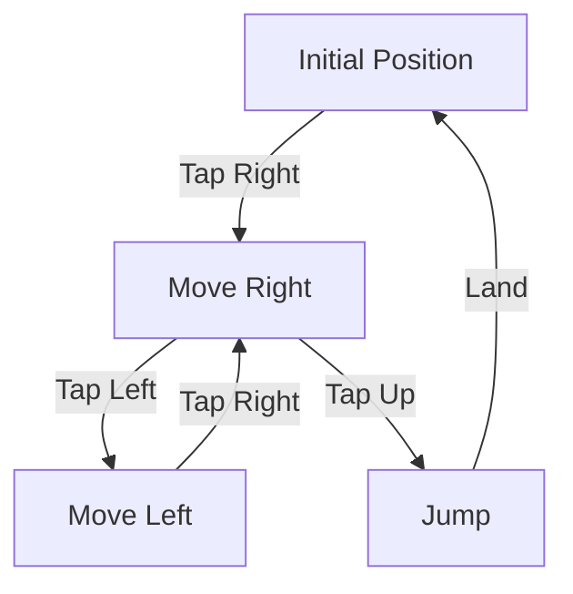

## 7.2.1 Character Movement

Welcome to the exciting world of game development! In this section, we'll explore how to bring your game characters to life by coding their movements. Character movement is a fundamental aspect of game mechanics, allowing players to interact with the game world. Let's dive in and learn how to make your characters move using Flutter!

### Introduction to Movement

Character movement is the way players interact with your game. Whether it's jumping over obstacles, running through levels, or dodging enemies, movement is key to creating an engaging experience. By learning how to code character movement, you'll be able to design games that are fun and interactive.

### Basic Controls

Before we start coding, let's think about how players will control the character. Common controls include:

- **Arrow Keys:** Used for moving left, right, up, and down.
- **On-Screen Buttons:** Touch controls for mobile devices to move, jump, or crouch.
- **Swipe Gestures:** For more advanced interactions like sliding or dashing.

In this lesson, we'll focus on using on-screen buttons and gestures to control character movement.

### Flutter Implementation

Flutter makes it easy to capture user input and update the game state. We'll use the `GestureDetector` widget to detect taps and swipes, and manage the character's position using state.

#### Using Gesture Detectors

The `GestureDetector` widget in Flutter is a powerful tool for capturing user interactions. It can detect various gestures like taps, double taps, long presses, and swipes. Here's how you can use it to move a character:

```dart
import 'package:flutter/material.dart';

class CharacterMovementGame extends StatefulWidget {
  @override
  _CharacterMovementGameState createState() => _CharacterMovementGameState();
}

class _CharacterMovementGameState extends State<CharacterMovementGame> {
  double characterPosition = 0.0;

  void moveCharacter(double offset) {
    setState(() {
      characterPosition += offset;
    });
  }

  @override
  Widget build(BuildContext context) {
    return Scaffold(
      appBar: AppBar(
        title: Text('Character Movement Game'),
      ),
      body: Center(
        child: Stack(
          children: [
            Positioned(
              left: characterPosition,
              child: GestureDetector(
                onTap: () {
                  moveCharacter(10.0); // Move character to the right
                },
                child: Image.asset('assets/character.png', width: 50, height: 50),
              ),
            ),
          ],
        ),
      ),
    );
  }
}
```

#### State Management

In the example above, we use a `StatefulWidget` to manage the character's position. The `setState` method updates the UI whenever the character moves. This is crucial for reflecting changes in the game world.

#### Code Example Explained

- **`characterPosition`:** A variable to track the character's horizontal position.
- **`moveCharacter`:** A function that updates the character's position by a given offset.
- **`GestureDetector`:** Captures tap events to move the character.

### Interactive Exercise

Now it's your turn! Try modifying the code to:

- Change the character's speed by adjusting the offset in `moveCharacter`.
- Add new movement directions, such as moving left or jumping.

### Visual Aids

To help visualize how the character moves, let's look at a simple diagram:



This diagram shows the possible movements based on user input. Each action updates the character's position, creating a dynamic and interactive experience.

### Best Practices and Tips

- **Smooth Movement:** Ensure movements are smooth by using consistent offsets and updating the state efficiently.
- **Responsive Controls:** Test your controls on different devices to ensure they are responsive and intuitive.
- **Feedback:** Provide visual or audio feedback when the character moves to enhance the player's experience.

### Common Pitfalls

- **Laggy Movement:** Avoid large offsets that can make movement appear jumpy.
- **Unresponsive Controls:** Ensure the `GestureDetector` covers the entire area where input is expected.

By following these guidelines, you'll create a game with engaging and responsive character movement.

## Quiz Time!



### What is the primary purpose of character movement in a game?

- [x] To allow players to interact with the game world
- [ ] To make the game look more colorful
- [ ] To increase the game's difficulty
- [ ] To reduce the game's complexity

> **Explanation:** Character movement is essential for player interaction, enabling them to navigate and engage with the game environment.

### Which Flutter widget is used to detect user gestures?

- [ ] Container
- [x] GestureDetector
- [ ] ListView
- [ ] Scaffold

> **Explanation:** The `GestureDetector` widget is used in Flutter to capture various user gestures like taps and swipes.

### What method is used to update the UI in a StatefulWidget?

- [ ] build()
- [ ] initState()
- [x] setState()
- [ ] dispose()

> **Explanation:** The `setState()` method is used to update the UI by notifying the framework of changes in the widget's state.

### In the code example, what does the `moveCharacter` function do?

- [ ] It changes the character's image
- [x] It updates the character's position
- [ ] It changes the character's color
- [ ] It resets the game

> **Explanation:** The `moveCharacter` function updates the character's position by modifying the `characterPosition` variable.

### How can you modify the character's speed in the example code?

- [x] By changing the offset value in `moveCharacter`
- [ ] By changing the image size
- [ ] By adding more GestureDetectors
- [ ] By modifying the app's title

> **Explanation:** Adjusting the offset value in the `moveCharacter` function changes how far the character moves with each tap, effectively altering its speed.

### What is a common pitfall when implementing character movement?

- [ ] Using too many colors
- [ ] Making the character too small
- [x] Laggy or jumpy movement
- [ ] Adding too many sound effects

> **Explanation:** Laggy or jumpy movement can occur if the offsets are too large or the state updates are inefficient, leading to a poor user experience.

### What should you do to ensure responsive controls?

- [x] Test on different devices
- [ ] Use only one GestureDetector
- [ ] Avoid using state management
- [ ] Use random offsets

> **Explanation:** Testing on different devices ensures that controls are responsive and intuitive across various screen sizes and input methods.

### Which method is used to initialize state in a StatefulWidget?

- [ ] build()
- [x] initState()
- [ ] setState()
- [ ] dispose()

> **Explanation:** The `initState()` method is used to initialize state when a StatefulWidget is created.

### What is the role of the `GestureDetector` in the example?

- [ ] To display images
- [ ] To manage state
- [x] To capture user input
- [ ] To animate widgets

> **Explanation:** The `GestureDetector` captures user input, such as taps, to trigger actions like moving the character.

### True or False: The `setState()` method is used to permanently store data in Flutter apps.

- [ ] True
- [x] False

> **Explanation:** False. The `setState()` method is used to update the UI temporarily and does not store data permanently.



By mastering character movement, you're taking a big step toward creating interactive and engaging games. Keep experimenting and have fun bringing your game ideas to life!
