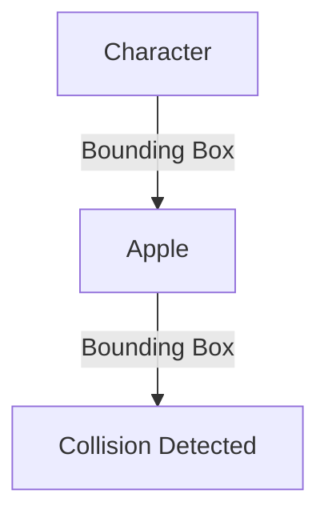

## 7.2.2 Collision Detection

In the exciting world of game development, one of the key elements that bring a game to life is the ability to detect when objects interact with each other. This is known as **collision detection**. Imagine a game where your character collects apples. How does the game know when the character has touched an apple? That's where collision detection comes in!

### What is Collision Detection?

Collision detection is a technique used in games to determine when two objects, such as a character and an apple, come into contact. This allows the game to respond to player actions, like collecting items or avoiding obstacles. Without collision detection, games would lack interactivity and excitement.

### Why It’s Important

Collision detection is crucial because it enables the game to react to the player's movements and decisions. For example, when your character collects an apple, the game can increase the score or play a sound. Similarly, if the character hits an obstacle, the game might reduce the player's health or end the game. This interaction makes the game engaging and fun to play.

### Basic Concepts of Collision Detection

#### Bounding Boxes

One of the simplest ways to detect collisions is by using **bounding boxes**. A bounding box is an imaginary rectangle that surrounds an object. By checking if these rectangles overlap, we can determine if two objects are colliding.

#### Simple Logic

The basic logic for collision detection involves checking if the bounding boxes of two objects overlap. This can be done using an `if` statement. If the rectangles overlap, a collision has occurred.

### Flutter Implementation

In Flutter, we can use the `Rect` class to create bounding boxes for our objects. Let's see how we can implement collision detection using position and size.

#### Using Position and Size

To detect collisions, we need to know the position and size of the objects involved. We can represent these using the `Rect` class in Flutter, which allows us to define a rectangle with specific coordinates and dimensions.

#### Code Example

Here's a simple code example to demonstrate collision detection in Flutter:

```dart
bool checkCollision(Rect a, Rect b) {
  return a.overlaps(b);
}

// Usage
Rect characterRect = Rect.fromLTWH(characterX, characterY, width, height);
Rect appleRect = Rect.fromLTWH(appleX, appleY, width, height);

if (checkCollision(characterRect, appleRect)) {
  // Collect the apple
}
```

In this example, we define two rectangles: one for the character and one for the apple. The `checkCollision` function checks if these rectangles overlap, indicating a collision.

### Interactive Exercise

Now it's your turn! Try implementing collision detection in your game. Create a simple game where your character collects items, like apples, by detecting collisions. Test it out and see how the game responds when the character touches an item.

### Visual Aids

To help visualize collision detection, let's look at a diagram showing bounding boxes around a character and an object:



In this diagram, you can see how the bounding boxes of the character and the apple overlap, indicating a collision.

### Best Practices and Tips

- **Optimize Performance:** Collision detection can be computationally expensive, especially with many objects. Consider optimizing your code by checking collisions only when necessary.
- **Use Accurate Bounding Boxes:** Ensure your bounding boxes accurately represent the objects. This will improve collision detection accuracy.
- **Handle Edge Cases:** Consider what happens when objects are at the edges of the screen or overlap only slightly.

By mastering collision detection, you'll be able to create interactive and engaging games that respond to player actions. Keep experimenting and refining your skills, and soon you'll be building amazing games!

## Quiz Time!



### What is collision detection?

- [x] A technique to determine when two objects in a game touch each other.
- [ ] A method to increase the speed of a game.
- [ ] A way to create animations in a game.
- [ ] A process to design game levels.

> **Explanation:** Collision detection is used to determine when two objects, such as a character and an item, interact or touch each other in a game.

### Why is collision detection important in games?

- [x] It allows the game to respond to player actions.
- [ ] It makes the game graphics look better.
- [ ] It reduces the game's memory usage.
- [ ] It speeds up the game's loading time.

> **Explanation:** Collision detection is important because it enables the game to react to player actions, such as collecting items or avoiding obstacles, making the game interactive and engaging.

### What is a bounding box?

- [x] An imaginary rectangle that surrounds an object for collision detection.
- [ ] A tool used to draw graphics in a game.
- [ ] A method to store game data.
- [ ] A way to organize game levels.

> **Explanation:** A bounding box is an imaginary rectangle used to detect collisions by checking if it overlaps with another bounding box.

### How do you check for collisions using bounding boxes?

- [x] By checking if the bounding boxes of two objects overlap.
- [ ] By measuring the distance between two objects.
- [ ] By comparing the colors of two objects.
- [ ] By counting the number of objects on the screen.

> **Explanation:** Collision detection using bounding boxes involves checking if the rectangles around two objects overlap.

### In Flutter, which class is used to create bounding boxes?

- [x] Rect
- [ ] Box
- [ ] Shape
- [ ] Container

> **Explanation:** In Flutter, the `Rect` class is used to create rectangles that can serve as bounding boxes for collision detection.

### What does the `overlaps` method do in Flutter?

- [x] Checks if two rectangles overlap.
- [ ] Draws a rectangle on the screen.
- [ ] Changes the color of a rectangle.
- [ ] Resizes a rectangle.

> **Explanation:** The `overlaps` method in Flutter checks if two rectangles overlap, indicating a collision.

### What should you consider when implementing collision detection?

- [x] Optimize performance and handle edge cases.
- [ ] Use only one bounding box for all objects.
- [ ] Ignore small objects in the game.
- [ ] Use complex shapes for bounding boxes.

> **Explanation:** When implementing collision detection, it's important to optimize performance and handle edge cases to ensure accuracy and efficiency.

### What happens when a collision is detected in a game?

- [x] The game can respond, such as collecting an item or triggering an event.
- [ ] The game automatically restarts.
- [ ] The game graphics change color.
- [ ] The game speed increases.

> **Explanation:** When a collision is detected, the game can respond by performing actions like collecting items or triggering events.

### Can collision detection be used for both collecting items and avoiding obstacles?

- [x] True
- [ ] False

> **Explanation:** Collision detection can be used for various interactions, including collecting items and avoiding obstacles, making it versatile in game development.

### What is one way to visualize collision detection?

- [x] Using diagrams with bounding boxes around objects.
- [ ] By drawing lines between objects.
- [ ] By changing the background color.
- [ ] By increasing the game's volume.

> **Explanation:** Visualizing collision detection can be done using diagrams that show bounding boxes around objects, helping to understand how collisions are detected.


