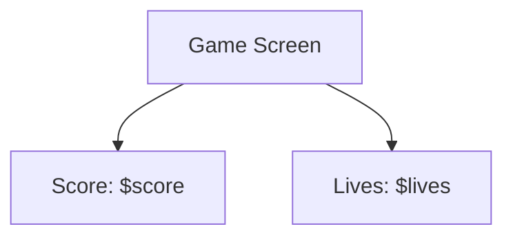

## 7.2.3 Scoring and Lives

In this section, we'll explore how to add scoring systems and lives to your Flutter game. These elements are crucial for creating engaging and challenging gameplay experiences. By the end of this lesson, you'll know how to track and display scores and lives, making your game more interactive and fun!

### Scoring Basics

Scoring in games is a way to reward players for their achievements, such as collecting items or defeating enemies. Points can motivate players to improve their skills and reach higher levels. Let's start by understanding how we can implement a basic scoring system in Flutter.

### Lives Concept

Lives represent the number of chances a player has before the game ends. When a player loses all their lives, it's usually game over. Managing lives adds an element of challenge and strategy to your game.

### Flutter Implementation

To implement scoring and lives in your Flutter game, we'll use variables to keep track of these values. Let's dive into the code!

#### Variables for Score and Lives

We'll start by declaring variables to store the player's score and lives. These variables will be updated as the player progresses through the game.

```dart
int score = 0; // Initial score
int lives = 3; // Initial number of lives

void collectApple() {
  setState(() {
    score += 10; // Increase score by 10 when an apple is collected
  });
}

void loseLife() {
  setState(() {
    lives -= 1; // Decrease lives by 1 when a life is lost
    if (lives <= 0) {
      // Game Over logic
    }
  });
}
```

In this example, `collectApple()` is a function that increases the score by 10 points each time it's called, simulating the collection of an apple. The `loseLife()` function decreases the player's lives by 1 and checks if the lives have reached zero, which would trigger a game over scenario.

#### Displaying Scores and Lives

To display the score and lives on the screen, we'll use `Text` widgets within a `Column` widget. This allows us to show the current score and lives at the top of the game interface.

```dart
Column(
  children: [
    Text('Score: $score', style: TextStyle(fontSize: 24, fontWeight: FontWeight.bold)),
    Text('Lives: $lives', style: TextStyle(fontSize: 24, fontWeight: FontWeight.bold)),
  ],
)
```

This code snippet creates a vertical column with two text widgets, one for the score and one for the lives. The `TextStyle` is used to make the text larger and bold, ensuring it's easily visible to the player.

### Interactive Exercise

Now it's your turn! Try adding scoring and lives to your game. Use the code examples above to implement the functionality, and test your game to ensure points are added correctly when items are collected and lives decrease when the player makes mistakes.

### Visual Aids

To help you visualize where scores and lives appear on the game screen, here's a simple layout diagram:



In this diagram, the game screen displays the score and lives at the top, providing players with constant feedback on their progress.

### Best Practices

- **Keep it Simple:** Start with a basic scoring and lives system. You can always add more complexity later.
- **Feedback:** Provide immediate feedback to players when they gain points or lose lives. This keeps them engaged and aware of their performance.
- **Balance:** Ensure that the scoring and lives system is balanced. Too many lives might make the game too easy, while too few can make it frustrating.

### Common Pitfalls

- **Not Updating UI:** Ensure that the UI updates when the score or lives change. Use `setState()` to trigger a rebuild of the widgets displaying these values.
- **Game Over Logic:** Remember to handle the game over scenario when lives reach zero. This could involve displaying a game over screen or restarting the game.

### Conclusion

Implementing scoring and lives in your game adds depth and excitement, encouraging players to improve their skills and achieve higher scores. With these mechanics in place, your game will be more engaging and rewarding for players.

## Quiz Time!



### What is the primary purpose of a scoring system in a game?

- [x] To reward players for their achievements
- [ ] To make the game more difficult
- [ ] To confuse players
- [ ] To reduce the game's complexity

> **Explanation:** A scoring system rewards players for their achievements, motivating them to improve their skills and reach higher levels.

### What do lives represent in a game?

- [x] The number of chances a player has before the game is over
- [ ] The player's health level
- [ ] The number of enemies defeated
- [ ] The amount of time left in the game

> **Explanation:** Lives represent the number of chances a player has before the game ends, adding an element of challenge and strategy.

### How do you increase the score when an apple is collected in the provided code example?

- [x] `score += 10;`
- [ ] `score -= 10;`
- [ ] `score = 10;`
- [ ] `score++;`

> **Explanation:** The code `score += 10;` increases the score by 10 points when an apple is collected.

### What function is used to decrease lives in the provided code example?

- [x] `loseLife()`
- [ ] `collectApple()`
- [ ] `decreaseLife()`
- [ ] `reduceLife()`

> **Explanation:** The `loseLife()` function is used to decrease the player's lives by 1.

### What widget is used to display the score and lives on the screen?

- [x] `Text`
- [ ] `Button`
- [ ] `Image`
- [ ] `Slider`

> **Explanation:** The `Text` widget is used to display the score and lives on the screen.

### Which method is used to update the UI when the score or lives change?

- [x] `setState()`
- [ ] `initState()`
- [ ] `build()`
- [ ] `dispose()`

> **Explanation:** The `setState()` method is used to update the UI when the score or lives change, triggering a rebuild of the widgets.

### What should you do when the player's lives reach zero?

- [x] Trigger a game over scenario
- [ ] Increase the player's score
- [ ] Add more lives
- [ ] Do nothing

> **Explanation:** When the player's lives reach zero, you should trigger a game over scenario, such as displaying a game over screen or restarting the game.

### What is a common pitfall when implementing scoring and lives?

- [x] Not updating the UI when values change
- [ ] Adding too many lives
- [ ] Using too many variables
- [ ] Making the game too easy

> **Explanation:** A common pitfall is not updating the UI when the score or lives change, which can confuse players.

### Why is it important to provide feedback to players when they gain points or lose lives?

- [x] To keep them engaged and aware of their performance
- [ ] To make the game more difficult
- [ ] To confuse players
- [ ] To reduce the game's complexity

> **Explanation:** Providing feedback keeps players engaged and aware of their performance, enhancing the gaming experience.

### True or False: Lives in a game can be used to make the game more challenging.

- [x] True
- [ ] False

> **Explanation:** True. Lives add an element of challenge and strategy to the game, as players must manage their chances carefully.


