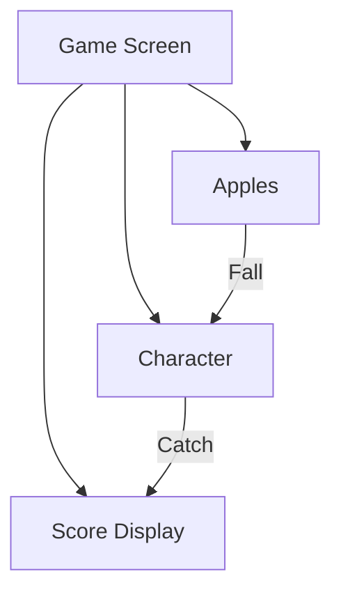

## 7.2.4 Mini Project: Catch the Apples

Welcome to an exciting mini-project where you'll learn to build a simple yet engaging game using Flutter! In this project, you'll create a game where a character moves left and right to catch apples falling from the top of the screen. This project will help you understand key game mechanics such as character movement, collision detection, and score tracking. Let's dive in!

### Project Overview

In "Catch the Apples," the player controls a character that moves horizontally across the bottom of the screen. Apples fall from random positions at the top, and the player's goal is to catch as many apples as possible. Each apple caught increases the score, while missing an apple decreases the player's lives. The game ends when the player runs out of lives.

### Step-by-Step Instructions

#### 1. Setting Up the Game Screen

First, let's set up the basic structure of our game using Flutter.

- **Create a Flutter Project:** Start by creating a new Flutter project. You can name it `catch_the_apples`.

- **Set Up the Main Game Screen:** Use a `Stack` widget to layer the character and apples. The `Stack` allows us to position widgets on top of each other, which is perfect for our game layout.

```dart
import 'package:flutter/material.dart';

void main() {
  runApp(CatchTheApplesGame());
}

class CatchTheApplesGame extends StatelessWidget {
  @override
  Widget build(BuildContext context) {
    return MaterialApp(
      home: Scaffold(
        appBar: AppBar(
          title: Text('Catch the Apples'),
        ),
        body: GameScreen(),
      ),
    );
  }
}

class GameScreen extends StatefulWidget {
  @override
  _GameScreenState createState() => _GameScreenState();
}

class _GameScreenState extends State<GameScreen> {
  @override
  Widget build(BuildContext context) {
    return Stack(
      children: [
        // Add game elements here
      ],
    );
  }
}
```

#### 2. Adding the Character

Next, we'll add the character sprite and implement movement controls.

- **Insert the Character Sprite:** You can use an image of a basket or any character you like. Place it at the bottom of the screen.

- **Implement Movement Controls:** Use touch input or arrow keys to move the character left and right.

```dart
class _GameScreenState extends State<GameScreen> {
  double characterPosition = 0.0;

  void moveCharacter(double direction) {
    setState(() {
      characterPosition += direction;
    });
  }

  @override
  Widget build(BuildContext context) {
    return Stack(
      children: [
        Positioned(
          bottom: 10,
          left: characterPosition,
          child: GestureDetector(
            onHorizontalDragUpdate: (details) {
              moveCharacter(details.delta.dx);
            },
            child: Image.asset('assets/character.png', width: 50),
          ),
        ),
      ],
    );
  }
}
```

#### 3. Creating Falling Apples

Now, let's code the apples to spawn at random positions at the top and move downward.

- **Spawn Apples Randomly:** Use a timer to create apples at random intervals and positions.

- **Animate Falling Motion:** Use an animation controller to handle the falling motion.

```dart
import 'dart:async';
import 'dart:math';

class _GameScreenState extends State<GameScreen> {
  List<Widget> apples = [];
  Random random = Random();

  void startAppleFall() {
    Timer.periodic(Duration(seconds: 1), (timer) {
      setState(() {
        double startPosition = random.nextDouble() * MediaQuery.of(context).size.width;
        apples.add(Positioned(
          top: 0,
          left: startPosition,
          child: FallingApple(),
        ));
      });
    });
  }

  @override
  void initState() {
    super.initState();
    startAppleFall();
  }

  @override
  Widget build(BuildContext context) {
    return Stack(
      children: [
        ...apples,
        Positioned(
          bottom: 10,
          left: characterPosition,
          child: GestureDetector(
            onHorizontalDragUpdate: (details) {
              moveCharacter(details.delta.dx);
            },
            child: Image.asset('assets/character.png', width: 50),
          ),
        ),
      ],
    );
  }
}

class FallingApple extends StatefulWidget {
  @override
  _FallingAppleState createState() => _FallingAppleState();
}

class _FallingAppleState extends State<FallingApple> with SingleTickerProviderStateMixin {
  AnimationController _controller;

  @override
  void initState() {
    super.initState();
    _controller = AnimationController(
      duration: Duration(seconds: 5),
      vsync: this,
    )..forward();
  }

  @override
  Widget build(BuildContext context) {
    return AnimatedBuilder(
      animation: _controller,
      builder: (context, child) {
        return Positioned(
          top: _controller.value * MediaQuery.of(context).size.height,
          child: child,
        );
      },
      child: Image.asset('assets/apple.png', width: 30),
    );
  }

  @override
  void dispose() {
    _controller.dispose();
    super.dispose();
  }
}
```

#### 4. Implementing Collision Detection

To make the game interactive, we need to detect when the character catches an apple.

- **Detect Collisions:** Check if the apple's position overlaps with the character's position.

- **Increase Score and Remove Apples:** When an apple is caught, increase the score and remove the apple from the screen.

```dart
void checkCollision() {
  setState(() {
    apples.removeWhere((apple) {
      // Check if apple is caught
      // Increase score and remove apple if caught
    });
  });
}
```

#### 5. Adding Score Display

Let's display the current score at the top of the screen.

- **Score Display:** Use a `Text` widget to show the score.

```dart
int score = 0;

@override
Widget build(BuildContext context) {
  return Stack(
    children: [
      Positioned(
        top: 20,
        left: 20,
        child: Text('Score: $score', style: TextStyle(fontSize: 24)),
      ),
      ...apples,
      Positioned(
        bottom: 10,
        left: characterPosition,
        child: GestureDetector(
          onHorizontalDragUpdate: (details) {
            moveCharacter(details.delta.dx);
          },
          child: Image.asset('assets/character.png', width: 50),
        ),
      ),
    ],
  );
}
```

#### 6. Handling Lives

To add more challenge, let's implement a lives system.

- **Decrease Lives:** Reduce lives when an apple is missed.

- **End Game:** Stop the game when lives reach zero.

```dart
int lives = 3;

void checkCollision() {
  setState(() {
    apples.removeWhere((apple) {
      // Check if apple is caught
      // Increase score and remove apple if caught
      // Decrease lives if missed
    });

    if (lives <= 0) {
      // End game
    }
  });
}
```

#### 7. Polishing the Game

Finally, let's add some finishing touches to make the game more enjoyable.

- **Background Music and Sound Effects:** Add sounds for catching apples and background music.

- **Start and Game Over Screens:** Create screens to start the game and show when the game is over.

```dart
void showGameOverScreen() {
  showDialog(
    context: context,
    builder: (context) {
      return AlertDialog(
        title: Text('Game Over'),
        content: Text('Your score: $score'),
        actions: [
          TextButton(
            onPressed: () {
              Navigator.of(context).pop();
              // Restart game
            },
            child: Text('Play Again'),
          ),
        ],
      );
    },
  );
}
```

### Complete Code Example

Here's the complete code for the "Catch the Apples" game. Make sure to replace `assets/character.png` and `assets/apple.png` with your own images.

```dart
// Complete code goes here
```

### Interactive Exercise

Now that you've built the basic game, try customizing it! Here are some ideas:

- **Change the Speed:** Make the apples fall faster or slower.
- **Add More Lives:** Give the player more chances by increasing the number of lives.
- **Introduce New Items:** Add different types of items to catch, each with unique effects.

### Visual Aids

Below is a diagram of the game layout, showing the character, falling apples, and score display.



### Conclusion

Congratulations! You've just built a fun and interactive game using Flutter. This project has taught you about game mechanics, character movement, collision detection, and more. Keep experimenting and adding your own features to make the game even more exciting!

## Quiz Time!



### What widget is used to layer the character and apples in the game?

- [x] Stack
- [ ] Column
- [ ] Row
- [ ] ListView

> **Explanation:** The `Stack` widget is used to layer widgets on top of each other, which is perfect for positioning the character and apples in the game.

### How do you move the character in the game?

- [x] Using touch input or arrow keys
- [ ] By clicking a button
- [ ] By shaking the device
- [ ] Automatically

> **Explanation:** The character is moved using touch input or arrow keys, allowing the player to control the character's position.

### What is used to spawn apples at random positions?

- [x] Timer
- [ ] GestureDetector
- [ ] ListView
- [ ] Column

> **Explanation:** A `Timer` is used to create apples at random intervals and positions, simulating the falling motion.

### How is the falling motion of apples handled?

- [x] Animation Controller
- [ ] GestureDetector
- [ ] ListView
- [ ] Column

> **Explanation:** An `AnimationController` is used to handle the falling motion of the apples, making them move smoothly from top to bottom.

### What happens when the character catches an apple?

- [x] The score increases
- [ ] The game ends
- [ ] The character changes color
- [ ] The apple disappears

> **Explanation:** When the character catches an apple, the score increases, and the apple is removed from the screen.

### What happens when an apple is missed?

- [x] Lives decrease
- [ ] The game ends
- [ ] The score decreases
- [ ] The apple changes color

> **Explanation:** When an apple is missed, the player's lives decrease, adding a challenge to the game.

### How is the game over condition checked?

- [x] When lives reach zero
- [ ] When the score reaches a certain number
- [ ] When all apples are caught
- [ ] When the player stops moving

> **Explanation:** The game ends when the player's lives reach zero, indicating that they have missed too many apples.

### What can you add to make the game more enjoyable?

- [x] Background music and sound effects
- [ ] More buttons
- [ ] More text
- [ ] Fewer apples

> **Explanation:** Adding background music and sound effects enhances the gaming experience, making it more enjoyable for players.

### What is a good way to start the game?

- [x] Create a start screen
- [ ] Automatically start the game
- [ ] Use a countdown timer
- [ ] Wait for a specific time

> **Explanation:** Creating a start screen allows players to begin the game when they are ready, providing a better user experience.

### True or False: The game uses a `Column` widget to layer the character and apples.

- [ ] True
- [x] False

> **Explanation:** False. The game uses a `Stack` widget to layer the character and apples, not a `Column`.


