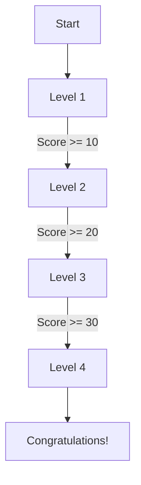

## 7.3.1 Adding Levels

Welcome to the exciting world of game development! In this section, we'll explore how to add levels to your game, making it more challenging and engaging for players. Levels are a fantastic way to keep players interested and motivated to continue playing. Let's dive into the details of designing and implementing levels in your Flutter game.

### Why Levels Matter

Levels are an essential component of many games. They provide a sense of progression and achievement, encouraging players to keep playing and improving their skills. As players advance through levels, they encounter new challenges and obstacles, making the game more exciting and rewarding.

### Designing Levels

When designing levels for your game, consider how you can gradually increase the difficulty to keep players engaged. Here are some strategies to consider:

#### Increasing Difficulty

1. **Speed and Quantity:** Increase the speed of falling objects or the number of obstacles as players progress to higher levels. For example, in a "Catch the Apples" game, you might increase the speed at which apples fall or add more apples to catch.

2. **Complex Patterns:** Introduce more complex movement patterns or obstacles that require players to think strategically and react quickly.

3. **Limited Resources:** Reduce the number of lives or time available to complete a level, adding an extra layer of challenge.

#### Unlocking Levels

Unlocking levels is a great way to reward players for their progress. You can implement a system where players must complete a level before moving on to the next. This adds a sense of accomplishment and encourages players to keep playing.

### Flutter Implementation

Now, let's look at how to implement levels in your Flutter game. We'll use variables to track the current level and adjust game parameters accordingly.

#### Level Variables

In your Flutter game, you can use a variable to keep track of the current level. This variable will help you adjust the game's difficulty as players progress.

Here's a simple example:

```dart
int level = 1;

void nextLevel() {
  setState(() {
    level += 1;
    appleSpeed += 2; // Increase difficulty
  });
}
```

In this example, the `level` variable keeps track of the current level. The `nextLevel` function increments the level and increases the speed of falling apples, making the game more challenging.

#### Progression Logic

To advance the game to the next level, you'll need to implement logic that checks if certain conditions are met. For example, you might advance to the next level when the player reaches a specific score.

Here's how you might implement this logic:

```dart
void checkProgression(int score) {
  if (score >= level * 10) { // Example condition
    nextLevel();
  }
}
```

In this example, the game advances to the next level when the player's score reaches a multiple of 10 times the current level. You can adjust the condition to fit your game's design.

### Interactive Exercise

Now it's your turn! Try adding multiple levels to your "Catch the Apples" game. Experiment with different ways to increase difficulty, such as changing the speed of falling apples or adding new obstacles. Use the code examples above as a starting point, and feel free to get creative!

### Visual Aids

To help you visualize how levels progress and how game parameters change with each level, here's a simple flowchart:



In this flowchart, players start at Level 1 and progress to the next level by reaching a specific score. Each level increases in difficulty, providing a rewarding challenge for players.

### Best Practices and Tips

- **Balance Difficulty:** Ensure that each level is challenging but not impossible. Test your levels to find the right balance.
- **Provide Feedback:** Give players feedback when they complete a level, such as a congratulatory message or a visual effect.
- **Encourage Exploration:** Design levels that encourage players to explore different strategies and approaches.

By following these guidelines, you'll create a game that is both fun and challenging, keeping players engaged and motivated to continue playing.

## Quiz Time!



### Why are levels important in a game?

- [x] They provide a sense of progression and achievement.
- [ ] They make the game easier.
- [ ] They reduce the game's complexity.
- [ ] They limit player engagement.

> **Explanation:** Levels provide a sense of progression and achievement, encouraging players to continue playing and improving their skills.

### What is one way to increase difficulty in a game level?

- [x] Increase the speed of falling objects.
- [ ] Decrease the number of obstacles.
- [ ] Reduce the player's score.
- [ ] Simplify the game's controls.

> **Explanation:** Increasing the speed of falling objects makes the game more challenging and requires players to react quickly.

### What is the purpose of unlocking levels?

- [x] To reward players for their progress.
- [ ] To make the game shorter.
- [ ] To reduce the game's difficulty.
- [ ] To limit player access.

> **Explanation:** Unlocking levels rewards players for their progress and encourages them to keep playing.

### How can you track the current level in a Flutter game?

- [x] Use a variable to store the current level.
- [ ] Use a constant to store the current level.
- [ ] Use a function to store the current level.
- [ ] Use a widget to store the current level.

> **Explanation:** A variable can be used to store the current level and adjust game parameters accordingly.

### What does the `nextLevel` function do in the provided code example?

- [x] Increments the level and increases the difficulty.
- [ ] Decreases the level and reduces the difficulty.
- [ ] Resets the game to the first level.
- [ ] Pauses the game.

> **Explanation:** The `nextLevel` function increments the level and increases the difficulty by adjusting game parameters.

### What condition is used to advance to the next level in the `checkProgression` function?

- [x] The player's score reaches a multiple of 10 times the current level.
- [ ] The player's score is less than the current level.
- [ ] The player's score is equal to the current level.
- [ ] The player's score is a prime number.

> **Explanation:** The condition checks if the player's score reaches a multiple of 10 times the current level to advance to the next level.

### What is a benefit of providing feedback to players when they complete a level?

- [x] It enhances the player's experience and motivation.
- [ ] It makes the game more difficult.
- [ ] It reduces the game's complexity.
- [ ] It limits player engagement.

> **Explanation:** Providing feedback enhances the player's experience and motivation by acknowledging their achievements.

### What is a good practice when designing game levels?

- [x] Balance difficulty to ensure levels are challenging but not impossible.
- [ ] Make all levels the same difficulty.
- [ ] Remove all obstacles from levels.
- [ ] Limit player exploration.

> **Explanation:** Balancing difficulty ensures that levels are challenging but not impossible, providing a rewarding experience for players.

### What is the purpose of the flowchart in the article?

- [x] To visualize how levels progress and how game parameters change.
- [ ] To show the game's final score.
- [ ] To display the game's controls.
- [ ] To illustrate the game's graphics.

> **Explanation:** The flowchart visualizes how levels progress and how game parameters change, helping readers understand the game's structure.

### True or False: Levels should be designed to encourage players to explore different strategies.

- [x] True
- [ ] False

> **Explanation:** Levels should encourage players to explore different strategies and approaches, enhancing the game's replayability and engagement.


