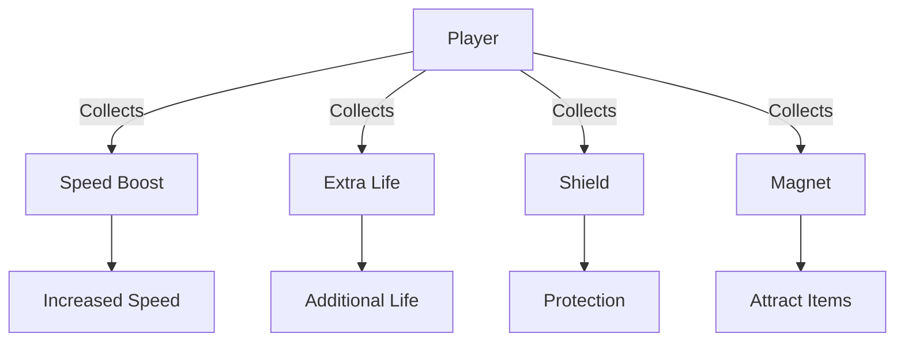

## 7.3.2 Power-Ups and Bonuses

In this exciting section, we're going to add a new layer of fun and complexity to your game by introducing power-ups and bonuses. These elements can transform a simple game into an engaging and dynamic experience for players. Let's dive into what power-ups are, how they can enhance your game, and how to implement them using Flutter.

### What are Power-Ups?

Power-ups are special items or abilities that players can collect during gameplay to gain temporary advantages. They can change the dynamics of the game, making it more exciting and challenging. For example, a power-up might slow down time, allow the player to catch multiple apples at once, or provide a protective shield.

### Benefits of Power-Ups

Power-ups add variety and excitement to games by:

- **Increasing Engagement:** Players are more likely to stay engaged when they have new challenges and rewards.
- **Enhancing Strategy:** Players must decide when and how to use power-ups effectively.
- **Adding Replay Value:** With different power-ups, each game session can feel unique.

### Designing Power-Ups

When designing power-ups, consider the following:

#### Types of Power-Ups

1. **Speed Boosts:** Temporarily increase the player's speed.
2. **Extra Lives:** Give the player an additional chance after losing.
3. **Shields:** Protect the player from obstacles or enemies.
4. **Magnets:** Attract items like apples towards the player.

#### Visual Representation

To make power-ups easily recognizable, use distinct colors, shapes, or icons. This helps players quickly identify and decide whether to collect them.

### Flutter Implementation

Let's explore how to implement power-ups in your Flutter game.

#### Spawning Power-Ups

Power-ups can appear randomly or at specific intervals. Here's a simple way to spawn power-ups in your game:

```dart
void spawnPowerUp() {
  // Randomly decide when to spawn a power-up
  if (Random().nextInt(100) < 10) { // 10% chance
    // Create a new power-up at a random position
    PowerUp newPowerUp = PowerUp(
      type: 'speed',
      position: Offset(Random().nextDouble() * screenWidth, 0),
    );
    powerUps.add(newPowerUp);
  }
}
```

#### Handling Power-Up Effects

When a player collects a power-up, apply its effects temporarily:

```dart
void applyPowerUp(String type) {
  if (type == 'slow') {
    appleSpeed = slowSpeed;
    // Set a timer to revert back after some time
    Timer(Duration(seconds: 5), () {
      appleSpeed = normalSpeed;
    });
  } else if (type == 'shield') {
    playerHasShield = true;
    // Remove shield after some time
    Timer(Duration(seconds: 5), () {
      playerHasShield = false;
    });
  }
  // Add other power-up types here
}
```

### Interactive Exercise

Now it's your turn! Think of a new power-up you could add to your game. What effect will it have? How will it change the gameplay? Implement your power-up and test it out.

### Visual Aids

To help visualize the concept of power-ups, consider using icons or diagrams. Here's an example of how you might represent different power-ups in your game:



### Best Practices and Tips

- **Balance:** Ensure power-ups are balanced so they enhance the game without making it too easy.
- **Feedback:** Provide visual or audio feedback when a power-up is collected.
- **Experiment:** Try different types of power-ups to see which ones work best for your game.

By adding power-ups and bonuses, you're not only making your game more fun but also giving players more reasons to keep playing. Keep experimenting and see how these elements can transform your game!

## Quiz Time!



### What are power-ups in a game?

- [x] Special items that give temporary benefits
- [ ] Permanent upgrades to the player
- [ ] Decorative elements in the game
- [ ] Background music tracks

> **Explanation:** Power-ups are special items that provide temporary benefits or abilities to the player, enhancing the gameplay experience.

### Which of the following is NOT a type of power-up?

- [ ] Speed Boost
- [ ] Extra Life
- [ ] Shield
- [x] Background Color Change

> **Explanation:** While speed boosts, extra lives, and shields are common power-ups, changing the background color is not typically considered a power-up.

### How do power-ups enhance a game?

- [x] By increasing engagement and adding variety
- [ ] By making the game easier to win
- [ ] By reducing the number of levels
- [ ] By removing challenges

> **Explanation:** Power-ups increase engagement and add variety, making the game more exciting and challenging.

### What should you consider when designing power-ups?

- [x] Visual representation and balance
- [ ] Only the color of the power-up
- [ ] The number of power-ups
- [ ] The game's soundtrack

> **Explanation:** When designing power-ups, it's important to consider their visual representation and balance to ensure they enhance the game effectively.

### In Flutter, how can you spawn power-ups?

- [x] Randomly or at specific intervals
- [ ] Only at the start of the game
- [ ] Every time the player scores
- [ ] When the player loses a life

> **Explanation:** Power-ups can be spawned randomly or at specific intervals to keep the game dynamic and engaging.

### What is the purpose of using a timer with power-ups?

- [x] To revert the effects after a set time
- [ ] To make the game run faster
- [ ] To pause the game
- [ ] To change the game's background music

> **Explanation:** A timer is used to revert the effects of a power-up after a set duration, ensuring the power-up's impact is temporary.

### Which of the following is a benefit of adding power-ups to a game?

- [x] Enhancing strategy and replay value
- [ ] Making the game predictable
- [ ] Reducing player engagement
- [ ] Simplifying game mechanics

> **Explanation:** Power-ups enhance strategy and replay value by providing players with new challenges and rewards.

### What is a common visual aid for power-ups?

- [x] Distinct colors or icons
- [ ] Background music
- [ ] Game credits
- [ ] Level maps

> **Explanation:** Distinct colors or icons are commonly used to make power-ups easily recognizable to players.

### How can power-ups affect gameplay?

- [x] By temporarily changing game mechanics
- [ ] By permanently altering the game rules
- [ ] By removing obstacles
- [ ] By ending the game

> **Explanation:** Power-ups temporarily change game mechanics, adding excitement and variety to the gameplay.

### True or False: Power-ups should always make the game easier.

- [ ] True
- [x] False

> **Explanation:** Power-ups should enhance the game by adding variety and excitement, not necessarily by making it easier.


