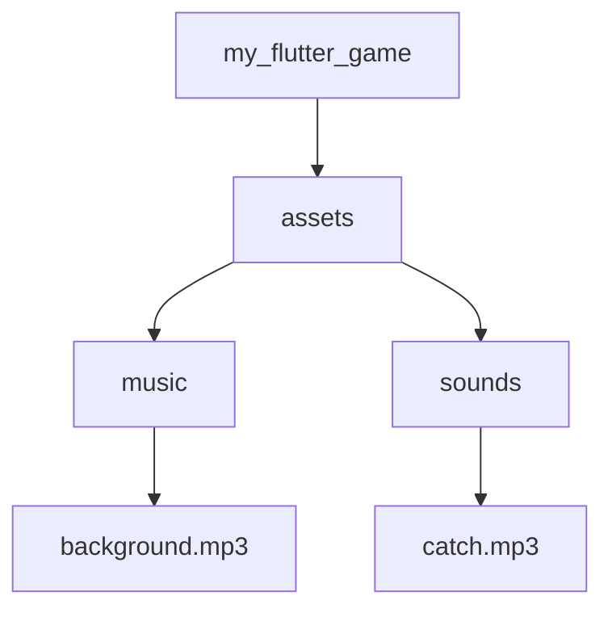

## 7.3.3 Sound Effects and Music

In this section, we will explore how to add sound effects and music to your Flutter game to make it more immersive and enjoyable. Sound plays a crucial role in enhancing the gaming experience, providing feedback to players, and setting the mood of the game. Let's dive into the world of audio in Flutter!

### The Importance of Sound in Games

Sound effects and music are vital components of any game. They help create an engaging atmosphere and can significantly enhance the player's experience. Imagine playing a game without any sound—no background music to set the tone, no sound effects to indicate actions or events. It would feel incomplete and less exciting.

- **Background Music:** This is the continuous music that plays during the game, creating a mood or theme.
- **Sound Effects:** These are short sounds triggered by specific actions, such as catching an apple, jumping, or losing a life.

### Types of Audio in Games

1. **Background Music:** Sets the overall mood and keeps players engaged.
2. **Sound Effects:** Provide immediate feedback for actions, making the game more interactive.

### Implementing Audio in Flutter

To add sound to your Flutter game, we will use the `audioplayers` package, which makes it easy to play audio files. Follow these steps to integrate sound into your game:

#### Step 1: Using Packages

First, you need to add the `audioplayers` package to your Flutter project. Open your `pubspec.yaml` file and add the following dependency:

```yaml
dependencies:
  flutter:
    sdk: flutter
  audioplayers: ^0.20.1
```

After adding the dependency, run `flutter pub get` to install the package.

#### Step 2: Adding Audio Files

Next, you need to add your audio files to the project. Create a folder named `assets` in the root of your project, and inside it, create two subfolders: `music` and `sounds`. Place your background music file in the `music` folder and your sound effects in the `sounds` folder.

Here's how your project structure should look:

```
my_flutter_game/
├── assets/
│   ├── music/
│   │   └── background.mp3
│   └── sounds/
│       └── catch.mp3
```

Don't forget to declare these assets in your `pubspec.yaml` file:

```yaml
flutter:
  assets:
    - assets/music/background.mp3
    - assets/sounds/catch.mp3
```

#### Step 3: Playing Audio with Code

Now, let's write some code to play these audio files. We'll use the `audioplayers` package to handle audio playback.

```dart
// Import the package
import 'package:audioplayers/audioplayers.dart';

// Initialize the player
AudioPlayer player = AudioPlayer();

// Function to play background music
void playBackgroundMusic() {
  player.play(AssetSource('assets/music/background.mp3'));
}

// Function to play sound effect
void playCatchSound() {
  player.play(AssetSource('assets/sounds/catch.mp3'));
}
```

#### Step 4: Adding Audio to Game Events

To make your game interactive, you need to trigger sounds when certain events occur. For example, you can play a sound effect when the player catches an apple or loses a life.

Here's how you can integrate sound effects into your game logic:

```dart
// Example function for catching an apple
void onAppleCaught() {
  // Play the catch sound effect
  playCatchSound();
  // Additional logic for catching an apple
  // ...
}

// Example function for losing a life
void onLifeLost() {
  // Play a different sound effect for losing a life
  player.play(AssetSource('assets/sounds/life_lost.mp3'));
  // Additional logic for losing a life
  // ...
}
```

### Interactive Exercise

Now it's your turn! Try adding your own sound effects and background music to your game. Experiment with different sounds and see how they change the feel of your game. Here are some ideas to get you started:

- Add a sound effect for jumping or collecting items.
- Change the background music based on different levels or game states.
- Use different sound effects for winning or losing.

### Visual Aids

To help you visualize where to place your audio files and how to structure your code, here are some screenshots and diagrams:

#### Project Structure Diagram



This diagram shows how to organize your audio files within the project.

### Best Practices and Tips

- **Keep Audio Files Small:** To ensure your game runs smoothly, use compressed audio files and keep them small.
- **Balance Volume Levels:** Make sure your background music and sound effects are balanced in volume so that one doesn't overpower the other.
- **Test on Different Devices:** Audio playback can vary across devices, so test your game on multiple devices to ensure consistent sound quality.

By following these steps, you can add sound effects and music to your Flutter game, making it more engaging and fun for players. Remember, the right audio can transform a simple game into an immersive experience!

## Quiz Time!



### What is the main purpose of background music in a game?

- [x] To set the mood and keep players engaged
- [ ] To distract players from the game
- [ ] To make the game more difficult
- [ ] To replace sound effects

> **Explanation:** Background music sets the overall mood of the game and keeps players engaged by providing a continuous audio backdrop.

### Which Flutter package is commonly used for playing audio?

- [x] audioplayers
- [ ] flutter_audio
- [ ] sound_player
- [ ] music_flutter

> **Explanation:** The `audioplayers` package is widely used in Flutter for handling audio playback.

### Where should you declare your audio files in a Flutter project?

- [x] In the `pubspec.yaml` file
- [ ] In the main.dart file
- [ ] In the assets folder only
- [ ] In the lib folder

> **Explanation:** Audio files must be declared in the `pubspec.yaml` file to be accessible in the Flutter project.

### What type of audio is typically used for immediate feedback in games?

- [x] Sound effects
- [ ] Background music
- [ ] Podcasts
- [ ] Narration

> **Explanation:** Sound effects provide immediate feedback for actions, making the game more interactive.

### How can you trigger a sound effect when an event occurs in a game?

- [x] By calling a function that plays the sound effect
- [ ] By adding the sound to the background music
- [ ] By changing the game's theme
- [ ] By modifying the game's graphics

> **Explanation:** You can trigger a sound effect by calling a function that plays the sound when a specific event occurs.

### What is the benefit of using compressed audio files in a game?

- [x] To ensure the game runs smoothly
- [ ] To increase the game's file size
- [ ] To make the game louder
- [ ] To decrease the game's graphics quality

> **Explanation:** Compressed audio files help ensure the game runs smoothly by reducing the file size and resource usage.

### Why is it important to test audio playback on different devices?

- [x] Because audio playback can vary across devices
- [ ] Because it changes the game's graphics
- [ ] Because it affects the game's code
- [ ] Because it alters the game's difficulty

> **Explanation:** Audio playback can vary across devices, so testing on multiple devices ensures consistent sound quality.

### What should you do if your background music overpowers sound effects?

- [x] Balance the volume levels
- [ ] Remove the sound effects
- [ ] Increase the game's difficulty
- [ ] Change the game's graphics

> **Explanation:** Balancing the volume levels ensures that background music and sound effects are heard clearly without overpowering each other.

### Can you use different sound effects for different game events?

- [x] Yes
- [ ] No

> **Explanation:** Yes, using different sound effects for various game events enhances the player's experience by providing specific feedback for each action.

### True or False: Sound effects are only used for background music.

- [ ] True
- [x] False

> **Explanation:** False. Sound effects are used for immediate feedback on actions, not just for background music.


