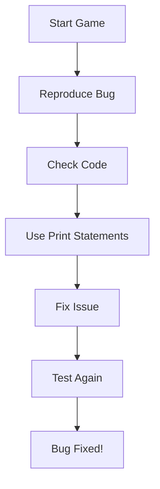

---

linkTitle: "7.4.1 Debugging the Game"
title: "Debugging the Game: Finding and Fixing Bugs in Your Flutter Game"
description: "Learn how to identify and fix common bugs in your Flutter game using debugging tools and techniques. Improve your game's performance and ensure a smooth gaming experience."
categories:
- Game Development
- Flutter
- Debugging
tags:
- Debugging
- Flutter
- Game Development
- Coding for Kids
- Problem Solving
date: 2024-10-25
type: docs
nav_weight: 741000
---

## 7.4.1 Debugging the Game

Welcome to the exciting world of debugging! In this section, we'll explore how to find and fix those pesky bugs that might be hiding in your game. Debugging is an essential skill for any coder, and it's all about making your game work just the way you want it to. Let's dive in!

### What is Debugging?

Debugging is like being a detective in the world of coding. It's the process of identifying and fixing errors or issues in your code. These errors, often called "bugs," can cause your game to behave unexpectedly. Debugging helps you ensure that your game runs smoothly and provides a great experience for players.

### Common Bugs in Games

Before we start fixing bugs, let's look at some common issues you might encounter in your game:

#### Movement Issues

- **Problem:** Characters not moving as expected.
- **Example:** Your game character might not respond to keyboard inputs or move in the wrong direction.

#### Collision Problems

- **Problem:** Incorrect detection of interactions.
- **Example:** Your character might walk through walls or not collide with objects as intended.

#### Performance Lag

- **Problem:** Game running slowly or freezing.
- **Example:** The game might become unresponsive or have a low frame rate, making it difficult to play.

### Debugging Tools

To help us find and fix these bugs, we'll use some handy debugging tools:

#### Flutter Debug Console

The Flutter Debug Console is a powerful tool that shows error messages and logs. It helps you understand what's going wrong in your code.

- **How to Use:** When you run your game, the console will display messages that can help you identify issues.

#### Print Statements

Using `print()` statements is a simple yet effective way to see what's happening in your code.

- **How to Use:** Insert `print()` statements in your code to display the values of variables and track the flow of execution.

### Debugging Steps

Let's go through the steps to debug your game effectively:

#### 1. Reproduce the Bug

The first step is to consistently reproduce the issue. This means playing your game until the bug appears. Understanding when and how the bug occurs is crucial for fixing it.

#### 2. Check the Code

Review the relevant sections of code where the bug might be occurring. Look for any mistakes or unexpected logic that could be causing the issue.

#### 3. Use Print Statements

Insert `print()` statements to check the values of variables and the flow of execution. This will help you pinpoint where things are going wrong.

```dart
// Example of using print statements
void moveCharacter() {
  print('Character position before move: $characterPosition');
  characterPosition += 1; // Move character
  print('Character position after move: $characterPosition');
}
```

#### 4. Fix the Issue

Once you've identified the problem, adjust the code to resolve it. This might involve correcting logic errors, fixing typos, or optimizing performance.

#### 5. Test Again

After making changes, test your game to ensure the bug is fixed. Play through the part of the game where the bug occurred to confirm it's resolved.

### Interactive Exercise

Let's try debugging a sample piece of buggy code. Below is a simple game snippet with a bug. Can you spot and fix it?

```dart
// Buggy code example
int score = 0;

void updateScore() {
  score = score + 10;
  print('Score updated: $score');
}

void main() {
  updateScore();
  updateScore();
  updateScore();
  // Expected score: 30, but it shows 20
}
```

**Hint:** Check the logic in the `updateScore` function. Is it updating the score correctly?

### Visual Aids

To help you visualize the debugging process, here are some screenshots of the Flutter Debug Console and examples of using print statements:



### Conclusion

Debugging is a crucial part of game development. By learning to identify and fix bugs, you ensure your game is enjoyable and runs smoothly. Remember, every coder encounters bugs, and each one is an opportunity to learn and improve your skills. Happy debugging!

## Quiz Time!



### What is debugging?

- [x] The process of identifying and fixing errors in code
- [ ] Writing new features for a game
- [ ] Designing the user interface
- [ ] Testing the game with friends

> **Explanation:** Debugging involves finding and fixing errors or issues in the code to ensure the game runs smoothly.

### Which tool can be used to view error messages in Flutter?

- [x] Flutter Debug Console
- [ ] Text Editor
- [ ] Image Editor
- [ ] Music Player

> **Explanation:** The Flutter Debug Console displays error messages and logs that help identify issues in the code.

### What is a common bug related to character movement?

- [x] Characters not moving as expected
- [ ] Characters changing color
- [ ] Characters speaking too loudly
- [ ] Characters disappearing

> **Explanation:** Movement issues occur when characters do not respond to inputs or move incorrectly.

### How can print statements help in debugging?

- [x] By displaying variable values and tracking code execution
- [ ] By changing the color of the game
- [ ] By adding new features
- [ ] By deleting code

> **Explanation:** Print statements help track the flow of execution and display variable values to identify issues.

### What is the first step in debugging?

- [x] Reproduce the bug
- [ ] Fix the code
- [ ] Test the game
- [ ] Add new features

> **Explanation:** Reproducing the bug helps understand when and how it occurs, which is crucial for fixing it.

### What should you do after fixing a bug?

- [x] Test the game again
- [ ] Delete the code
- [ ] Add more bugs
- [ ] Change the game theme

> **Explanation:** Testing the game ensures that the bug is fixed and the game runs smoothly.

### What is a common bug related to collisions?

- [x] Incorrect detection of interactions
- [ ] Characters changing size
- [ ] Game music stopping
- [ ] Background color changing

> **Explanation:** Collision problems occur when interactions between objects are not detected correctly.

### How can you check the flow of execution in your code?

- [x] Use print statements
- [ ] Change the game graphics
- [ ] Add new levels
- [ ] Remove all code

> **Explanation:** Print statements help track the flow of execution and identify where issues occur.

### What is the purpose of debugging?

- [x] To ensure the game runs smoothly
- [ ] To add more features
- [ ] To change the game design
- [ ] To delete code

> **Explanation:** Debugging helps identify and fix errors to ensure the game provides a great experience.

### True or False: Debugging is only necessary for large games.

- [ ] True
- [x] False

> **Explanation:** Debugging is important for games of all sizes to ensure they run smoothly and provide a good user experience.


