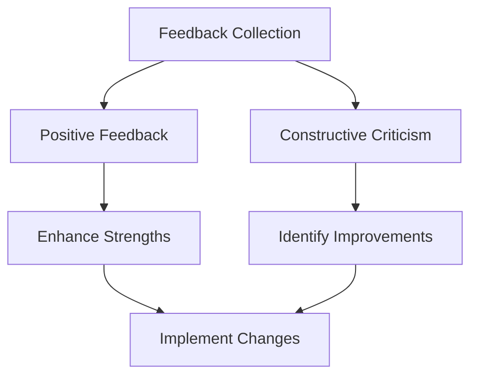

## 7.4.2 Getting Feedback

Creating a game is an exciting journey, but it doesn't end once you've finished coding. To truly make your game shine, gathering feedback is essential. Feedback helps you understand what players enjoy and what could be improved, guiding you to make your game even better. In this section, we'll explore why feedback is important, where to find it, and how to use it effectively.

### Why Feedback is Important

Feedback is like a treasure map for game developers. It points you toward the areas of your game that are working well and highlights where you might need to make changes. By listening to feedback, you can:

- **Enhance Player Experience:** Understand what players love and what frustrates them.
- **Identify Bugs:** Discover issues you might have missed during testing.
- **Inspire New Ideas:** Gain insights into features or improvements you hadn't considered.
- **Boost Confidence:** Positive feedback can motivate you to keep creating and improving.

### Sources of Feedback

Feedback can come from various sources, each offering unique perspectives:

#### Friends and Family

Start by sharing your game with friends and family. They are likely to give honest opinions and support your development journey. Encourage them to be truthful about their experience, as this will help you grow as a developer.

#### Online Communities

Once you're comfortable, consider sharing your game with safe online communities. Platforms like Scratch, Code.org, or kid-friendly forums can be great places to connect with other young developers. Always remember to involve a parent or guardian when engaging online to ensure a safe experience.

### Types of Feedback

Understanding the different types of feedback will help you interpret and use it effectively:

#### Positive Feedback

This feedback highlights what players enjoy about your game. It might include comments on fun gameplay, appealing graphics, or engaging storylines. Positive feedback is encouraging and helps you identify your strengths.

#### Constructive Criticism

Constructive criticism offers suggestions for improvement. It might point out confusing controls, difficult levels, or features that could be added. This type of feedback is invaluable for making your game better.

### How to Collect Feedback

There are several methods to collect feedback, each with its own advantages:

#### Surveys or Questionnaires

Create a simple survey with questions about the player's experience. Here are some example questions:

- What did you enjoy most about the game?
- Was there anything you found confusing or difficult?
- What features would you like to see added?
- How would you rate the game on a scale of 1 to 5?

You can use free online tools like Google Forms to create and share your survey.

#### Direct Conversations

Talking directly with players can provide immediate and detailed feedback. Ask them open-ended questions and encourage them to share their thoughts freely. This method allows for a more interactive exchange of ideas.

### Interactive Exercise: Collecting Feedback

Let's put what we've learned into practice! Share your game with at least two people and collect feedback using a simple feedback form. Here's a template you can use:

```
Feedback Form

1. What did you like most about the game?
2. What was challenging or confusing?
3. Any suggestions for improvement?
4. Additional comments:
```

### Visual Aids: Interpreting Feedback

To help you understand and organize the feedback you receive, consider using a simple chart or table:



This diagram shows how feedback flows into actionable steps. Positive feedback helps you enhance your strengths, while constructive criticism guides you to identify and implement improvements.

### Conclusion

Gathering feedback is a crucial step in game development. It allows you to refine your game, ensuring it provides an enjoyable experience for players. By actively seeking and using feedback, you're not only improving your game but also growing as a developer. Remember, every piece of feedback is an opportunity to learn and create something amazing!

## Quiz Time!



### Why is feedback important in game development?

- [x] It helps identify what works well and what needs improvement.
- [ ] It makes the game more expensive.
- [ ] It reduces the number of players.
- [ ] It complicates the development process.

> **Explanation:** Feedback is crucial because it helps developers understand what aspects of the game are successful and which areas require improvement.

### What is a good source of feedback for young developers?

- [x] Friends and family
- [ ] Strangers on the internet
- [ ] Only professional game developers
- [ ] No feedback is needed

> **Explanation:** Friends and family are great sources of feedback as they can provide honest and supportive opinions.

### What type of feedback highlights what players enjoy about the game?

- [x] Positive Feedback
- [ ] Negative Feedback
- [ ] Constructive Criticism
- [ ] No Feedback

> **Explanation:** Positive feedback focuses on the aspects of the game that players find enjoyable.

### What is constructive criticism?

- [x] Suggestions for improvements or features to add
- [ ] Only negative comments
- [ ] Praise for the game
- [ ] Ignoring the game's issues

> **Explanation:** Constructive criticism provides suggestions for improvement, helping developers enhance their game.

### Which method can be used to collect feedback?

- [x] Surveys or Questionnaires
- [ ] Ignoring player opinions
- [ ] Only using direct conversations
- [ ] Avoiding feedback altogether

> **Explanation:** Surveys or questionnaires are effective methods for collecting structured feedback from players.

### What should you do with positive feedback?

- [x] Enhance your strengths
- [ ] Ignore it
- [ ] Only focus on negative feedback
- [ ] Discard it

> **Explanation:** Positive feedback helps you identify and enhance the strengths of your game.

### How can direct conversations help in collecting feedback?

- [x] They provide immediate and detailed feedback.
- [ ] They are always negative.
- [ ] They are less effective than surveys.
- [ ] They are only for professional developers.

> **Explanation:** Direct conversations allow for immediate and detailed feedback, offering a more interactive exchange of ideas.

### What is the purpose of a feedback form?

- [x] To collect structured feedback from players
- [ ] To confuse players
- [ ] To make the game more complex
- [ ] To avoid getting feedback

> **Explanation:** A feedback form is used to collect structured feedback, helping developers understand player experiences.

### What is the benefit of sharing your game with online communities?

- [x] Receiving diverse feedback from other young developers
- [ ] Only getting positive feedback
- [ ] Avoiding criticism
- [ ] Keeping the game private

> **Explanation:** Online communities can provide diverse feedback and connect you with other young developers.

### True or False: Feedback is only useful if it is positive.

- [ ] True
- [x] False

> **Explanation:** Feedback is valuable whether it is positive or constructive, as both types provide insights for improvement.


