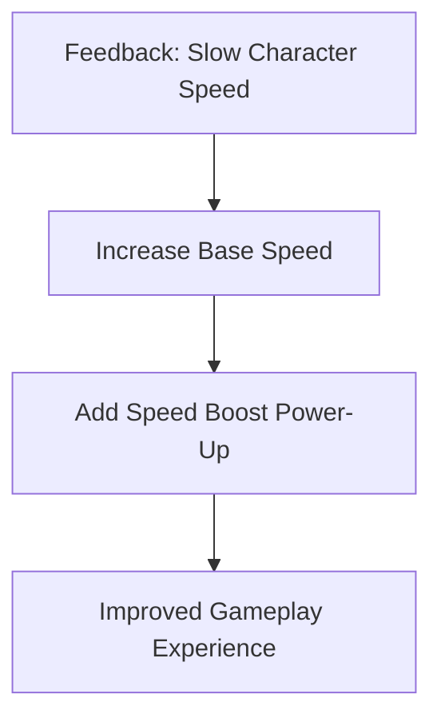

## 7.4.3 Improving Gameplay

Creating a game is an exciting journey, but the adventure doesn't end once your game is playable. One of the most important steps in game development is improving gameplay based on feedback. This section will guide you through the process of using feedback to enhance your game, making it more enjoyable and engaging for players.

### Analyzing Feedback

Feedback is a valuable tool that helps you understand how players experience your game. Here's how you can effectively analyze feedback:

1. **Collect Feedback:** Gather feedback from friends, family, or other players. This can be done through surveys, direct conversations, or observing players as they play your game.

2. **Identify Common Themes:** Look for patterns in the feedback. Are multiple players mentioning the same issue or suggesting similar improvements? These common themes are crucial areas to focus on.

3. **Categorize Feedback:** Organize feedback into categories such as gameplay mechanics, user interface, difficulty, and overall enjoyment. This will help you see which areas need the most attention.

### Prioritizing Improvements

Once you've analyzed the feedback, it's time to decide which improvements to make. Here are some tips:

- **Importance:** Focus on changes that will have the biggest impact on the player's experience. For example, if many players find a level too difficult, adjusting the difficulty could significantly improve enjoyment.

- **Feasibility:** Consider how easy or difficult it is to implement each change. Start with improvements that are both impactful and feasible.

- **Balance:** Ensure that changes don't disrupt the balance of the game. For example, making a game too easy might reduce the challenge and excitement.

### Implementing Changes

Now that you've prioritized the feedback, it's time to make changes to your game. Here are some areas to consider:

#### Gameplay Mechanics

Enhancing gameplay mechanics can make your game more engaging. Consider adding new features or refining existing ones. For example, if players suggest adding a new power-up, think about how it can enhance the gameplay experience.

```dart
// Example: Adding a new power-up mechanic
void activatePowerUp() {
  player.speed *= 2; // Double the player's speed
  Timer(Duration(seconds: 5), () {
    player.speed /= 2; // Reset speed after 5 seconds
  });
}
```

#### Difficulty Balancing

Adjusting the difficulty ensures that your game is challenging but not frustrating. Use feedback to find the right balance.

```dart
// Example: Adjusting enemy speed for difficulty balancing
void adjustDifficulty(String level) {
  if (level == 'easy') {
    enemy.speed = 2;
  } else if (level == 'medium') {
    enemy.speed = 4;
  } else if (level == 'hard') {
    enemy.speed = 6;
  }
}
```

#### User Interface Enhancements

Improving the user interface (UI) can make your game more intuitive and enjoyable. Consider feedback on button placement, menu navigation, and overall design.

```dart
// Example: Improving button visibility
ElevatedButton(
  style: ElevatedButton.styleFrom(
    primary: Colors.blue, // Change button color
    padding: EdgeInsets.symmetric(horizontal: 20, vertical: 10),
  ),
  onPressed: () {
    // Button action
  },
  child: Text('Start Game', style: TextStyle(fontSize: 18)),
)
```

### Iterative Development

Game development is an iterative process, meaning it's all about making continuous improvements. After implementing changes, gather more feedback and repeat the process. This cycle of feedback and improvement helps you create a polished and enjoyable game.

### Interactive Exercise

Let's put these concepts into practice! Choose one piece of feedback you've received and implement a corresponding improvement in your game. For example, if players mentioned that a level is too hard, try adjusting the difficulty settings.

### Visual Aids: Before-and-After Examples

To illustrate how feedback can enhance gameplay, let's look at a before-and-after example:

**Before:** Players found the main character's speed too slow, making the game feel sluggish.

**After:** By increasing the character's speed and adding a temporary speed boost power-up, the game now feels more dynamic and exciting.



### Conclusion

Improving gameplay through feedback is a crucial part of game development. By analyzing feedback, prioritizing improvements, and implementing changes, you can create a more engaging and enjoyable game. Remember, game development is an ongoing process, so keep iterating and refining your game based on player feedback.

## Quiz Time!



### What is the first step in using feedback to improve your game?

- [x] Collect feedback from players.
- [ ] Implement changes immediately.
- [ ] Ignore negative feedback.
- [ ] Focus only on positive comments.

> **Explanation:** The first step is to collect feedback from players to understand their experience and identify areas for improvement.

### How should you prioritize which feedback to act on?

- [x] Based on importance and feasibility.
- [ ] By ignoring all negative feedback.
- [ ] By implementing all suggestions at once.
- [ ] By focusing only on UI changes.

> **Explanation:** Prioritizing feedback based on importance and feasibility ensures that you make impactful changes that are manageable.

### What is an example of a gameplay mechanic improvement?

- [x] Adding a new power-up feature.
- [ ] Changing the game's background color.
- [ ] Removing all enemies from the game.
- [ ] Making the game menu more colorful.

> **Explanation:** Adding a new power-up feature is a gameplay mechanic improvement that can enhance the player's experience.

### Why is difficulty balancing important?

- [x] To ensure the game is challenging but not frustrating.
- [ ] To make the game as hard as possible.
- [ ] To remove all challenges from the game.
- [ ] To focus only on visual improvements.

> **Explanation:** Difficulty balancing is important to maintain a level of challenge that is enjoyable and not frustrating for players.

### What is iterative development?

- [x] A process of continuous improvement.
- [ ] Completing the game in one go.
- [ ] Ignoring feedback after the first release.
- [ ] Making changes without testing.

> **Explanation:** Iterative development involves continuously improving the game based on feedback and testing.

### Which of the following is a UI enhancement?

- [x] Improving button visibility.
- [ ] Adding more enemies.
- [ ] Increasing the game's difficulty.
- [ ] Removing all sound effects.

> **Explanation:** Improving button visibility is a UI enhancement that can make the game more intuitive for players.

### What should you do after implementing changes based on feedback?

- [x] Gather more feedback and repeat the process.
- [ ] Stop collecting feedback.
- [ ] Ignore any new feedback.
- [ ] Consider the game finished.

> **Explanation:** After implementing changes, it's important to gather more feedback to continue improving the game.

### How can you use feedback to enhance gameplay mechanics?

- [x] By adding new features or refining existing ones.
- [ ] By removing all gameplay elements.
- [ ] By ignoring player suggestions.
- [ ] By focusing only on graphics.

> **Explanation:** Feedback can be used to add new features or refine existing gameplay mechanics to enhance the player's experience.

### What is a common theme in feedback analysis?

- [x] Identifying patterns in player suggestions.
- [ ] Ignoring repeated feedback.
- [ ] Focusing only on negative comments.
- [ ] Implementing all feedback immediately.

> **Explanation:** Identifying patterns in player suggestions helps you focus on common themes that need improvement.

### True or False: Game development is a one-time process.

- [ ] True
- [x] False

> **Explanation:** Game development is an ongoing process that involves continuous improvement based on feedback.


