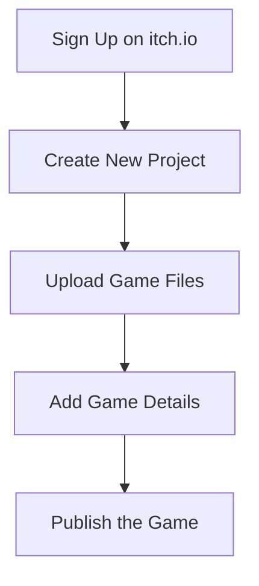

## 7.4.4 Publishing Your Game: Options and Steps

Congratulations on building your first game! Now it's time to share your creation with the world. In this section, we'll explore different ways to publish your game, ensuring it's ready for others to play and enjoy. We'll guide you through the process of preparing your game, choosing a platform, and making it available online.

### Where to Publish

#### Online Platforms

Publishing your game online is a fantastic way to reach a wide audience. Here are some kid-friendly platforms where you can share your Flutter game:

- **itch.io:** A popular platform for indie game developers, itch.io allows you to upload and share your games for free. It's a great place to showcase your work and get feedback from other game enthusiasts.
- **GitHub Pages:** If you're interested in web development, GitHub Pages is an excellent option. You can host your game as a web app, making it accessible to anyone with a web browser.

#### School or Community Events

Don't forget about local opportunities to share your game:

- **School Showcases:** Many schools host events where students can present their projects. This is a perfect chance to demonstrate your game and explain how you built it.
- **Community Events:** Look for local coding clubs or tech fairs where you can display your game and connect with other young developers.

### Preparing the Game for Sharing

Before you publish your game, it's important to ensure it's polished and ready for others to play.

#### Final Testing

- **Bug-Free Experience:** Play through your game multiple times to catch any bugs or glitches. Ask friends or family to test it as well, as fresh eyes can spot issues you might miss.
- **Smooth Performance:** Make sure your game runs smoothly on different devices. Check for any performance issues that could affect the player's experience.

#### Creating a Readme File

A Readme file is like a guidebook for your game. It should include:

- **Game Description:** A brief overview of what your game is about.
- **How to Play:** Simple instructions on how to play the game.
- **Credits:** Acknowledgments for anyone who helped you, or resources you used.

Here's an example of a simple Readme file:

```

## Description
My Awesome Game is a fun and exciting adventure where you collect stars and avoid obstacles.

## How to Play
- Use the arrow keys to move your character.
- Collect as many stars as you can.
- Avoid the obstacles to keep your score high.

## Credits
- Developed by [Your Name]
- Special thanks to [Friend's Name] for testing the game.
```

#### Packaging the App

To share your game, you'll need to package it for distribution. Here are two common formats:

- **Web App:** Export your Flutter project as a web app, which can be hosted on platforms like GitHub Pages.
- **APK:** If you're targeting Android devices, you can build an APK file that users can install on their phones or tablets.

### Steps to Publish on itch.io

Let's walk through the process of publishing your game on itch.io:

1. **Create an Account:** Visit [itch.io](https://itch.io) and sign up for a free account. This will allow you to upload and manage your games.

2. **Create a New Project:** Once logged in, click on "Dashboard" and then "Create New Project." Here, you'll upload your game files.

3. **Add Game Details:** Fill in the game title, description, and upload screenshots. Make sure your description is engaging and gives players a good idea of what to expect.

4. **Publish the Game:** After adding all the necessary details, click "Publish" to make your game live. Now, anyone can play your game!

### Interactive Exercise

Now it's your turn! Choose a publishing platform and follow the steps to share your game. Whether you opt for itch.io, GitHub Pages, or a local event, take pride in showcasing your hard work.

### Visual Aids

To help you visualize the process, here are some screenshots of the publishing process on itch.io:



This diagram outlines the steps you'll take to publish your game on itch.io. Each step is straightforward and designed to help you share your creation with ease.

### Best Practices and Tips

- **Engage with Your Audience:** Once your game is published, encourage players to leave feedback. This can help you improve your game and learn for future projects.
- **Stay Safe Online:** When sharing your game, remember to protect your personal information. Use a username instead of your real name if you're concerned about privacy.
- **Celebrate Your Achievement:** Publishing a game is a big accomplishment! Take a moment to celebrate your hard work and creativity.

By following these steps, you'll be well on your way to sharing your game with the world. Whether it's online or at a local event, your game is sure to impress and inspire others.

## Quiz Time!



### What is a Readme file used for?

- [x] To provide a description and instructions for the game
- [ ] To store game code
- [ ] To display graphics
- [ ] To play sound effects

> **Explanation:** A Readme file provides a description of the game, instructions on how to play, and credits.

### Which platform allows you to host your game as a web app?

- [x] GitHub Pages
- [ ] itch.io
- [ ] School Showcases
- [ ] Local Events

> **Explanation:** GitHub Pages is used to host web apps, making them accessible via a web browser.

### What should you do before publishing your game?

- [x] Test for bugs and performance issues
- [ ] Delete all game files
- [ ] Change the game title
- [ ] Remove all graphics

> **Explanation:** It's important to test your game thoroughly to ensure a smooth and bug-free experience for players.

### What is the first step to publish on itch.io?

- [x] Create an account
- [ ] Upload screenshots
- [ ] Add game details
- [ ] Publish the game

> **Explanation:** The first step is to create an account on itch.io to manage and upload your games.

### What should be included in the game details on itch.io?

- [x] Game title and description
- [x] Screenshots
- [ ] Personal address
- [ ] Bank details

> **Explanation:** Game details should include the title, description, and screenshots to give players an idea of what to expect.

### What is a benefit of publishing your game online?

- [x] Reaching a wider audience
- [ ] Keeping the game private
- [ ] Making it unplayable
- [ ] Hiding it from others

> **Explanation:** Publishing online allows your game to reach a wider audience, increasing its visibility and potential feedback.

### Which file format is used for Android devices?

- [x] APK
- [ ] EXE
- [ ] ZIP
- [ ] PDF

> **Explanation:** APK is the file format used for Android applications, allowing them to be installed on Android devices.

### What is a good practice after publishing your game?

- [x] Encourage feedback from players
- [ ] Ignore player comments
- [ ] Delete the game
- [ ] Change the game genre

> **Explanation:** Encouraging feedback helps you improve your game and learn from player experiences.

### Why should you use a username instead of your real name online?

- [x] To protect your privacy
- [ ] To confuse players
- [ ] To hide your identity
- [ ] To make it harder to find your game

> **Explanation:** Using a username helps protect your privacy when sharing content online.

### True or False: You should celebrate your achievement after publishing your game.

- [x] True
- [ ] False

> **Explanation:** Celebrating your achievement is important as it acknowledges your hard work and creativity.


