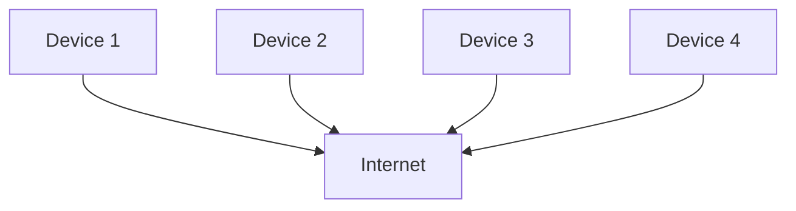

## 8.1.1 What is the Internet?

Welcome to the exciting world of the Internet! In this section, we'll explore what the Internet is, how it works, and why it's such an important part of our daily lives. Let's dive in!

### What is the Internet?

Imagine a giant spider web that stretches across the entire world. Each point on this web represents a computer or device, all connected to each other. This is a simple way to think about the Internet—a vast network that links computers and devices globally, allowing them to communicate and share information.

The Internet is like a superhighway for data. It enables us to send and receive information quickly and easily, no matter where we are. Whether you're sending an email, watching a video, or playing an online game, you're using the Internet to connect with others and access information.

### Everyday Uses of the Internet

The Internet is an essential part of our daily lives, and we use it in many different ways. Here are some common activities you might do on the Internet:

- **Browsing Websites:** You can explore a world of information by visiting websites on topics you love, from science to sports to your favorite hobbies.
- **Playing Online Games:** Many games allow you to play with friends or other players from around the world, all thanks to the Internet.
- **Watching Videos:** Streaming platforms let you watch movies, TV shows, and videos on demand.
- **Chatting with Friends:** Messaging apps and social media platforms help you stay connected with friends and family, no matter where they are.

### A Brief History of the Internet

The Internet didn't always exist. It started as a small project in the late 1960s, designed to connect a few computers for research purposes. Over time, it grew and evolved, becoming the massive network we know today. The Internet has transformed how we communicate, learn, and entertain ourselves, making it an indispensable tool in our daily lives.

### Interactive Examples of Internet Use in Apps

Apps use the Internet in many creative ways. Here are a few examples:

- **Fetching News Articles:** News apps can pull the latest articles from around the world, keeping you informed about current events.
- **Streaming Music:** Music apps let you listen to your favorite songs anytime, anywhere, by streaming them over the Internet.
- **Real-Time Chats:** Messaging apps allow you to have instant conversations with friends and family, no matter where they are.

### Interactive Exercise

Think about how you use the Internet every day. Can you list three ways you rely on the Internet? Discuss how these activities depend on being connected to the web. This exercise will help you appreciate the Internet's role in your life.

### Visual Aid: How Devices Connect to the Internet

To better understand how the Internet works, let's look at a simple diagram showing how different devices connect to the Internet:

In this diagram, each device (like your computer, smartphone, or tablet) connects to the Internet, allowing them to communicate and share information with each other.

### Conclusion

The Internet is a powerful tool that connects us to the world. It enables us to learn, play, and communicate in ways that were unimaginable just a few decades ago. As you continue your journey in coding and technology, understanding the Internet will help you create amazing apps and experiences that can reach people everywhere.

## Quiz Time!



### What is the Internet often compared to in this section?

- [x] A giant spider web
- [ ] A large book
- [ ] A fast car
- [ ] A deep ocean

> **Explanation:** The Internet is compared to a giant spider web because it connects many devices around the world, similar to how a web connects different points.

### What is one common activity people do on the Internet?

- [x] Browsing websites
- [ ] Painting pictures
- [ ] Riding bicycles
- [ ] Planting trees

> **Explanation:** Browsing websites is a common activity on the Internet, allowing people to access information on various topics.

### How did the Internet start?

- [x] As a small project to connect a few computers
- [ ] As a way to watch movies
- [ ] As a tool for playing games
- [ ] As a method for cooking

> **Explanation:** The Internet began as a small project to connect a few computers for research purposes.

### Which of the following is NOT an example of using the Internet?

- [ ] Streaming music
- [ ] Playing online games
- [ ] Chatting with friends
- [x] Reading a printed book

> **Explanation:** Reading a printed book does not require the Internet, unlike the other activities listed.

### What does the Internet allow devices to do?

- [x] Communicate and share information
- [ ] Cook food
- [ ] Build houses
- [ ] Grow plants

> **Explanation:** The Internet allows devices to communicate and share information with each other.

### What is a real-time chat?

- [x] Instant conversations over the Internet
- [ ] A type of video game
- [ ] A cooking show
- [ ] A painting class

> **Explanation:** Real-time chat refers to instant conversations that happen over the Internet.

### Which of these is an example of using the Internet in apps?

- [x] Fetching news articles
- [ ] Writing a letter
- [ ] Drawing a picture
- [ ] Building a sandcastle

> **Explanation:** Fetching news articles is an example of how apps use the Internet to provide information.

### What is the Internet's role in streaming music?

- [x] It allows you to listen to songs anytime, anywhere
- [ ] It helps you cook meals
- [ ] It teaches you how to draw
- [ ] It builds houses

> **Explanation:** The Internet enables music apps to stream songs, allowing you to listen to them anytime and anywhere.

### How has the Internet changed our lives?

- [x] By transforming communication, learning, and entertainment
- [ ] By making food taste better
- [ ] By changing the color of the sky
- [ ] By growing taller trees

> **Explanation:** The Internet has transformed how we communicate, learn, and entertain ourselves.

### True or False: The Internet is only used for playing games.

- [ ] True
- [x] False

> **Explanation:** False. The Internet is used for many activities, including browsing websites, streaming music, and chatting with friends.


