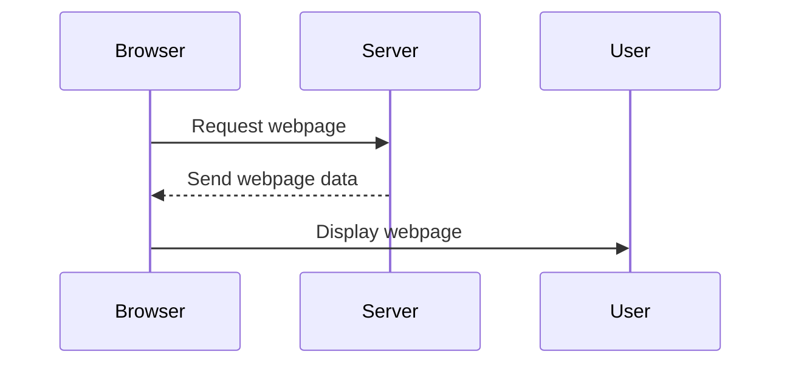

## 8.1.2 Browsers and Servers

In this section, we'll explore the fascinating world of browsers and servers, two essential components that make the internet work. Understanding how these tools interact will help you appreciate the magic behind every click and tap you make online.

### What is a Browser?

A **browser** is a special tool that you use to explore the internet. Think of it as a window to the vast world of websites and web applications. Popular browsers include Chrome, Firefox, Safari, and Edge. Each browser allows you to:

- **Visit Websites:** By typing a URL (like `www.example.com`) into the address bar, you can access any website.
- **Interact with Web Apps:** From playing games to checking your email, browsers let you interact with various web applications.
- **Display Content:** They render text, images, videos, and more, turning code into the beautiful pages you see.

### What is a Server?

A **server** is like a powerful computer that stores all the information and files needed for websites and web applications. When you want to visit a website, the server is responsible for:

- **Storing Data:** It keeps all the website's files, including text, images, and code.
- **Responding to Requests:** When your browser asks for a webpage, the server sends the necessary data back.
- **Handling Multiple Users:** Servers can manage requests from many users at once, ensuring everyone gets the information they need.

### How They Work Together

The interaction between browsers and servers is a dance of requests and responses. Here's a simple breakdown of how they work together:

1. **You Type a URL:** When you enter a website address into your browser, it prepares a request.
2. **The Browser Sends a Request:** This request travels across the internet to the server that hosts the website.
3. **The Server Receives the Request:** The server processes the request and gathers the necessary data.
4. **The Server Sends Back Data:** It sends the webpage data back to your browser.
5. **The Browser Displays the Webpage:** Your browser takes the data and displays it as a webpage you can see and interact with.

### Simple Interaction Flow

Let's visualize this process with a step-by-step explanation:

- **Step 1:** You open your browser and type in a URL.
- **Step 2:** The browser sends a request to the server.
- **Step 3:** The server receives the request and processes it.
- **Step 4:** The server sends the webpage data back to the browser.
- **Step 5:** The browser displays the webpage for you to enjoy.

### Mermaid.js Sequence Diagram

To better understand this interaction, let's look at a sequence diagram:

This diagram shows the flow of communication between the browser and the server, highlighting each step in the process.

### Real-World Example

Imagine you want to visit your favorite game website. Here's how the browser and server work together:

- **You Type the Game's URL:** Your browser sends a request to the server hosting the game.
- **The Server Processes the Request:** It finds the game's files and prepares to send them.
- **The Server Sends the Game Data:** Your browser receives the data and displays the game.
- **You Play the Game:** Thanks to the browser and server, you can enjoy your favorite game seamlessly.

### Interactive Exercise

Now it's your turn! Draw your own sequence diagram showing how your browser requests and receives data from a server when you visit a website. Use the steps we've discussed to guide you.

### Visual Aids

Below is a screenshot of a browser requesting a page and the server responding. Notice the flow of data:

*The browser sends a request to the server.*

*The server responds with the webpage data.*

These images illustrate the journey of data from server to browser, helping you visualize the process.

Understanding the roles of browsers and servers is crucial for anyone interested in web development or simply curious about how the internet works. With this knowledge, you're one step closer to mastering the digital world!

## Quiz Time!



### What is the primary role of a browser?

- [x] To display websites and web applications
- [ ] To store website data
- [ ] To manage internet connections
- [ ] To create web content

> **Explanation:** A browser is used to display websites and web applications, allowing users to interact with them.

### What does a server do when it receives a request from a browser?

- [x] Sends the requested webpage data back to the browser
- [ ] Deletes the request
- [ ] Stores the request for later
- [ ] Ignores the request

> **Explanation:** When a server receives a request from a browser, it processes the request and sends the necessary webpage data back to the browser.

### Which of the following is NOT a browser?

- [ ] Chrome
- [ ] Firefox
- [ ] Safari
- [x] Windows

> **Explanation:** Windows is an operating system, not a browser. Browsers like Chrome, Firefox, and Safari are used to access the internet.

### What happens after a browser receives data from a server?

- [x] It displays the webpage for the user
- [ ] It sends the data to another server
- [ ] It deletes the data
- [ ] It stores the data permanently

> **Explanation:** After receiving data from a server, the browser displays the webpage for the user to see and interact with.

### How do browsers and servers communicate?

- [x] Through requests and responses
- [ ] Through phone calls
- [ ] Through emails
- [ ] Through text messages

> **Explanation:** Browsers and servers communicate through a series of requests and responses, allowing data to be exchanged.

### What is the first step when you want to visit a website?

- [x] Type the URL into the browser
- [ ] Call the server
- [ ] Send an email to the website owner
- [ ] Download the website files

> **Explanation:** The first step to visit a website is to type the URL into the browser, which initiates the request to the server.

### What does a server store?

- [x] Website files and data
- [ ] User passwords
- [ ] Browser settings
- [ ] Internet history

> **Explanation:** A server stores website files and data, which it sends to browsers upon request.

### Which of the following is a real-world example of browser-server interaction?

- [x] Visiting a game website
- [ ] Writing a letter
- [ ] Reading a book
- [ ] Watching TV

> **Explanation:** Visiting a game website involves browser-server interaction, where the browser requests game data from the server.

### What is the purpose of a sequence diagram?

- [x] To visualize the interaction between browser and server
- [ ] To create website content
- [ ] To store data
- [ ] To manage internet connections

> **Explanation:** A sequence diagram visualizes the interaction between browser and server, showing the flow of requests and responses.

### True or False: A browser can function without a server.

- [ ] True
- [x] False

> **Explanation:** False. A browser needs a server to retrieve and display web content, as servers store the necessary data.


