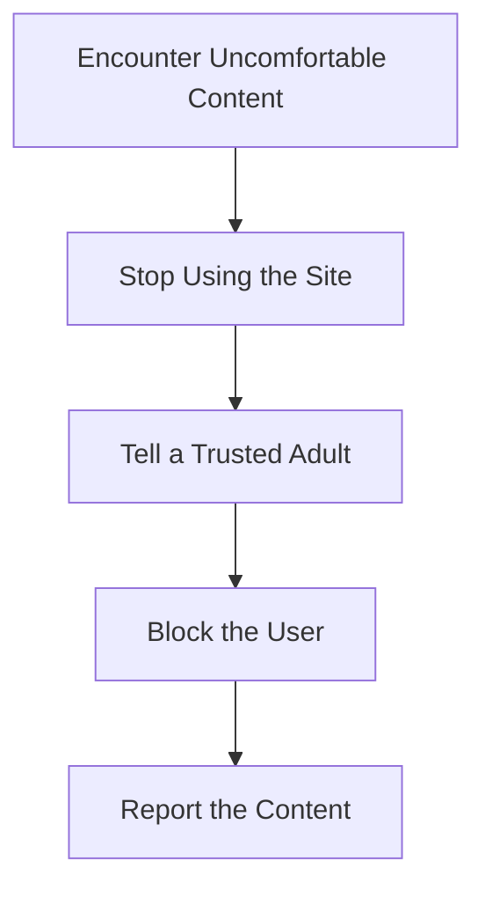

## 8.1.3 Safety on the Internet

In today's digital age, the internet is a wonderful place full of exciting information, games, and opportunities to learn and connect with others. However, just like in the real world, it's important to stay safe while exploring online. This section will guide you through essential tips and strategies to ensure your internet adventures are both fun and secure.

### The Importance of Online Safety

Imagine the internet as a vast playground. While there are many fun things to do, there are also rules to follow to keep everyone safe. Online safety is crucial because it helps protect your personal information and ensures that your online experiences are positive and secure. Just as you wouldn't share your home address with a stranger on the street, you should be cautious about what you share online.

### Key Safety Tips

Let's explore some key tips to help you stay safe on the internet:

#### Protect Personal Information

Your personal information is like a treasure chest. It's valuable and should be kept safe. Here are some things you should never share online:

- **Full Name:** Use a nickname or just your first name.
- **Address:** Keep your home address private.
- **Phone Number:** Don't share your phone number with people you don't know.
- **Passwords:** Keep your passwords secret and strong.

#### Recognize Safe Websites

When browsing the internet, it's important to know which websites are safe. Here are some signs of a secure website:

- **"https://" in the URL:** The "s" stands for secure. It means the website is using a secure connection.
- **Padlock Icon:** Look for a padlock symbol in the address bar. It indicates that the site is secure.

#### Be Cautious with Strangers

Just like in real life, it's important to be careful when interacting with strangers online. Remember:

- **Don't Talk to Strangers:** Avoid chatting with people you don't know.
- **Don't Share Information:** Never give out personal details to strangers.

#### Handling Cyberbullying

Cyberbullying is when someone uses the internet to be mean or hurtful. If you encounter cyberbullying:

- **Tell a Trusted Adult:** Always inform a parent, teacher, or guardian.
- **Don't Respond:** Avoid replying to mean messages.
- **Block the Bully:** Use the block feature to prevent further contact.

#### Responsible Sharing

Before you post or share something online, ask yourself:

- **Is it Kind?** Make sure your post is positive and respectful.
- **Is it Safe?** Avoid sharing personal information or photos that reveal too much.

### Interactive Scenario

Let's practice what we've learned with a few scenarios. Decide what you would do in each situation:

1. **Scenario 1:** You receive a friend request from someone you don't know. What should you do?
   - Ignore the request and tell a trusted adult.

2. **Scenario 2:** A website asks for your home address to enter a contest. What should you do?
   - Do not enter your address and leave the site.

3. **Scenario 3:** You see a mean comment on your friend's post. What should you do?
   - Encourage your friend to tell an adult and not to respond to the comment.

### Mermaid.js Flowchart: What to Do If You Encounter Something Uncomfortable Online

Here's a simple flowchart to help you decide what to do if you come across something online that makes you feel uncomfortable:

### Interactive Exercise

Let's test your knowledge with a short quiz. Match the safety tips to the situations:

1. **Situation:** A website asks for your password.
   - **Tip:** Never share your passwords.

2. **Situation:** You receive a message from someone you don't know.
   - **Tip:** Don't talk to strangers online.

3. **Situation:** You want to post a picture of your new pet.
   - **Tip:** Think before sharing photos.

### Visual Aids

To help you remember these tips, here are some icons representing safety measures:

- **Lock Icon:** Represents secure websites.
- **Shield Icon:** Symbolizes protection and safety.
- **Stop Sign:** Reminds you to stop and think before sharing.

By following these tips and being mindful of your online actions, you can enjoy the internet safely and responsibly. Remember, the internet is a tool for learning and fun, but it's important to use it wisely.

## Quiz Time!



### What should you do if a website asks for your home address?

- [x] Do not enter your address and leave the site.
- [ ] Enter your address to win a prize.
- [ ] Share your address with friends online.
- [ ] Ignore the request and continue browsing.

> **Explanation:** It's important to keep your home address private and not share it online, especially with websites you don't trust.

### What does the "s" in "https://" stand for?

- [x] Secure
- [ ] Simple
- [ ] Safe
- [ ] Special

> **Explanation:** The "s" in "https://" indicates that the website is using a secure connection, which helps protect your data.

### If you encounter cyberbullying, what is the first thing you should do?

- [x] Tell a trusted adult.
- [ ] Respond to the bully.
- [ ] Ignore it and hope it stops.
- [ ] Share the message with friends.

> **Explanation:** Informing a trusted adult is the best first step to handle cyberbullying effectively.

### What icon should you look for to ensure a website is secure?

- [x] Padlock icon
- [ ] Star icon
- [ ] Heart icon
- [ ] Arrow icon

> **Explanation:** A padlock icon in the address bar indicates that the website is secure.

### Why is it important not to talk to strangers online?

- [x] To protect your personal information.
- [x] To avoid potential dangers.
- [ ] To make new friends.
- [ ] To learn new things.

> **Explanation:** Talking to strangers online can expose you to risks, so it's important to protect your personal information and stay safe.

### What should you do before sharing a photo online?

- [x] Think about whether it's safe and kind.
- [ ] Share it immediately.
- [ ] Ask a stranger for their opinion.
- [ ] Post it without thinking.

> **Explanation:** Always consider the safety and kindness of your post before sharing it online.

### What is a good response to a mean comment online?

- [x] Tell a trusted adult and don't respond.
- [ ] Respond with a mean comment.
- [ ] Share it with friends.
- [ ] Ignore it and hope it stops.

> **Explanation:** Telling a trusted adult and not responding is the best way to handle mean comments online.

### What should you do if you receive a friend request from someone you don't know?

- [x] Ignore the request and tell a trusted adult.
- [ ] Accept the request to make new friends.
- [ ] Share your personal information with them.
- [ ] Ask them who they are.

> **Explanation:** It's safest to ignore friend requests from strangers and inform a trusted adult.

### What is the purpose of a shield icon in online safety?

- [x] Symbolizes protection and safety.
- [ ] Represents a game level.
- [ ] Indicates a sale.
- [ ] Shows a new message.

> **Explanation:** A shield icon is often used to represent protection and safety in online contexts.

### True or False: It's okay to share your passwords with your best friend.

- [ ] True
- [x] False

> **Explanation:** Passwords should always be kept private, even from close friends, to ensure your accounts remain secure.


