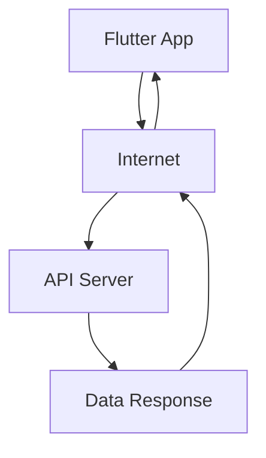

---

linkTitle: "8.1.4 Using the Web in Apps"
title: "Using the Web in Apps: Integrating Internet Features in Flutter Apps"
description: "Learn how to integrate dynamic content and real-time features in Flutter apps using the Internet."
categories:
- Flutter Development
- Mobile Apps
- Internet Integration
tags:
- Flutter
- Internet
- API
- Real-Time Features
- Dynamic Content
date: 2024-10-25
type: docs
nav_weight: 8140

canonical: "https://fluttermasterylibrary.com/5/8/1/4"
license: "© 2023 Tokenizer Inc. CC BY-NC-SA 4.0"
---

## 8.1.4 Using the Web in Apps

In today's digital age, the Internet plays a crucial role in enhancing the functionality and user experience of mobile and web applications. By integrating Internet features, apps can provide dynamic content, real-time interactions, and data-sharing capabilities. In this section, we'll explore how Flutter apps can leverage the Internet to offer these exciting features.

### Dynamic Content

Dynamic content refers to information that is constantly updated and fetched from the Internet. This allows apps to display the latest news, weather updates, or live scores without requiring manual updates. Let's break down how this works:

- **Fetching Data:** Apps can request data from online sources, known as APIs (Application Programming Interfaces). These APIs provide the latest information that the app can display to users.
- **Displaying Updates:** Once the data is fetched, the app can update its interface to show the new information. This process can happen automatically at regular intervals or when the user requests it.

**Example:** A news app can fetch the latest headlines from a news API and display them to the user. Similarly, a weather app can retrieve current weather conditions from a weather API.

### Real-Time Features

Real-time features are functionalities that require constant Internet connectivity to provide immediate updates and interactions. These include:

- **Chat Applications:** Allow users to send and receive messages instantly.
- **Multiplayer Games:** Enable players to interact with each other in real-time.
- **Live Streaming:** Provide live video or audio feeds to users.

These features rely on continuous data exchange between the app and the server, ensuring that users receive the most current information.

### Data Sharing

Data sharing involves sending and receiving data over the Internet, allowing users to share information with others or store their preferences online. This can include:

- **User Preferences:** Apps can save user settings or preferences to a server, allowing them to be accessed from any device.
- **Content Sharing:** Users can share content, such as photos or documents, with others through the app.

**Example:** A chat app enables users to send messages to each other, while a cloud storage app allows users to upload and access files from anywhere.

### Examples in Flutter Apps

Let's look at some practical examples of how Flutter apps can use the Internet to provide dynamic content and real-time features:

#### News App

A Flutter news app can fetch the latest headlines from an online news API. Here's a simple example of how this might work:

```dart
import 'package:flutter/material.dart';
import 'package:http/http.dart' as http;
import 'dart:convert';

void main() => runApp(NewsApp());

class NewsApp extends StatelessWidget {
  @override
  Widget build(BuildContext context) {
    return MaterialApp(
      home: NewsScreen(),
    );
  }
}

class NewsScreen extends StatefulWidget {
  @override
  _NewsScreenState createState() => _NewsScreenState();
}

class _NewsScreenState extends State<NewsScreen> {
  List<String> headlines = [];

  @override
  void initState() {
    super.initState();
    fetchNews();
  }

  void fetchNews() async {
    final response = await http.get(Uri.parse('https://api.example.com/news'));
    if (response.statusCode == 200) {
      final data = json.decode(response.body);
      setState(() {
        headlines = data['articles'].map<String>((article) => article['title']).toList();
      });
    }
  }

  @override
  Widget build(BuildContext context) {
    return Scaffold(
      appBar: AppBar(title: Text('Latest News')),
      body: ListView.builder(
        itemCount: headlines.length,
        itemBuilder: (context, index) {
          return ListTile(title: Text(headlines[index]));
        },
      ),
    );
  }
}
```

In this example, the app fetches news articles from an API and displays the headlines in a list.

#### Weather App

A weather app can display current weather conditions by accessing online data. The app can fetch weather information from a weather API and update the UI accordingly.

#### Chat App

A chat app enables real-time messaging between users. By connecting to a chat server, the app can send and receive messages instantly, providing a seamless communication experience.

### Mermaid.js Diagram

To visualize how an app fetches data from an API, consider the following diagram:



This diagram illustrates the flow of data between a Flutter app and an API server. The app sends a request to the server, which responds with the requested data.

### Real-World Application

The "News Reader" mini project is a perfect example of how the web is integrated into apps. By fetching the latest news articles from an online source, the app provides users with up-to-date information.

### Interactive Exercise

Think of an app idea and identify what online data or services it would use to function. Consider how the app would fetch and display this data, and what real-time features it might include.

### Visual Aids

Below are screenshots of example apps showing data being fetched from the Internet. These images highlight the integration of web features in Flutter apps.


*Figure 1: News app fetching headlines from an online source.*


*Figure 2: Weather app displaying current conditions from a weather API.*

By understanding how to use the Internet in apps, you can create dynamic, interactive, and engaging applications that provide real-time content and features to users. This knowledge opens up a world of possibilities for your future projects!

## Quiz Time!



### What is dynamic content in apps?

- [x] Content that is constantly updated from the Internet
- [ ] Static information that never changes
- [ ] Content stored locally on the device
- [ ] Preloaded data that doesn't require Internet

> **Explanation:** Dynamic content refers to information that is fetched and updated from the Internet, such as news feeds or weather updates.

### Which feature requires constant Internet connectivity?

- [x] Real-time chat
- [ ] Offline document editing
- [ ] Viewing downloaded videos
- [ ] Reading a local PDF file

> **Explanation:** Real-time chat requires constant Internet connectivity to send and receive messages instantly.

### How do apps fetch updated information from the Internet?

- [x] By using APIs
- [ ] By storing data locally
- [ ] By using Bluetooth
- [ ] By using USB connections

> **Explanation:** Apps use APIs (Application Programming Interfaces) to fetch updated information from the Internet.

### What is an example of data sharing in apps?

- [x] Sending messages in a chat app
- [ ] Viewing a static image
- [ ] Editing a local document
- [ ] Playing a downloaded song

> **Explanation:** Data sharing involves sending and receiving data over the Internet, such as sending messages in a chat app.

### What is the role of an API server in an app?

- [x] To provide data to the app
- [ ] To store the app's code
- [ ] To display the app's UI
- [ ] To manage the app's settings

> **Explanation:** An API server provides data to the app, allowing it to fetch and display updated information.

### What does a weather app typically fetch from the Internet?

- [x] Current weather conditions
- [ ] Local files
- [ ] Device settings
- [ ] User preferences

> **Explanation:** A weather app fetches current weather conditions from the Internet to display to the user.

### Which of the following is a real-time feature?

- [x] Multiplayer gaming
- [ ] Viewing a saved photo
- [ ] Editing a local text file
- [ ] Reading a downloaded book

> **Explanation:** Multiplayer gaming is a real-time feature that requires constant Internet connectivity for player interactions.

### What is the purpose of using the Internet in apps?

- [x] To provide dynamic content and real-time features
- [ ] To increase app size
- [ ] To reduce app functionality
- [ ] To limit user interaction

> **Explanation:** The Internet is used in apps to provide dynamic content and real-time features, enhancing user experience.

### How can apps store user preferences online?

- [x] By sending data to a server
- [ ] By saving data locally
- [ ] By using Bluetooth
- [ ] By using a USB drive

> **Explanation:** Apps can store user preferences online by sending data to a server, allowing access from any device.

### True or False: Real-time features do not require Internet connectivity.

- [ ] True
- [x] False

> **Explanation:** Real-time features require Internet connectivity to provide immediate updates and interactions.


