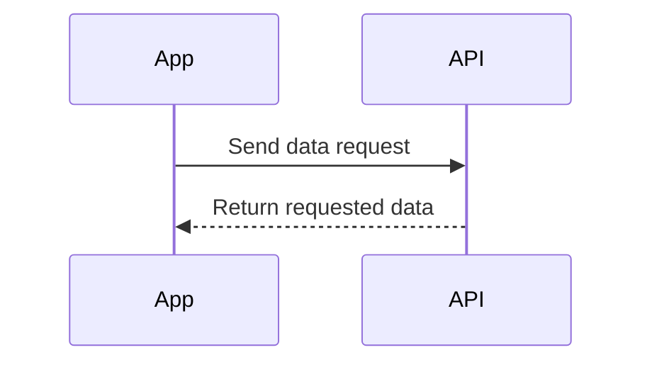

---

linkTitle: "8.2.1 APIs Explained"
title: "Understanding APIs: How Apps Communicate with Servers"
description: "Learn about APIs and how they enable apps to fetch data from servers, using relatable examples and practical insights."
categories:
- Coding for Kids
- Flutter Development
- Internet and Web
tags:
- APIs
- Data Fetching
- Flutter
- Programming Basics
- Kids Coding
date: 2024-10-25
type: docs
nav_weight: 8210

canonical: "https://fluttermasterylibrary.com/5/8/2/1"
license: "© 2023 Tokenizer Inc. CC BY-NC-SA 4.0"
---

## 8.2.1 APIs Explained

Welcome to the fascinating world of APIs, or Application Programming Interfaces! In this section, we'll explore how APIs allow apps to communicate with servers to fetch data, making our apps dynamic and interactive. By the end of this chapter, you'll have a solid understanding of what APIs are, how they work, and how you can use them in your own projects.

### What is an API?

An API, or Application Programming Interface, is like a set of rules that allows one piece of software to talk to another. Imagine you're at a restaurant. You don't go into the kitchen to make your food; instead, you tell a waiter what you want. The waiter takes your order to the kitchen and brings back your food. In this analogy, the waiter is like an API. Your app is the customer, and the server (where the data lives) is the kitchen.

### Everyday Examples of APIs

APIs are everywhere! Here are a few examples to help you understand how they work in everyday life:

- **Weather Apps:** When you check the weather on your phone, the app uses an API to request the latest weather data from a server.
- **Social Media:** When you post a picture or update your status, the app uses an API to send your data to the server and update your profile.
- **Maps and Navigation:** When you search for directions, the app uses an API to get map data and calculate the best route.

### Types of APIs

There are many types of APIs, but one of the most common is the **Web API**. Web APIs allow apps to fetch data over the Internet. They are used by websites and mobile apps to access information stored on remote servers.

### How Do APIs Work?

Let's dive into how APIs work. The process involves two main steps: sending a request and receiving a response.

1. **Sending a Request:** Your app sends a request to the API. This request includes information about what data you want. It's like telling the waiter your order.
   
2. **Receiving a Response:** The API processes your request and sends back the data you asked for. This is like the waiter bringing your food from the kitchen.

Here's a simple sequence diagram to visualize this process:

### Real-World Example: News Reader App

Let's consider a real-world example to see how APIs work in action. Imagine you're building a "News Reader" app. You want your app to display the latest news articles. Instead of storing all the news articles on your device, your app can use a news API to fetch the latest articles from a server.

- **Request:** Your app sends a request to the news API, asking for the latest articles.
- **Response:** The API sends back the articles, and your app displays them to the user.

### Interactive Exercise: Create Your Own API Analogy

Now it's your turn! Think of another analogy that explains how APIs work. Here are a few ideas to get you started:

- **Library System:** Imagine you want a book from a library. Instead of searching through all the shelves yourself, you ask a librarian (API) to find it for you.
- **Online Shopping:** When you buy something online, you don't go to the warehouse. Instead, you place an order (request) and the store (API) sends you the product (data).

Write down your analogy and share it with a friend or family member. See if they can understand how APIs work based on your explanation!

### Visual Aids: Comparing APIs to Real-World Systems

To help you visualize how APIs work, let's compare them to a few real-world systems:

- **Restaurant Waiter:** As mentioned earlier, the waiter takes your order and brings back your food, just like an API takes a request and returns data.
- **Library Librarian:** The librarian helps you find the book you need, similar to how an API fetches data for your app.
- **Online Shopping Cart:** You add items to your cart and check out, and the store processes your order and delivers the items, much like an API processes requests and delivers data.

By understanding these comparisons, you can see how APIs simplify the process of fetching data, making it easier for apps to communicate with servers.

### Conclusion

APIs are powerful tools that allow apps to fetch data from servers, making them dynamic and interactive. By understanding how APIs work, you can create apps that provide real-time information and services to users. Whether you're building a news reader, a weather app, or a social media platform, APIs are essential for connecting your app to the vast world of online data.

Now that you have a solid understanding of APIs, you're ready to start using them in your own projects. Remember, APIs are like the waiters of the digital world, helping your app communicate with servers to get the data it needs.

## Quiz Time!



### What is an API?

- [x] A set of rules that allows apps to communicate with servers
- [ ] A type of programming language
- [ ] A hardware component in computers
- [ ] A type of database

> **Explanation:** An API, or Application Programming Interface, is a set of rules that allows apps to communicate with servers and request data.

### Which of the following is an everyday example of an API?

- [x] A weather app fetching the latest weather data
- [ ] A calculator performing a math operation
- [ ] A text editor saving a document
- [ ] A camera taking a picture

> **Explanation:** A weather app uses an API to fetch the latest weather data from a server, making it an example of an API in action.

### What type of API is commonly used to fetch data over the Internet?

- [x] Web API
- [ ] Hardware API
- [ ] Local API
- [ ] System API

> **Explanation:** Web APIs are commonly used to fetch data over the Internet, allowing apps to access information stored on remote servers.

### In the restaurant analogy, what role does the API play?

- [x] The waiter who takes orders and brings back food
- [ ] The chef who cooks the food
- [ ] The customer who orders the food
- [ ] The menu that lists the food options

> **Explanation:** In the restaurant analogy, the API acts as the waiter who takes orders (requests) and brings back food (data) from the kitchen (server).

### What are the two main steps in how APIs work?

- [x] Sending a request and receiving a response
- [ ] Writing code and compiling it
- [ ] Designing a user interface and testing it
- [ ] Installing software and updating it

> **Explanation:** The two main steps in how APIs work are sending a request to the API and receiving a response with the requested data.

### What does the API send back to the app after processing a request?

- [x] The requested data
- [ ] A new version of the app
- [ ] A list of errors
- [ ] A security update

> **Explanation:** After processing a request, the API sends back the requested data to the app.

### Which of the following is NOT a real-world analogy for an API?

- [ ] A restaurant waiter
- [ ] A library librarian
- [ ] An online shopping cart
- [x] A computer mouse

> **Explanation:** A computer mouse is not a real-world analogy for an API. APIs are compared to systems like waiters, librarians, and shopping carts that facilitate requests and responses.

### How does a news reader app use an API?

- [x] It requests the latest articles from a news API
- [ ] It stores all articles locally on the device
- [ ] It generates news articles automatically
- [ ] It sends articles to a printer

> **Explanation:** A news reader app uses an API to request the latest articles from a news API, allowing it to display up-to-date content.

### What is the main benefit of using APIs in apps?

- [x] They allow apps to fetch data from servers
- [ ] They make apps run faster
- [ ] They improve the graphics of an app
- [ ] They reduce the size of an app

> **Explanation:** The main benefit of using APIs in apps is that they allow apps to fetch data from servers, enabling dynamic and interactive features.

### True or False: APIs are only used in mobile apps.

- [ ] True
- [x] False

> **Explanation:** False. APIs are used in a wide range of applications, including mobile apps, web apps, and desktop software, to enable communication with servers and access data.


