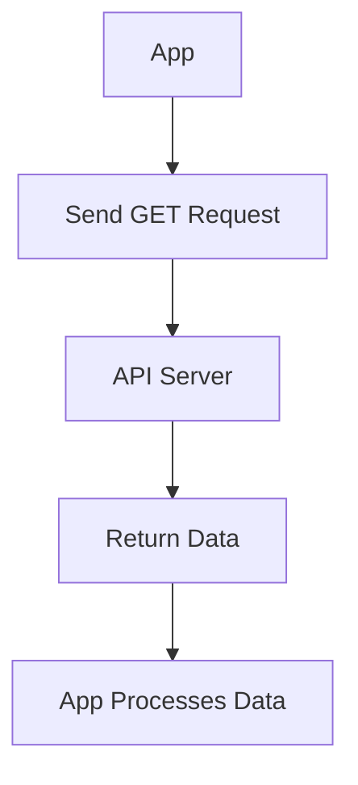

## 8.2.2 Making Requests

In this section, we will embark on an exciting journey to learn how to fetch data from the internet using Flutter. Imagine being able to ask a website for information and getting it back to use in your app—this is what making requests is all about!

### Understanding Requests

Making a request is like asking a friend for a piece of information. When you make a request to a website or an online service, you're asking it to send you some data. This data could be anything from the latest news articles to a random joke. In the world of coding, these requests are often made to something called an API (Application Programming Interface).

### Types of Requests

There are several types of HTTP requests, but the most common one for fetching data is the **GET request**. Think of a GET request as a polite way of saying, "Please give me this information." It's the type of request we'll focus on in this section.

### Flutter Implementation

To make requests in Flutter, we use a special tool called the `http` package. This package helps us send requests and handle the responses we get back.

#### Adding the `http` Package

First, we need to add the `http` package to our Flutter project. This package allows us to make HTTP requests easily.

Open your `pubspec.yaml` file and add the following line under dependencies:

```yaml
dependencies:
  http: ^0.13.5
```

After adding this line, save the file and run `flutter pub get` in your terminal to install the package.

#### Basic GET Request Example

Let's write a simple function to make a GET request and fetch some data. We'll use a fictional API for this example.

```dart
import 'package:http/http.dart' as http;
import 'dart:convert';

Future<void> fetchData() async {
  final response = await http.get(Uri.parse('https://api.example.com/data'));
  if (response.statusCode == 200) {
    var data = jsonDecode(response.body);
    print(data);
  } else {
    print('Failed to load data');
  }
}
```

#### Explaining the Code

- **Import Statements:** We start by importing the `http` package and `dart:convert`. The `http` package helps us make requests, while `dart:convert` allows us to work with JSON data.
  
- **Making the Request:** The `http.get` function sends a GET request to the URL we provide. In this case, it's `'https://api.example.com/data'`.

- **Handling the Response:** After sending the request, we check if the response was successful by looking at the `statusCode`. A status code of 200 means success. We then decode the JSON response using `jsonDecode` and print the data.

### Visualizing the Request Process

To better understand how making a request works, let's look at a flowchart:



This flowchart shows the journey of a request from your app to the API server and back. Your app sends a request, the server processes it, and then sends the data back to your app.

### Real-World Application

Imagine you're building a "News Reader" app. You can use what you've learned to fetch the latest news articles from a news API. This way, your app can always display the most current news to its users.

### Interactive Exercise

Now it's your turn! Try writing a function that makes a GET request to a public API, like fetching a random joke. Here's a hint to get you started:

```dart
Future<void> fetchJoke() async {
  final response = await http.get(Uri.parse('https://official-joke-api.appspot.com/random_joke'));
  if (response.statusCode == 200) {
    var joke = jsonDecode(response.body);
    print('Here\'s a joke: ${joke['setup']} - ${joke['punchline']}');
  } else {
    print('Failed to load joke');
  }
}
```

### Visual Aids

Annotated code snippets and flowcharts are great tools to help visualize the request process. Use them to understand each step and see how data flows from the API to your app.

## Quiz Time!



### What is a GET request used for?

- [x] Fetching data from a server
- [ ] Sending data to a server
- [ ] Deleting data from a server
- [ ] Updating data on a server

> **Explanation:** A GET request is used to fetch data from a server.

### Which package do we use in Flutter to make HTTP requests?

- [x] `http`
- [ ] `flutter_http`
- [ ] `requests`
- [ ] `dart_http`

> **Explanation:** The `http` package is used in Flutter to make HTTP requests.

### What does a status code of 200 indicate?

- [x] The request was successful
- [ ] The request failed
- [ ] The server is down
- [ ] The data is missing

> **Explanation:** A status code of 200 indicates that the request was successful.

### What is the purpose of `jsonDecode` in the code example?

- [x] To convert JSON data into a Dart object
- [ ] To encode Dart objects into JSON
- [ ] To send data to the server
- [ ] To handle errors

> **Explanation:** `jsonDecode` is used to convert JSON data into a Dart object.

### What should you do after adding a new package to `pubspec.yaml`?

- [x] Run `flutter pub get`
- [ ] Restart your computer
- [ ] Delete the package
- [ ] Ignore it

> **Explanation:** After adding a new package, you should run `flutter pub get` to install it.

### Which of the following is NOT a type of HTTP request?

- [ ] GET
- [ ] POST
- [ ] DELETE
- [x] FETCH

> **Explanation:** FETCH is not a type of HTTP request. The common types are GET, POST, DELETE, etc.

### What does the `http.get` function do?

- [x] Sends a GET request to a specified URL
- [ ] Sends a POST request to a specified URL
- [ ] Deletes data from a server
- [ ] Updates data on a server

> **Explanation:** The `http.get` function sends a GET request to a specified URL.

### What is an API?

- [x] A way for apps to communicate with each other
- [ ] A type of database
- [ ] A programming language
- [ ] A type of server

> **Explanation:** An API (Application Programming Interface) is a way for apps to communicate with each other.

### What does the `await` keyword do in the code example?

- [x] It waits for the HTTP request to complete before proceeding
- [ ] It speeds up the HTTP request
- [ ] It cancels the HTTP request
- [ ] It retries the HTTP request

> **Explanation:** The `await` keyword waits for the HTTP request to complete before proceeding.

### True or False: A GET request can be used to send data to a server.

- [ ] True
- [x] False

> **Explanation:** False. A GET request is used to fetch data, not send it.


