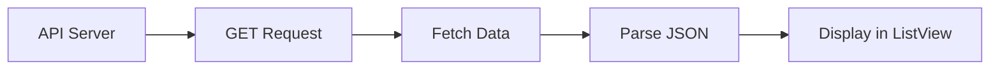

## 8.2.3 Displaying Online Data

Welcome to an exciting part of your coding journey! In this section, we'll learn how to take data fetched from the Internet and display it in your Flutter apps. This is a crucial skill for creating dynamic and interactive applications that can show real-time information, like news articles, weather updates, or even social media feeds.

### Understanding Data Structures

When we fetch data from the Internet, it's often in a format called JSON (JavaScript Object Notation). JSON is a lightweight data-interchange format that's easy for humans to read and write, and easy for machines to parse and generate. Here's a simple example of what JSON data might look like:

```json
[
  {
    "title": "Breaking News: Flutter is Awesome!",
    "description": "Flutter allows you to build beautiful apps for mobile, web, and desktop from a single codebase."
  },
  {
    "title": "Learn Dart Today",
    "description": "Dart is a client-optimized language for fast apps on any platform."
  }
]
```

### Parsing JSON Data

To use this data in our Flutter app, we need to convert it into Dart objects. This process is called parsing. Let's create a Dart class to represent an article and write a function to parse JSON data into a list of articles.

```dart
import 'dart:convert';

class Article {
  final String title;
  final String description;

  Article({required this.title, required this.description});

  factory Article.fromJson(Map<String, dynamic> json) {
    return Article(
      title: json['title'],
      description: json['description'],
    );
  }
}

List<Article> parseArticles(String responseBody) {
  final parsed = jsonDecode(responseBody).cast<Map<String, dynamic>>();
  return parsed.map<Article>((json) => Article.fromJson(json)).toList();
}
```

In this code:
- We define an `Article` class with `title` and `description` properties.
- The `fromJson` factory constructor creates an `Article` instance from a JSON object.
- The `parseArticles` function takes a JSON string, decodes it, and converts it into a list of `Article` objects.

### Displaying Data with Widgets

Now that we have our data in a usable format, let's display it using Flutter's `ListView` widget. `ListView` is perfect for showing a scrollable list of items.

```dart
import 'package:flutter/material.dart';

class ArticleList extends StatelessWidget {
  final List<Article> articles;

  ArticleList({required this.articles});

  @override
  Widget build(BuildContext context) {
    return ListView.builder(
      itemCount: articles.length,
      itemBuilder: (context, index) {
        return ListTile(
          title: Text(articles[index].title),
          subtitle: Text(articles[index].description),
        );
      },
    );
  }
}
```

In this snippet:
- We create an `ArticleList` widget that takes a list of articles.
- `ListView.builder` efficiently creates list items on demand.
- Each `ListTile` displays the title and description of an article.

### Styling the Data

To make our app more visually appealing, we can style the list items. Let's add some basic styling:

```dart
ListTile(
  title: Text(
    articles[index].title,
    style: TextStyle(fontWeight: FontWeight.bold, fontSize: 18),
  ),
  subtitle: Text(
    articles[index].description,
    style: TextStyle(color: Colors.grey[600]),
  ),
)
```

Here, we use `TextStyle` to change the font weight and size of the title and the color of the description.

### Mermaid.js Component Diagram

To visualize how data flows from the API to the UI components, let's look at a Mermaid.js diagram:



This diagram shows the process of fetching data from an API, parsing it, and displaying it in a `ListView`.

### Real-World Application: News Reader App

Let's continue with our "News Reader" app example. Imagine you've fetched a list of news articles from an API. Using the techniques we've learned, you can display these articles in a scrollable list. Each article shows its title and description, and you can style them to match your app's theme.

### Interactive Exercise

Now it's your turn! Modify the "News Reader" app to display additional information, such as the publication date or source of each article. Here's a hint: you'll need to update the `Article` class and the JSON parsing function to include these new fields.

### Visual Aids

Below is a screenshot of what your app might look like after displaying the fetched data:


In this screenshot, you can see how each article is neatly displayed with its title and description.

## Quiz Time!



### What is JSON?

- [x] A lightweight data-interchange format
- [ ] A programming language
- [ ] A type of database
- [ ] A web server

> **Explanation:** JSON stands for JavaScript Object Notation and is used for data interchange.

### What does the `fromJson` method do in the `Article` class?

- [x] Converts a JSON object into an `Article` instance
- [ ] Converts an `Article` instance into a JSON object
- [ ] Fetches data from an API
- [ ] Displays data in a ListView

> **Explanation:** The `fromJson` method is a factory constructor that creates an `Article` object from a JSON map.

### Which widget is used to display a scrollable list of items in Flutter?

- [x] ListView
- [ ] GridView
- [ ] Column
- [ ] Row

> **Explanation:** `ListView` is used to display a scrollable list of widgets.

### What function is used to decode a JSON string in Dart?

- [x] jsonDecode
- [ ] jsonEncode
- [ ] parseJson
- [ ] decodeJson

> **Explanation:** `jsonDecode` is used to convert a JSON string into a Dart object.

### How can you style text in Flutter?

- [x] Using the `TextStyle` class
- [ ] Using the `Color` class
- [ ] Using the `Container` class
- [ ] Using the `Padding` class

> **Explanation:** `TextStyle` is used to define the style of text in Flutter.

### What is the purpose of the `ListView.builder` constructor?

- [x] To create list items on demand
- [ ] To create a static list of items
- [ ] To fetch data from an API
- [ ] To style list items

> **Explanation:** `ListView.builder` is used to build list items dynamically as they are scrolled into view.

### What is the role of the `itemBuilder` function in `ListView.builder`?

- [x] It defines how each list item should be displayed
- [ ] It fetches data from the Internet
- [ ] It styles the entire list
- [ ] It sets the background color of the list

> **Explanation:** `itemBuilder` is a function that returns a widget for each item in the list.

### What does the `itemCount` property in `ListView.builder` specify?

- [x] The number of items in the list
- [ ] The height of each list item
- [ ] The width of the list
- [ ] The color of the list items

> **Explanation:** `itemCount` specifies how many items the list should display.

### True or False: JSON data must be converted into Dart objects to be used in a Flutter app.

- [x] True
- [ ] False

> **Explanation:** JSON data needs to be parsed into Dart objects to be used effectively in Flutter.

### What is the first step in displaying online data in a Flutter app?

- [x] Fetching data from an API
- [ ] Styling the data
- [ ] Displaying data in a ListView
- [ ] Parsing JSON data

> **Explanation:** The first step is to fetch data from an API before parsing and displaying it.



By following these steps and exercises, you're well on your way to creating dynamic apps that can display real-time data from the Internet. Keep experimenting and have fun coding!
