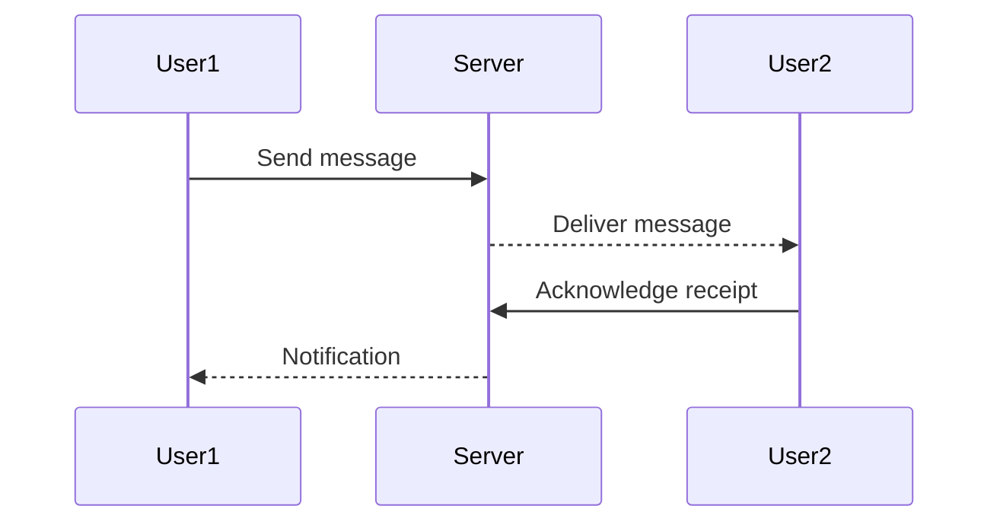

## 8.3.1 Real-Time Communication

Welcome to the exciting world of real-time communication! In this section, we'll explore how technology allows us to send and receive messages instantly, making it possible to chat with friends, collaborate on projects, and even play games together in real-time. Let's dive in and discover how this amazing technology works!

### What is Real-Time Communication?

Real-time communication refers to the ability to send and receive messages instantly, without any noticeable delay. Imagine typing a message to your friend and seeing their reply pop up almost immediately. That's the magic of real-time communication! It's like having a conversation in person, but through your devices.

### Applications of Real-Time Communication

Real-time communication is all around us, and you might already be using it every day! Here are some common applications:

- **Chatting Apps:** Apps like WhatsApp, Discord, and Messenger allow us to send text messages, voice notes, and even video calls instantly.
- **Live Gaming Chats:** When playing online games, you can chat with other players in real-time, strategizing and having fun together.
- **Collaborative Tools:** Tools like Google Docs and Slack enable teams to work together on projects, sharing ideas and feedback instantly.

### How Does Real-Time Communication Work?

Real-time communication relies on the Internet to send and receive messages between devices almost instantly. Here's a simple breakdown of how it works:

1. **Client:** This is your app or device, like your smartphone or computer, that sends and receives messages.
2. **Server:** This is a powerful computer system that routes messages between clients. It acts like a post office, ensuring your messages reach the right destination.

When you send a message, it travels from your device (the client) to the server. The server then forwards the message to the recipient's device. This process happens so quickly that it feels instant!

### Basic Components of Real-Time Communication

To better understand how real-time communication works, let's look at its basic components:

- **Client:** The app or device you use to send and receive messages. It could be a chat app on your phone or a messaging platform on your computer.
- **Server:** A central system that manages the flow of messages between clients. It ensures messages are delivered to the right recipients.

Here's a simple sequence diagram to visualize a real-time message exchange between two users:

### Real-World Example: A Simple Chat Scenario

Imagine you and your friend are using a chat app to exchange messages. Here's how it might look:

1. **You (User1)** type a message: "Hey, are you free to play a game?"
2. **Your device (Client)** sends the message to the **Server**.
3. The **Server** forwards the message to your friend's device (User2).
4. **Your friend (User2)** receives the message and replies: "Yes, let's play!"
5. The **Server** sends the reply back to your device, and you see the message instantly.

### Interactive Exercise

Think about different scenarios where real-time communication is useful. Here are a few examples to get you started:

- Chatting with friends and family.
- Collaborating on a school project with classmates.
- Playing online games with teammates.
- Participating in a virtual classroom discussion.

Can you think of more scenarios? Write them down and share your ideas with others!

### Visual Aids

To help you visualize real-time communication, imagine a chat interface on your screen. You type a message, hit send, and watch as it appears on your friend's screen almost instantly. It's like magic, but it's all thanks to the technology behind real-time communication!

### Conclusion

Real-time communication has transformed the way we interact with each other, making it possible to connect instantly, no matter where we are in the world. Whether you're chatting with friends, collaborating on projects, or playing games, real-time communication is an essential part of our digital lives. Keep exploring and experimenting with this technology, and who knows? You might create the next big chat app!

## Quiz Time!



### What is real-time communication?

- [x] Instant messaging where messages are sent and received immediately.
- [ ] Sending emails that arrive after a few minutes.
- [ ] Writing letters and sending them through the mail.
- [ ] Watching a recorded video.

> **Explanation:** Real-time communication involves sending and receiving messages instantly, like in instant messaging apps.

### Which of the following is an example of real-time communication?

- [x] Chatting on WhatsApp.
- [ ] Sending a postcard.
- [ ] Watching a movie.
- [ ] Reading a book.

> **Explanation:** Chatting on WhatsApp is an example of real-time communication because messages are sent and received instantly.

### What role does the server play in real-time communication?

- [x] It routes messages between clients.
- [ ] It stores all messages permanently.
- [ ] It creates new messages.
- [ ] It deletes old messages.

> **Explanation:** The server routes messages between clients, ensuring they reach the correct destination.

### In a real-time chat app, what is the client?

- [x] The app or device that sends and receives messages.
- [ ] The server that manages messages.
- [ ] The internet connection.
- [ ] The user who reads the messages.

> **Explanation:** The client is the app or device used to send and receive messages in real-time communication.

### What happens when you send a message in a real-time chat app?

- [x] The message is sent to the server, which forwards it to the recipient.
- [ ] The message is stored on your device only.
- [ ] The message is sent directly to the recipient without a server.
- [ ] The message is sent to a random user.

> **Explanation:** In real-time communication, the message is sent to the server, which then forwards it to the recipient.

### Which of the following is NOT a real-time communication application?

- [ ] Discord
- [ ] WhatsApp
- [x] Email
- [ ] Slack

> **Explanation:** Email is not a real-time communication application because there is often a delay in sending and receiving messages.

### How does real-time communication benefit online gaming?

- [x] It allows players to chat and strategize instantly.
- [ ] It makes games load faster.
- [ ] It improves graphics quality.
- [ ] It reduces the cost of games.

> **Explanation:** Real-time communication allows players to chat and strategize instantly, enhancing the gaming experience.

### What is an example of a collaborative tool that uses real-time communication?

- [x] Google Docs
- [ ] Microsoft Word
- [ ] Adobe Photoshop
- [ ] Notepad

> **Explanation:** Google Docs is a collaborative tool that uses real-time communication to allow multiple users to edit documents simultaneously.

### What is the main advantage of real-time communication?

- [x] Instant interaction between users.
- [ ] Lower cost of communication.
- [ ] Better security.
- [ ] Easier to use than other forms of communication.

> **Explanation:** The main advantage of real-time communication is the ability to interact instantly with other users.

### Real-time communication is only possible with a fast internet connection.

- [ ] True
- [x] False

> **Explanation:** While a fast internet connection can improve the experience, real-time communication can still occur with slower connections, though there may be some delays.


