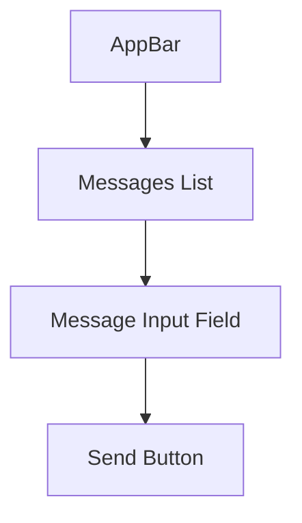

## 8.3.2 Building a Chat Interface

Welcome to an exciting part of your coding journey where we will learn how to build a chat interface using Flutter! Chat applications are a fun and interactive way to communicate, and creating one will teach you a lot about designing user interfaces and managing data. Let's dive into the world of chat apps and see how we can build a simple yet functional chat interface.

### Key Components of a Chat Interface

Before we start coding, let's understand the key components that make up a chat interface:

1. **AppBar:** This is the top bar of the app that usually displays the app name or the chat room title. It helps users know where they are in the app.

2. **Messages List:** A scrollable area that shows all the messages that have been sent and received. This is where the conversation happens!

3. **Message Input Field:** A text field where users can type their messages. It's important for users to be able to express themselves.

4. **Send Button:** A button that users click to send their typed message. This button makes sure that the message is delivered.

### Flutter Implementation

Now that we know what components we need, let's see how we can implement them using Flutter.

#### AppBar Setup

The AppBar is a simple yet important part of our chat interface. Here's how you can set it up:

```dart
AppBar(
  title: Text('Chat App'),
);
```

This code creates an AppBar with the title "Chat App". You can customize the title to match your chat room's name.

#### Messages List using `ListView.builder`

The messages list is where all the chat messages are displayed. We use `ListView.builder` to create a scrollable list of messages:

```dart
Expanded(
  child: ListView.builder(
    itemCount: messages.length,
    itemBuilder: (context, index) {
      return ListTile(
        title: Text(messages[index]),
      );
    },
  ),
)
```

In this code, `messages` is a list that contains all the chat messages. `ListView.builder` efficiently creates a list of `ListTile` widgets, each displaying a message.

#### Message Input and Send Button

The message input field and send button allow users to type and send messages. Here's how you can create them:

```dart
Row(
  children: [
    Expanded(
      child: TextField(
        controller: messageController,
        decoration: InputDecoration(
          hintText: 'Enter your message',
        ),
      ),
    ),
    IconButton(
      icon: Icon(Icons.send),
      onPressed: sendMessage,
    ),
  ],
)
```

In this setup, the `TextField` is where users type their messages, and the `IconButton` with a send icon is used to send the message. The `sendMessage` function will handle the sending action.

### State Management

To manage the list of messages and update the UI when new messages are sent, we use a `StatefulWidget`. This allows our app to react to changes, such as new messages being added to the list.

Here's a simple example of how you might manage state in your chat app:

```dart
class ChatScreen extends StatefulWidget {
  @override
  _ChatScreenState createState() => _ChatScreenState();
}

class _ChatScreenState extends State<ChatScreen> {
  List<String> messages = [];
  TextEditingController messageController = TextEditingController();

  void sendMessage() {
    setState(() {
      messages.add(messageController.text);
      messageController.clear();
    });
  }

  @override
  Widget build(BuildContext context) {
    return Scaffold(
      appBar: AppBar(
        title: Text('Chat App'),
      ),
      body: Column(
        children: [
          Expanded(
            child: ListView.builder(
              itemCount: messages.length,
              itemBuilder: (context, index) {
                return ListTile(
                  title: Text(messages[index]),
                );
              },
            ),
          ),
          Row(
            children: [
              Expanded(
                child: TextField(
                  controller: messageController,
                  decoration: InputDecoration(
                    hintText: 'Enter your message',
                  ),
                ),
              ),
              IconButton(
                icon: Icon(Icons.send),
                onPressed: sendMessage,
              ),
            ],
          ),
        ],
      ),
    );
  }
}
```

### Styling the Interface

To make your chat interface visually appealing, you can add padding, colors, and different text styles. Here's an example of how you can style the messages:

```dart
ListTile(
  title: Text(
    messages[index],
    style: TextStyle(
      color: Colors.blue,
      fontWeight: FontWeight.bold,
    ),
  ),
  contentPadding: EdgeInsets.symmetric(vertical: 10.0, horizontal: 15.0),
)
```

This code changes the text color to blue and makes it bold. It also adds padding around each message for better spacing.

### Mermaid.js Component Diagram

To better understand the layout of our chat interface, let's look at a diagram that shows how the components are organized:



This diagram illustrates the flow from the AppBar at the top, through the Messages List, down to the Message Input Field and Send Button at the bottom.

### Real-World Application

The chat interface we built is a great starting point for creating a complete chat app with real-time capabilities. In real-world applications, you would connect this interface to a backend service to send and receive messages in real-time.

### Interactive Exercise

Now it's your turn! Try creating a simple static chat interface with a few pre-filled messages. This will help you get familiar with the layout and how the components work together.

### Visual Aids

Here are some screenshots of the chat interface at different stages:

1. **Initial Setup:** Shows the basic layout with the AppBar, Messages List, and Message Input Field.
2. **Styled Interface:** Displays the interface with added styles, such as colors and padding.
3. **Interactive Interface:** Demonstrates the interface with the ability to send and display messages.

These visuals will help you see how the interface evolves as you add more features and styles.

## Quiz Time!



### What is the purpose of the AppBar in a chat interface?

- [x] To display the app name or chat room title
- [ ] To send messages
- [ ] To store messages
- [ ] To manage user accounts

> **Explanation:** The AppBar is used to display the app name or chat room title, helping users know where they are in the app.

### Which Flutter widget is used to create a scrollable list of messages?

- [ ] Column
- [ ] Row
- [x] ListView.builder
- [ ] Container

> **Explanation:** `ListView.builder` is used to create a scrollable list of messages efficiently.

### What does the `TextField` widget do in the chat interface?

- [ ] Displays messages
- [x] Allows users to type messages
- [ ] Sends messages
- [ ] Deletes messages

> **Explanation:** The `TextField` widget allows users to type their messages.

### How do you send a message in the chat interface?

- [ ] By pressing the AppBar
- [ ] By typing in the TextField
- [x] By clicking the Send Button
- [ ] By scrolling the Messages List

> **Explanation:** Messages are sent by clicking the Send Button, which triggers the `sendMessage` function.

### What is the role of `StatefulWidget` in the chat app?

- [x] To manage the list of messages and update the UI
- [ ] To display static content
- [ ] To handle network requests
- [ ] To create animations

> **Explanation:** `StatefulWidget` is used to manage the list of messages and update the UI when new messages are sent.

### How can you style the text in the Messages List?

- [x] By using the `TextStyle` class
- [ ] By changing the AppBar color
- [ ] By using the `Row` widget
- [ ] By adding more `TextField` widgets

> **Explanation:** The `TextStyle` class is used to style text, such as changing color and font weight.

### What does the `Expanded` widget do in the chat interface?

- [x] It allows the Messages List to take up available space
- [ ] It sends messages
- [ ] It adds padding
- [ ] It changes text color

> **Explanation:** The `Expanded` widget allows the Messages List to take up the available space in the layout.

### Which function is called to send a message in the chat app?

- [ ] `build`
- [ ] `initState`
- [x] `sendMessage`
- [ ] `dispose`

> **Explanation:** The `sendMessage` function is called to send a message and update the messages list.

### What is the purpose of the `messageController` in the chat app?

- [x] To control the text input in the TextField
- [ ] To manage the AppBar title
- [ ] To handle network requests
- [ ] To style the Messages List

> **Explanation:** The `messageController` is used to control the text input in the `TextField`, allowing us to retrieve and clear the text.

### True or False: The chat interface can be connected to a backend service for real-time messaging.

- [x] True
- [ ] False

> **Explanation:** True. The chat interface can be connected to a backend service to enable real-time messaging capabilities.


