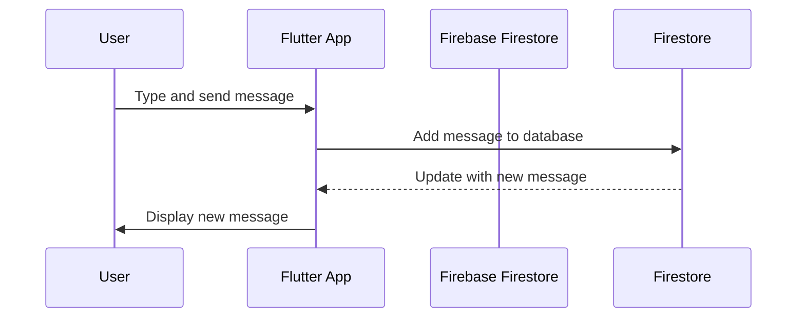

## 8.3.3 Sending and Receiving Messages

In this section, we will explore how to implement real-time messaging in a Flutter chat app using Firebase. We'll cover the flow of data, setting up Firebase, and using it to send and receive messages. By the end of this section, you'll have a working chat app that updates in real-time!

### Understanding Data Flow

Before diving into the code, let's understand how messages flow from one user to another in a chat app. When a user sends a message, it travels through the app to a server, which then distributes it to other users. In our case, Firebase will act as the server, handling the storage and synchronization of messages.

Here's a simple breakdown of the data flow:

1. **User A** types a message and sends it.
2. The **Flutter App** receives the message and sends it to **Firebase Firestore**.
3. **Firestore** stores the message and notifies all connected clients (including **User B**).
4. **User B's** app receives the update and displays the new message.

### Using Firebase for Real-Time Communication

Firebase is a powerful backend service that provides real-time database capabilities, making it perfect for chat applications. We'll use Firebase Firestore to store and synchronize messages.

#### Setting Up Firebase

To get started, we'll need to set up Firebase for our Flutter app.

1. **Create a Firebase Project:**
   - Go to the [Firebase Console](https://console.firebase.google.com/).
   - Click on "Add Project" and follow the instructions to create a new project.

2. **Register the Flutter App with Firebase:**
   - In the Firebase Console, navigate to "Project Settings" and select "Add App".
   - Choose the Android or iOS icon based on your target platform and follow the instructions to register your app.

3. **Add Firebase Packages to `pubspec.yaml`:**

   Open your `pubspec.yaml` file and add the following dependencies:

   ```yaml
   dependencies:
     firebase_core: ^2.4.1
     cloud_firestore: ^4.5.0
   ```

   Run `flutter pub get` to install the packages.

#### Initializing Firebase in Flutter

Before using Firebase services, we need to initialize Firebase in our Flutter app. Update your `main.dart` file as follows:

```dart
import 'package:flutter/material.dart';
import 'package:firebase_core/firebase_core.dart';

void main() async {
  WidgetsFlutterBinding.ensureInitialized();
  await Firebase.initializeApp();
  runApp(ChatApp());
}

class ChatApp extends StatelessWidget {
  @override
  Widget build(BuildContext context) {
    return MaterialApp(
      home: ChatScreen(),
    );
  }
}
```

### Firestore Database Setup

Firestore is a cloud-hosted, NoSQL database that lets you store and sync data between users in real-time. We'll use it to store our chat messages.

#### Sending Messages to Firestore

To send a message, we'll add it to a Firestore collection. Here's a simple function to do that:

```dart
import 'package:cloud_firestore/cloud_firestore.dart';
import 'package:flutter/material.dart';

class ChatScreen extends StatelessWidget {
  final TextEditingController messageController = TextEditingController();

  void sendMessage() {
    if (messageController.text.isNotEmpty) {
      FirebaseFirestore.instance.collection('messages').add({
        'text': messageController.text,
        'timestamp': FieldValue.serverTimestamp(),
      });
      messageController.clear();
    }
  }

  @override
  Widget build(BuildContext context) {
    return Scaffold(
      appBar: AppBar(title: Text('Chat')),
      body: Column(
        children: [
          Expanded(
            child: MessageList(),
          ),
          Padding(
            padding: const EdgeInsets.all(8.0),
            child: Row(
              children: [
                Expanded(
                  child: TextField(
                    controller: messageController,
                    decoration: InputDecoration(labelText: 'Enter your message'),
                  ),
                ),
                IconButton(
                  icon: Icon(Icons.send),
                  onPressed: sendMessage,
                ),
              ],
            ),
          ),
        ],
      ),
    );
  }
}
```

#### Receiving Messages from Firestore

To receive messages, we'll use a `StreamBuilder` to listen for updates from Firestore and update the UI automatically:

```dart
class MessageList extends StatelessWidget {
  @override
  Widget build(BuildContext context) {
    return StreamBuilder(
      stream: FirebaseFirestore.instance.collection('messages').orderBy('timestamp').snapshots(),
      builder: (context, snapshot) {
        if (!snapshot.hasData) return CircularProgressIndicator();
        return ListView.builder(
          itemCount: snapshot.data!.docs.length,
          itemBuilder: (context, index) {
            var message = snapshot.data!.docs[index]['text'];
            return ListTile(
              title: Text(message),
            );
          },
        );
      },
    );
  }
}
```

### Handling Real-Time Updates

The `StreamBuilder` widget is key to handling real-time updates. It listens to the Firestore collection and rebuilds the UI whenever new data arrives. This ensures that all users see the latest messages without needing to refresh the app manually.

### Visualizing the Process with Mermaid.js

To better understand the process of sending and receiving messages, let's look at a sequence diagram:



### Real-World Application

Now that we've covered the basics, it's time to apply these concepts to our "Simple Chat App" mini project. Follow the steps above to integrate Firebase into your app and enable real-time messaging.

### Interactive Exercise

Try modifying your chat app to use Firebase for sending and receiving messages. Follow the step-by-step instructions provided, and don't hesitate to experiment with different features!

### Visual Aids

Here are some screenshots to help you visualize the process:

- **Sending a Message:**

  

- **Receiving a Message:**

  

- **Firebase Console:**

  

## Quiz Time!



### What is the primary role of Firebase in a chat app?

- [x] To store and synchronize messages in real-time
- [ ] To design the user interface
- [ ] To handle user authentication only
- [ ] To provide analytics for the app

> **Explanation:** Firebase acts as a backend service that stores and synchronizes messages in real-time, enabling real-time communication between users.

### Which Firebase package is necessary for real-time database functionality in Flutter?

- [ ] firebase_auth
- [x] cloud_firestore
- [ ] firebase_analytics
- [ ] firebase_messaging

> **Explanation:** The `cloud_firestore` package is used to interact with Firestore, a real-time database service provided by Firebase.

### What does the `StreamBuilder` widget do in the context of a chat app?

- [x] Listens for updates from Firestore and rebuilds the UI
- [ ] Sends messages to Firestore
- [ ] Handles user authentication
- [ ] Provides analytics for the app

> **Explanation:** `StreamBuilder` listens for real-time updates from Firestore and rebuilds the UI whenever new data arrives, ensuring the app displays the latest messages.

### How do you initialize Firebase in a Flutter app?

- [x] By calling `Firebase.initializeApp()` in the `main` function
- [ ] By adding Firebase packages to `pubspec.yaml`
- [ ] By creating a Firebase project
- [ ] By registering the app with Firebase

> **Explanation:** Initializing Firebase in a Flutter app requires calling `Firebase.initializeApp()` in the `main` function to set up Firebase services.

### What is the purpose of the `sendMessage` function in the chat app?

- [x] To add a new message to the Firestore database
- [ ] To display messages on the screen
- [ ] To authenticate users
- [ ] To initialize Firebase

> **Explanation:** The `sendMessage` function adds a new message to the Firestore database, which is then synchronized with all connected clients.

### What does the `orderBy('timestamp')` method do in the Firestore query?

- [x] Sorts messages by their timestamp
- [ ] Filters messages by user
- [ ] Limits the number of messages displayed
- [ ] Groups messages by type

> **Explanation:** The `orderBy('timestamp')` method sorts messages by their timestamp, ensuring they are displayed in chronological order.

### Which widget is used to display a list of messages in the chat app?

- [x] ListView.builder
- [ ] Column
- [ ] Row
- [ ] Container

> **Explanation:** `ListView.builder` is used to display a list of messages, allowing for efficient rendering of large lists.

### What is the role of `FieldValue.serverTimestamp()` in the `sendMessage` function?

- [x] To add a server-generated timestamp to each message
- [ ] To authenticate the user
- [ ] To initialize Firebase
- [ ] To clear the message input field

> **Explanation:** `FieldValue.serverTimestamp()` adds a server-generated timestamp to each message, ensuring accurate time tracking.

### How does the chat app ensure that all users see the latest messages?

- [x] By using `StreamBuilder` to listen for real-time updates
- [ ] By manually refreshing the app
- [ ] By sending notifications to users
- [ ] By storing messages locally

> **Explanation:** The chat app uses `StreamBuilder` to listen for real-time updates from Firestore, ensuring all users see the latest messages without manual refresh.

### True or False: Firebase can only be used for storing messages in a chat app.

- [ ] True
- [x] False

> **Explanation:** False. Firebase offers a wide range of services, including authentication, analytics, and cloud functions, in addition to storing messages.


