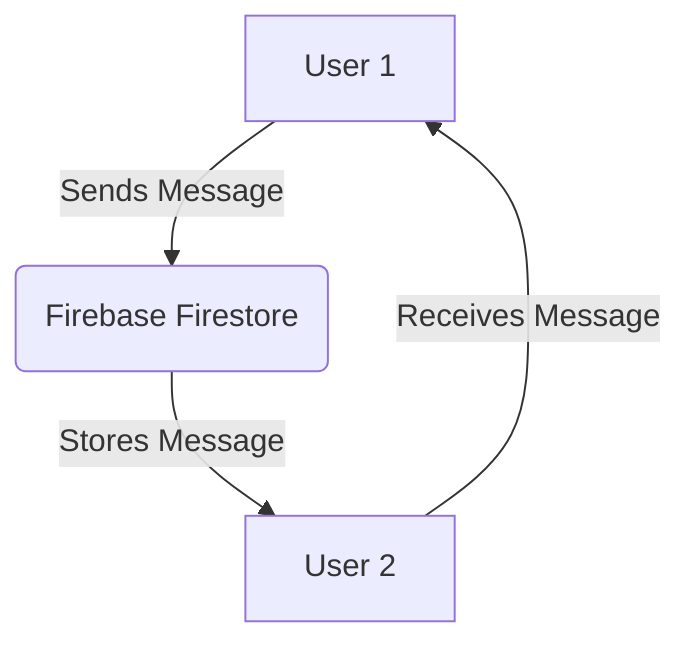

## 8.3.4 Mini Project: Simple Chat App

Welcome to an exciting project where you'll learn to build a simple chat application using Flutter and Firebase. This app will allow users to send and receive messages in real-time, giving you a taste of how modern communication apps work. Let's dive into the world of real-time messaging!

### Project Overview

In this project, you'll create a chat app that lets users type messages, send them, and see messages from others instantly. We'll use Firebase as our backend to store and retrieve messages, ensuring they are synchronized across all devices in real-time.

### Step-by-Step Instructions

#### 1. Setting Up Firebase

Before we start coding, we need to set up Firebase, which will handle our app's backend.

1. **Create a Firebase Project:**
   - Go to the [Firebase Console](https://console.firebase.google.com/).
   - Click on "Add Project" and follow the instructions to create a new project.

2. **Register Your Flutter App with Firebase:**
   - In your Firebase project, click on "Add App" and select the Android icon.
   - Follow the instructions to register your app. You'll need your app's package name, which you can find in your `AndroidManifest.xml` file.

3. **Download the `google-services.json` File:**
   - Once your app is registered, download the `google-services.json` file and place it in the `android/app` directory of your Flutter project.

4. **Add Firebase Dependencies:**
   - Open your `pubspec.yaml` file and add the following dependencies:

     ```yaml
     dependencies:
       flutter:
         sdk: flutter
       firebase_core: latest_version
       cloud_firestore: latest_version
     ```

   - Run `flutter pub get` to install the dependencies.

#### 2. Initializing Firebase

Now that Firebase is set up, let's initialize it in our Flutter app.

- Open your `main.dart` file and modify it as follows:

  ```dart
  import 'package:flutter/material.dart';
  import 'package:firebase_core/firebase_core.dart';

  void main() async {
    WidgetsFlutterBinding.ensureInitialized();
    await Firebase.initializeApp();
    runApp(ChatApp());
  }

  class ChatApp extends StatelessWidget {
    @override
    Widget build(BuildContext context) {
      return MaterialApp(
        title: 'Simple Chat App',
        home: ChatHomePage(),
      );
    }
  }
  ```

#### 3. Designing the Chat Interface

Let's create a user-friendly interface for our chat app.

- Create a new `StatefulWidget` for the chat screen:

  ```dart
  class ChatHomePage extends StatefulWidget {
    @override
    _ChatHomePageState createState() => _ChatHomePageState();
  }

  class _ChatHomePageState extends State<ChatHomePage> {
    final TextEditingController messageController = TextEditingController();

    @override
    Widget build(BuildContext context) {
      return Scaffold(
        appBar: AppBar(
          title: Text('Chat App'),
        ),
        body: Column(
          children: [
            Expanded(
              child: StreamBuilder(
                stream: FirebaseFirestore.instance
                    .collection('messages')
                    .orderBy('timestamp')
                    .snapshots(),
                builder: (context, AsyncSnapshot<QuerySnapshot> snapshot) {
                  if (!snapshot.hasData) return CircularProgressIndicator();
                  List<DocumentSnapshot> docs = snapshot.data!.docs;
                  List<Widget> messages = docs
                      .map((doc) => ListTile(
                            title: Text(doc['text']),
                          ))
                      .toList();
                  return ListView(
                    children: messages,
                  );
                },
              ),
            ),
            Padding(
              padding: EdgeInsets.all(8.0),
              child: Row(
                children: [
                  Expanded(
                    child: TextField(
                      controller: messageController,
                      decoration: InputDecoration(
                        hintText: 'Enter your message',
                      ),
                    ),
                  ),
                  IconButton(
                    icon: Icon(Icons.send),
                    onPressed: sendMessage,
                  ),
                ],
              ),
            ),
          ],
        ),
      );
    }
  }
  ```

#### 4. Implementing Message Sending

Let's add functionality to send messages to Firestore.

- Add the `sendMessage` function in `_ChatHomePageState`:

  ```dart
  void sendMessage() {
    if (messageController.text.isNotEmpty) {
      FirebaseFirestore.instance.collection('messages').add({
        'text': messageController.text,
        'timestamp': FieldValue.serverTimestamp(),
      });
      messageController.clear();
    }
  }
  ```

#### 5. Implementing Message Receiving

We'll use `StreamBuilder` to listen for new messages in real-time.

- The `StreamBuilder` in the `build` method listens to the `messages` collection and updates the UI whenever a new message is added.

#### 6. Handling Message Display

Differentiate between sent and received messages with styling.

- You can modify the `ListTile` widget to change the alignment or color based on the message sender.

#### 7. Testing the App

Run the app on multiple devices or emulators to see real-time message synchronization.

- Open the app on two devices and send messages to see them appear instantly on both screens.

#### 8. Enhancing the App

Consider adding features like user authentication, timestamps on messages, or emojis to make the app more interactive.

### Complete Code Example

Here's the complete code for your simple chat app:

```dart
import 'package:flutter/material.dart';
import 'package:firebase_core/firebase_core.dart';
import 'package:cloud_firestore/cloud_firestore.dart';

void main() async {
  WidgetsFlutterBinding.ensureInitialized();
  await Firebase.initializeApp();
  runApp(ChatApp());
}

class ChatApp extends StatelessWidget {
  @override
  Widget build(BuildContext context) {
    return MaterialApp(
      title: 'Simple Chat App',
      home: ChatHomePage(),
    );
  }
}

class ChatHomePage extends StatefulWidget {
  @override
  _ChatHomePageState createState() => _ChatHomePageState();
}

class _ChatHomePageState extends State<ChatHomePage> {
  final TextEditingController messageController = TextEditingController();

  void sendMessage() {
    if (messageController.text.isNotEmpty) {
      FirebaseFirestore.instance.collection('messages').add({
        'text': messageController.text,
        'timestamp': FieldValue.serverTimestamp(),
      });
      messageController.clear();
    }
  }

  @override
  Widget build(BuildContext context) {
    return Scaffold(
      appBar: AppBar(
        title: Text('Chat App'),
      ),
      body: Column(
        children: [
          Expanded(
            child: StreamBuilder(
              stream: FirebaseFirestore.instance
                  .collection('messages')
                  .orderBy('timestamp')
                  .snapshots(),
              builder: (context, AsyncSnapshot<QuerySnapshot> snapshot) {
                if (!snapshot.hasData) return CircularProgressIndicator();
                List<DocumentSnapshot> docs = snapshot.data!.docs;
                List<Widget> messages = docs
                    .map((doc) => ListTile(
                          title: Text(doc['text']),
                        ))
                    .toList();
                return ListView(
                  children: messages,
                );
              },
            ),
          ),
          Padding(
            padding: EdgeInsets.all(8.0),
            child: Row(
              children: [
                Expanded(
                  child: TextField(
                    controller: messageController,
                    decoration: InputDecoration(
                      hintText: 'Enter your message',
                    ),
                  ),
                ),
                IconButton(
                  icon: Icon(Icons.send),
                  onPressed: sendMessage,
                ),
              ],
            ),
          ),
        ],
      ),
    );
  }
}
```

### Interactive Exercise

Now that you've built your chat app, try these exercises:

- **Test Your App:** Run the app on different devices and send messages to see them appear in real-time.
- **Customize the App:** Add features like user names, message timestamps, or message bubbles with different colors.
- **Experiment with Emojis:** Allow users to send emojis or images to make the chat more expressive.

### Visual Aids

To help you visualize the app, here are some screenshots:

- **Chat Interface:** Shows the chat screen with messages being sent and received.
- **Firebase Firestore Console:** Displays the stored messages in the Firestore database.



This diagram illustrates the flow of messages between users and Firebase Firestore.

## Quiz Time!



### What is the primary purpose of using Firebase in our chat app?

- [x] To store and retrieve messages in real-time
- [ ] To design the user interface
- [ ] To compile the Flutter app
- [ ] To manage app permissions

> **Explanation:** Firebase is used to store and retrieve messages in real-time, allowing for instant communication between users.

### Which widget is used to listen for new messages in real-time?

- [ ] ListView
- [ ] TextField
- [x] StreamBuilder
- [ ] IconButton

> **Explanation:** `StreamBuilder` is used to listen to the Firestore collection for new messages and update the UI in real-time.

### What is the role of the `sendMessage` function?

- [x] To add a new message to the Firestore database
- [ ] To initialize Firebase
- [ ] To build the chat interface
- [ ] To clear the message input field

> **Explanation:** The `sendMessage` function adds a new message to the Firestore database when the user taps the send button.

### How do we ensure messages are displayed in the correct order?

- [ ] By using a ListView
- [ ] By using a TextField
- [x] By ordering messages by timestamp
- [ ] By using an IconButton

> **Explanation:** Messages are ordered by timestamp in the Firestore query to ensure they are displayed in the correct order.

### What should you do if the `messageController` text is empty?

- [ ] Send the message anyway
- [x] Do not send the message
- [ ] Display an error
- [ ] Restart the app

> **Explanation:** If the `messageController` text is empty, the message should not be sent to avoid sending blank messages.

### Which file must be added to the Flutter project to connect with Firebase?

- [ ] pubspec.yaml
- [x] google-services.json
- [ ] main.dart
- [ ] AndroidManifest.xml

> **Explanation:** The `google-services.json` file must be added to the Flutter project to connect with Firebase.

### What is the purpose of the `TextEditingController` in the chat app?

- [x] To manage the text input from the user
- [ ] To display messages
- [ ] To initialize Firebase
- [ ] To handle message sending

> **Explanation:** The `TextEditingController` manages the text input from the user, allowing us to retrieve and clear the text field.

### Which method is used to initialize Firebase in the Flutter app?

- [ ] runApp()
- [ ] build()
- [x] Firebase.initializeApp()
- [ ] main()

> **Explanation:** `Firebase.initializeApp()` is used to initialize Firebase in the Flutter app.

### What does the `StreamBuilder` widget do in the chat app?

- [x] It listens for changes in the Firestore database and updates the UI
- [ ] It sends messages to Firestore
- [ ] It initializes Firebase
- [ ] It manages user authentication

> **Explanation:** The `StreamBuilder` widget listens for changes in the Firestore database and updates the UI with new messages.

### True or False: The chat app can be enhanced by adding user authentication.

- [x] True
- [ ] False

> **Explanation:** True. Adding user authentication can enhance the chat app by allowing users to have personalized experiences and secure communication.



Congratulations on building your first real-time chat app! This project has introduced you to the basics of using Firebase with Flutter, and there's so much more you can explore. Keep experimenting and enhancing your app with new features and ideas. Happy coding!
