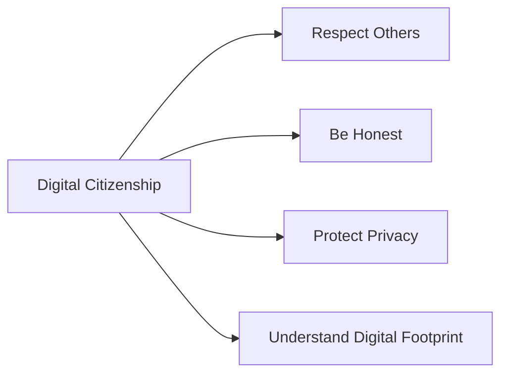

## 8.4.1 Digital Citizenship

In today's digital world, being a good citizen isn't just about how we act in person—it's also about how we behave online. This is what we call **Digital Citizenship**. Just like in the real world, being a responsible and respectful user of the Internet is crucial. Let's explore what it means to be a good digital citizen and how you can practice these principles every time you go online.

### What is Digital Citizenship?

Digital Citizenship is about behaving responsibly and ethically online, just as you would in the real world. It involves understanding how to use technology safely, respectfully, and wisely. Being a good digital citizen means you are aware of your actions online and how they affect others.

### Key Principles of Digital Citizenship

#### Respecting Others

One of the most important aspects of digital citizenship is treating others with kindness and respect. This means not engaging in cyberbullying or spreading hurtful comments. Remember, there's a real person on the other side of the screen, and your words can have a big impact.

**Example:** Instead of joining in on negative comments in a group chat, you can choose to post positive and encouraging messages.

#### Being Honest

Honesty is just as important online as it is offline. Sharing truthful information and not spreading falsehoods helps build trust and credibility. Always check your facts before sharing something with others.

**Example:** If you come across a piece of news that seems unbelievable, take a moment to verify it from reliable sources before sharing it.

#### Protecting Privacy

Keeping your personal information private is crucial. This includes not sharing your address, phone number, or other sensitive details online. Respecting others' privacy is equally important—never share someone else's information without their permission.

**Example:** When creating a profile on a new app, use a nickname instead of your real name and avoid sharing personal details.

#### Understanding Digital Footprint

Every action you take online leaves a trace, known as a digital footprint. This includes the websites you visit, the comments you leave, and the photos you post. Being aware of your digital footprint helps you make better choices about what you share online.

**Example:** Before posting a picture or comment, think about how it might be perceived by others and whether you'd be comfortable with it being seen by anyone.

### Real-World Examples

Let's look at a scenario to understand these principles better:

**Scenario:** You see a friend being teased in a group chat. What would a good digital citizen do?

- **Option A:** Join in the teasing to fit in with the group.
- **Option B:** Ignore the messages and hope it stops.
- **Option C:** Stand up for your friend and report the behavior to a trusted adult.

A good digital citizen would choose **Option C**. Standing up for others and reporting inappropriate behavior helps create a safer and more respectful online environment.

### Interactive Scenario

Imagine you're browsing a social media site and come across a post that seems untrue. What should you do?

- **Option A:** Share it immediately because it's interesting.
- **Option B:** Ignore it and move on.
- **Option C:** Check its accuracy with reliable sources before deciding to share or comment.

Choosing **Option C** is the responsible action. Always verify information before sharing it to prevent the spread of misinformation.

### Interactive Exercise: Do's and Don'ts of Digital Citizenship

Create your own list of "Do's and Don'ts" for being a good digital citizen. Here are some ideas to get you started:

**Do's:**
- Do treat others with respect and kindness.
- Do verify information before sharing.
- Do keep your personal information private.
- Do think before you post.

**Don'ts:**
- Don't engage in cyberbullying.
- Don't share false information.
- Don't reveal sensitive details about yourself or others.
- Don't post anything you wouldn't want everyone to see.

### Visual Aids

To help visualize these concepts, let's look at a flowchart illustrating the principles of digital citizenship:

This flowchart shows how each principle is interconnected and essential for being a responsible digital citizen.

### Illustrated Characters

Imagine characters demonstrating good and bad digital citizenship practices. For example, a character named "Respectful Riley" always leaves positive comments and stands up against cyberbullying, while "Careless Casey" often shares unverified information and doesn't think about privacy.

By following the example of "Respectful Riley," you can become a role model for others and help make the Internet a better place for everyone.

## Quiz Time!



### What is Digital Citizenship?

- [x] Behaving responsibly and ethically online.
- [ ] Using the Internet for entertainment.
- [ ] Sharing personal information freely.
- [ ] Ignoring online interactions.

> **Explanation:** Digital Citizenship involves behaving responsibly and ethically online, just as you would in the real world.

### Which of the following is a key principle of Digital Citizenship?

- [x] Respecting Others
- [ ] Ignoring Others
- [ ] Sharing Everything
- [ ] Being Secretive

> **Explanation:** Respecting others is a fundamental principle of Digital Citizenship, emphasizing kindness and avoiding cyberbullying.

### What should you do before sharing information online?

- [x] Verify its accuracy with reliable sources.
- [ ] Share it immediately if it's interesting.
- [ ] Ignore it and move on.
- [ ] Assume it's true if a friend posted it.

> **Explanation:** Always verify information with reliable sources before sharing to prevent the spread of misinformation.

### What is a digital footprint?

- [x] The trace you leave online through your actions.
- [ ] A type of online game.
- [ ] A digital shoe size.
- [ ] An online shopping cart.

> **Explanation:** A digital footprint is the trace you leave online through your actions, such as websites visited and comments posted.

### How can you protect your privacy online?

- [x] Keep personal information private.
- [ ] Share your address with friends.
- [ ] Post your phone number on social media.
- [x] Use a nickname instead of your real name.

> **Explanation:** Protecting privacy involves keeping personal information private and using nicknames instead of real names.

### What should you do if you see someone being teased online?

- [x] Stand up for them and report the behavior.
- [ ] Join in to fit in with the group.
- [ ] Ignore it and hope it stops.
- [ ] Share the teasing with others.

> **Explanation:** Standing up for others and reporting inappropriate behavior helps create a safer online environment.

### Why is honesty important in Digital Citizenship?

- [x] It builds trust and credibility.
- [ ] It makes you popular.
- [ ] It allows you to share anything.
- [x] It prevents the spread of falsehoods.

> **Explanation:** Honesty builds trust and credibility and prevents the spread of falsehoods online.

### What is cyberbullying?

- [x] Bullying that occurs online.
- [ ] A fun online game.
- [ ] A type of digital art.
- [ ] A way to make friends.

> **Explanation:** Cyberbullying is bullying that occurs online, often through hurtful comments or messages.

### What is the best way to handle a post that seems untrue?

- [x] Check its accuracy with reliable sources.
- [ ] Share it immediately because it's interesting.
- [ ] Ignore it and move on.
- [ ] Assume it's true if a friend posted it.

> **Explanation:** Always check the accuracy of a post with reliable sources before sharing to prevent misinformation.

### True or False: Your online actions do not affect your real-life reputation.

- [ ] True
- [x] False

> **Explanation:** False. Your online actions can affect your real-life reputation, as they contribute to your digital footprint.



By understanding and practicing these principles of digital citizenship, you can help create a positive and respectful online community. Remember, being a good digital citizen is about making thoughtful choices and treating others with kindness and respect.
