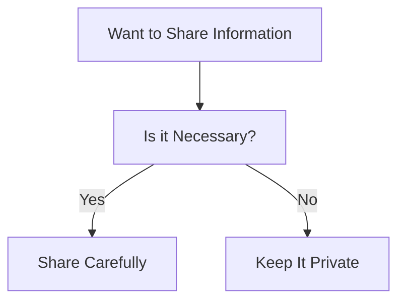

---

linkTitle: "8.4.2 Privacy and Data Protection"
title: "Privacy and Data Protection: Safeguarding Your Online Presence"
description: "Learn how to protect your personal information online with privacy and data protection tips for young coders."
categories:
- Internet Safety
- Online Privacy
- Data Protection
tags:
- Privacy
- Data Security
- Online Safety
- Kids Coding
- Internet Awareness
date: 2024-10-25
type: docs
nav_weight: 8420

---

## 8.4.2 Privacy and Data Protection

In today's digital world, understanding privacy and data protection is crucial for everyone, especially young coders like you. As you explore the internet and create apps, it's important to know how to keep your personal information safe. Let's dive into the world of privacy and learn some essential tips to protect your data online.

### Understanding Privacy

Privacy is all about keeping certain personal details to yourself to stay safe. Just like you wouldn't share your home address with a stranger on the street, you should be careful about what you share online. Privacy helps protect you from people who might misuse your information.

### Types of Personal Information

There are certain types of information that are considered personal and should be kept private. Here are some examples:

- **Full Name:** Your complete name should be shared only with people you trust.
- **Address:** Your home address is private and should not be shared publicly.
- **Phone Number:** Keep your phone number private to avoid unwanted contact.
- **School Details:** Information about where you go to school should be kept to yourself.
- **Passwords:** Never share your passwords with anyone, except trusted adults like your parents.

### Data Protection Tips

Now that you know what personal information is, let's look at some tips to protect it:

#### Strong Passwords

A strong password is your first line of defense against unauthorized access. Here are some tips for creating strong passwords:

- Use a mix of letters, numbers, and symbols.
- Make it at least 8 characters long.
- Avoid using easily guessed information like your name or birthdate.
- Use different passwords for different accounts.

#### Privacy Settings

Most apps and websites have privacy settings that let you control who can see your information. Here's how you can use them:

- **Review Settings:** Regularly check the privacy settings on your apps and websites.
- **Limit Visibility:** Choose settings that limit who can see your personal information.
- **Update Regularly:** Keep your settings updated as apps and websites change.

#### Think Before Sharing

Before you post anything online, ask yourself if it's something you want everyone to see. Here are some questions to consider:

- Is this information private?
- Could this post be used to identify me?
- Am I comfortable with this being public forever?

#### Recognizing Phishing

Phishing is when someone tries to trick you into giving them your personal information. Here are some ways to spot phishing attempts:

- **Suspicious Emails:** Be wary of emails that ask for personal information.
- **Check URLs:** Hover over links to see where they lead before clicking.
- **Verify Sources:** If you're unsure, contact the company directly using official contact information.

### Decision-Making Process for Sharing Personal Information

Here's a simple flowchart to help you decide whether to share personal information:

### Real-World Example

Imagine you receive an email that looks like it's from your favorite game, asking for your password to "verify your account." Here's how you should respond:

1. **Don't Reply:** Legitimate companies will never ask for your password via email.
2. **Check the Sender:** Look at the email address to see if it matches the official website.
3. **Contact Support:** Use the official website to contact customer support and verify the request.

### Interactive Exercise

Take a moment to review the privacy settings on a platform you use, like a social media app or an online game. Adjust the settings to ensure your information is protected. Here are some steps to guide you:

1. **Log In:** Access your account on the platform.
2. **Find Privacy Settings:** Look for a settings menu, often represented by a gear icon.
3. **Review Options:** Check who can see your posts, profile information, and contact details.
4. **Make Changes:** Adjust the settings to limit visibility to only trusted friends or family.

### Visual Aids

To help you understand privacy settings better, here are some icons representing private vs. public information:

- **🔒 Private:** Information that should be kept secure and only shared with trusted individuals.
- **🌐 Public:** Information that can be shared with a wider audience, but still with caution.

By following these tips and being mindful of your online presence, you can enjoy the internet safely and responsibly. Remember, protecting your privacy is an important part of being a smart and savvy coder!

## Quiz Time!



### What is privacy in the context of online safety?

- [x] Keeping personal details private to stay safe
- [ ] Sharing all your information with everyone
- [ ] Posting everything online
- [ ] Ignoring privacy settings

> **Explanation:** Privacy means keeping personal details private to protect yourself from potential threats online.

### Which of the following is considered personal information?

- [x] Full name
- [x] Address
- [ ] Favorite color
- [ ] Pet's name

> **Explanation:** Full name and address are personal information that should be kept private.

### What is a strong password?

- [x] A mix of letters, numbers, and symbols
- [ ] Your birthdate
- [ ] Your pet's name
- [ ] A simple word

> **Explanation:** A strong password includes a mix of letters, numbers, and symbols to enhance security.

### What should you do before sharing information online?

- [x] Think carefully if it's necessary
- [ ] Share everything
- [ ] Ignore privacy settings
- [ ] Post without thinking

> **Explanation:** Always think carefully about the necessity and implications before sharing information online.

### How can you recognize a phishing attempt?

- [x] Suspicious emails asking for personal information
- [ ] Emails from friends
- [ ] Official newsletters
- [ ] Verified sources

> **Explanation:** Phishing attempts often come as suspicious emails asking for personal information.

### What should you do if you receive an email asking for your password?

- [x] Do not reply and verify with the official source
- [ ] Reply with your password
- [ ] Ignore it completely
- [ ] Forward it to friends

> **Explanation:** Never reply with your password; instead, verify the request with the official source.

### What is the first step in reviewing your privacy settings?

- [x] Log in to your account
- [ ] Share your password
- [ ] Ignore the settings
- [ ] Ask a friend to do it

> **Explanation:** The first step is to log in to your account to access and review your privacy settings.

### Why is it important to update your privacy settings regularly?

- [x] To keep up with changes in apps and websites
- [ ] To share more information
- [ ] To make everything public
- [ ] To ignore privacy concerns

> **Explanation:** Regular updates ensure your settings are current with any changes in apps and websites.

### What does the lock icon (🔒) represent?

- [x] Private information
- [ ] Public information
- [ ] A broken link
- [ ] An error

> **Explanation:** The lock icon represents private information that should be kept secure.

### True or False: It's safe to share your passwords with friends.

- [ ] True
- [x] False

> **Explanation:** It's never safe to share your passwords with anyone except trusted adults like your parents.


